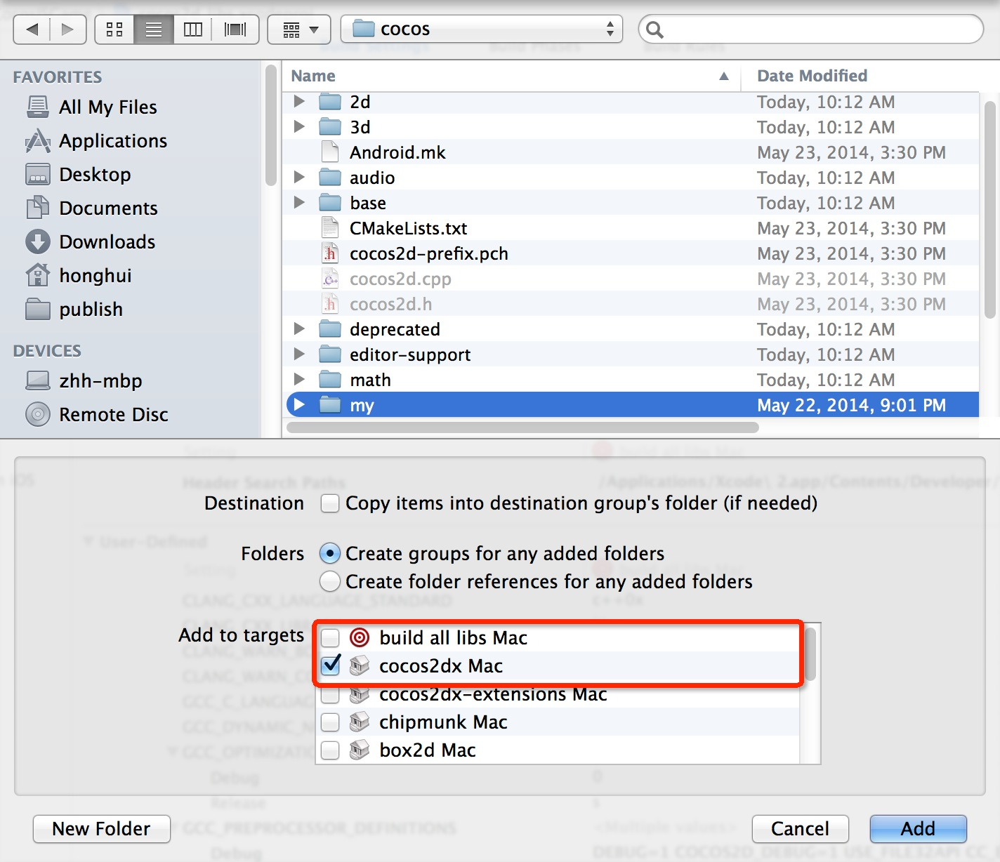
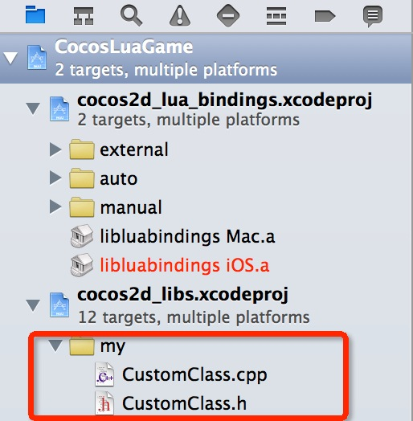

#如何绑定一个自定义类到Lua Runtime

这个文档主要展示如何在Runtime绑定一个自定义类到Lua。**而不是Lua绑定的细节**.

所有平台的进程都是相似的，为了简化步骤。我们将以Mac Runtime为例阐述。

### 为Runtime生成源代码
在这里，我们假设你在 Cocos Code IDE 已经有了一个叫做CocosLuaGame的cocos lua 工程  .

* Runtime的源代码储存在 \<projectLocation>/frameworks/runtime-src ，如果这个目录已经存在，那么跳过下一步骤。
* 否则，你要通过以下步骤来生成Runtime的源代码:
  * 右键 CocosLuaGame 工程
  * Cocos Tools->Add Native Codes Support...
  * 在**Create Native Source Wizard**里面点击 **Generate** 
  * 源代码已经生成了


### 在工程里面添加CustomClass类


```

// CustomClass.h

#ifndef __CUSTOM__CLASS

#define __CUSTOM__CLASS

#include "cocos2d.h"

namespace cocos2d {
class CustomClass : public cocos2d::Ref
{
public:
    
    CustomClass();

    ~CustomClass();

    bool init();
    
    std::string helloMsg();

    CREATE_FUNC(CustomClass);
};
} //namespace cocos2d

#endif // __CUSTOM__CLASS

```

```
// CustomClass.cpp
#include "CustomClass.h"

USING_NS_CC;

CustomClass::CustomClass(){
    
}

CustomClass::~CustomClass(){
    
}

bool CustomClass::init(){
    return true;
}

std::string CustomClass::helloMsg() {
    return "Hello from CustomClass::sayHello";
}

```

打开 **frameworks/runtime-src/proj.ios_mac/CocosLuaGame.xcodeproj**, 添加 CustomClass.h/CustomClass.cpp 到 cocos2d_libs.xcodeproj. 请确保 **cocos2dx iOS**在底部:


然后你就会看到新的工程结构: 



添加搜索路径:


### 添加 cocos2dx_custom.ini

打开 `tools/tolua` 目录，然后添加 `cocos2dx_custom.ini` 文件:


 请让 `target_namespace` 保留空白， Cocos Code IDE现在还没支持往命名空间内自动添加自定义类:

```
[cocos2dx_custom]
#prefix会被添加到生成的函数.你也可以选择不添加这个到你的模板
prefix = cocos2dx_custom

# 创建目标命名空间 (在 javascript里面， 这个会生成一些代码像： equiv. to `ns = ns || {}`)
# 所有的类都会嵌入到这个命名空间
target_namespace =

android_headers = -I%(androidndkdir)s/platforms/android-14/arch-arm/usr/include -I%(androidndkdir)s/sources/cxx-stl/gnu-libstdc++/4.7/libs/armeabi-v7a/include -I%(androidndkdir)s/sources/cxx-stl/gnu-libstdc++/4.7/include
android_flags = -D_SIZE_T_DEFINED_ 

clang_headers = -I%(clangllvmdir)s/lib/clang/3.3/include 
clang_flags = -nostdinc -x c++ -std=c++11

cocos_headers = -I%(cocosdir)s/cocos -I%(cocosdir)s/my -I%(cocosdir)s/cocos/base -I%(cocosdir)s/cocos/platform/android
cocos_flags = -DANDROID

cxxgenerator_headers = 

# 关于clang的额外内容
extra_arguments = %(android_headers)s %(clang_headers)s %(cxxgenerator_headers)s %(cocos_headers)s %(android_flags)s %(clang_flags)s %(cocos_flags)s %(extra_flags)s 

# 要解析的头文件
headers = %(cocosdir)s/cocos/my/CustomClass.h

# 用来生成代码的类. 在这里，你可以使用正则表达式。在检测正则表达式的时候，它将会以"^$"结尾，就像这样 :"^Menu*$".
classes = CustomClass.*

# 我们应该跳过哪些内容?在这个格式里面 ClassName::[function function]
# ClassName是一个正则表达式，不过会像这样使用 : "^ClassName$" 函数也是
# 正则表达式，但它们不用 "^$"来表示边界。如果你想跳过整个类，只需要
# 添加一个单独的 "*" 作为函数。看下面的几个例子。  "*"是个特殊的类名，
# 表示所有的类。这是个十分方便的通配符，可以帮助我们跳过所有命名相似的函数，
# 无论它在哪个类

skip = 

rename_functions = 

rename_classes = 

#在目标虚拟机上面注册的时候，我们是不是应该为所有的类移除某些东西呢？
remove_prefix = 

# 没有父类的类
classes_have_no_parents = 

#当被它们的子类发现的时候会跳过的基类
base_classes_to_skip = 

#没有构造器的类
# 集合是特殊的，我们将会使用手写的构造器
abstract_classes = 

# 决定是否使用脚本对象(js 对象)来控制本地(cpp) 对象的生命周期或者相反的方向。 这里支持值为 'yes' 和 'no'.
script_control_cpp = no

```

### 修改 tools/tolua/genbindings.py

在 tools/tolua/genbindings.py里面找到 `cmd_args`  ，然后增加一行:

```
  'cocos2dx_custom.ini' : ('cocos2dx_custom', 'lua_cocos2dx_custom'), \
```


### 运行 tools/tolua/genbindings.py

运行 tools/tolua/genbindings.py，然后你会在 cocos/scripting/lua-bindings/auto 目录找到 `lua_cocos2dx_custom.cpp` 和 `lua_cocos2dx_custom.h` , 在 cocos/scripting/lua-bindings/auto/api  里面找到 `CustomClass.lua`


add .h/.cpp in Xcode project:


### Register it to lua

打开 `lua_cocos2dx_custom.h`, 里面有个全局函数声明 --> `register_all_cocos2dx_custom(lua_State* tolua_S);`

在使用自定义类之前，使用这个函数。例如，运行Lua入口之前，在 AppDelegate.cpp里面有:

```
    ...
    #include "lua_cocos2dx_custom.hpp"
    ...
    
	// register custom function
    LuaStack* stack = engine->getLuaStack();
    auto state = stack->getLuaState();
    lua_getglobal(state, "_G");
    register_all_cocos2dx_custom(state);
    lua_pop(state, 1);
    
#if (COCOS2D_DEBUG>0)
    if (startRuntime())
        return true;
#endif

    engine->executeScriptFile(ConfigParser::getInstance()->getEntryFile().c_str());
    return true;        
```

###构建Runtime
在 Cocos Code IDE:

 * 右键 CocosLuaGame project
 * Cocos Tools->Build Runtime...
 * 选择目标平台 ，然后点击 **build**
 
### 为Cocos Code IDE(1.0.1.beta or above)添加自定义类的自动补全
压缩 `CustomClass.lua` 为一个zip文件， 例如用以下命令生成CustomClass.zip：

```
zip CustomClass.zip CustomClass.lua
```

在 Cocos Code IDE:

* 右键 CocosLuaGame project
* 构建 Path->Configure Build Path...->Libraries->Add ZIPS...
* 
* 选择 `CustomClass.zip` 和 **OK**

###在Lua里面使用自定义类
修改 main.lua, 在你需要的地方，使用该自定义类:

```
	local customClass = CustomClass:create()
    local msg = customClass:helloMsg()
    cclog("customClass's msg is : " .. msg)
```

###测试
附带着一个叫做 `CocosLuaGame` 的Runtime，Run/Debug 这个工程, 你将会在控制台看到下面的日志:

`customClass's msg is : Hello from CustomClass::sayHello`


