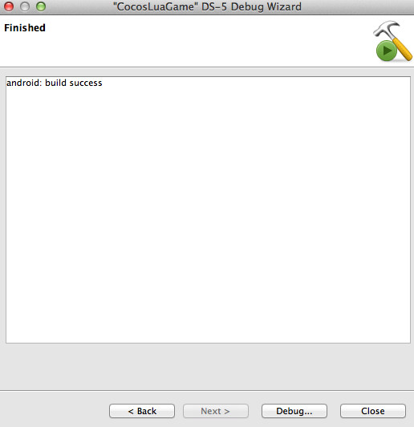
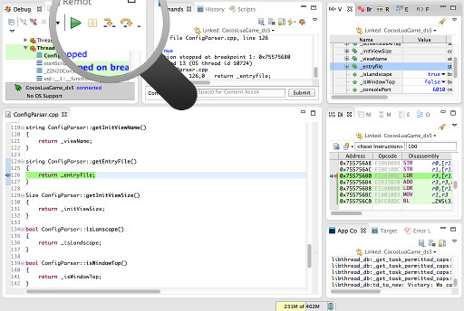

# Debug C++ Code with DS-5

Before debugging C++ code in Cocos Code IDE, ARM DS-5 should has been installed. [Click here to install DS-5](../zh.md).

Debugging C++ code with DS-5 on Android platform, there are some configuration works to do. Glad to say, Cocos Code IDE, since 1.1.0 version, builtin a wizard that makes the configrations works simply. In addition, the following tools also needed:

- Cocos2d-x 3.3 or Cocos2d-JS 3.2 and above
- Android SDK
- Android NDK r10c and above
- Apache Ant 1.9 and above

## Debugging Steps

-------
1. At first, creating a game that contains C ++ code, then selecting the project, click on the "DS-5 Debug ..." button on the toolbar.   

2. If you have not configured android compile environment, the settings dialog box opens automatically. If the environment has been set up before, this step will be skipped. 

3. In addition to selecting the version of the Android SDK, but also need to set which version of GCC toolchain to compile C ++ code, because the current DS-5 only supports debugging programs compiled with GCC. The better choice is select high version of GCC, because the lowwer version maybe cause some unexpected bugs.   

4. After setting the compiler options, click "Generate" button to start the build. The compile operation will take a while, after a successful compilation, click on "Debug ..." to enter the configuration dialog of the DS-5.  

5. All necessary options has been filled up, the only thing before start debugging is connecting a Android device, which debug mode has been terned on, with a USB cabble.  

6. After debugging start, DS-5 will break down automatically, then you can select one file, which in the left corner of the project management view, for breakpoint insertion.  

7. After opening the file in the code window, double click the left column for setting breakpoints.  

8. But the DS-5 Debug was also unable to break into the program at the entrance on Android, so the beginning of the code may have been run over. After setting a breakpoint, click "continue" or continue pressing "F8", the breakpoint works if the code execute in to the place.  

9. After stopping the debug, you can restart in the upper left corner of the "Debug" view. If you modify the C++ code, select "Cocos Tools" -> "DS-5 Debug ..." menu in the project's quick menu to open the wizard for recompilation. Of course, other ways to compile the code are also works.  

----------
According to the above steps, you can use DS-5 in Cocos Code IDE in the Android platform debugging C ++ code, can we debugging C++ code and scripting code simultaneously? Yes！Very simple:

    1. Start DS-5 debug and keep the game stay in the connection waiting view.
    2. switch to the Cocos Lua or Cocos JS perspective view.
    3. Start script debug using "Remote Debug" mode.

## Tips

- The table of engine version and the Android NDK version which has been tested：

    | Engine | Build Runtime | Package to APK | Debug with DS-5 |
    |:----------|:----------:|:----------:|:----------:|
    |Cocos2d-x 3.3|  r10c | r10c | r10c |
    |Cocos2d-x 3.2|  r9d, r10c | r9d, r10c | r10c |

- When debug with DS-5, the application can't execute script logic and stay in wait connection view if the engine version older than Cocos2d-x 3.3 or Cocos2d-JS 3.2. To fix this bug please modify a function "lua_cocos2dx_runtime_addSearchPath" in file: `"<PROJECT>/frameworks/runtime-src/Classes/runtime/Runtime.cpp"`:

        int lua_cocos2dx_runtime_addSearchPath(lua_State* tolua_S)
        {
            ......
        // Modify the 'if' condition, at line: 1090
        #if(CC_TARGET_PLATFORM == CC_PLATFORM_IOS || CC_TARGET_PLATFORM == CC_PLATFORM_ANDROID)
            cobj->addSearchPath(originPath);
        #endif
            ......
        }

- DS-5 uses the command tool "adb", which in Android SDK, to identify "USB" connected devices, It's all right on Windows, but need add "adb" to system path variable manually. Command as below:

        $>sudo ln <Android SDK>/platform-tools/adb /usr/bin/adb
        
- Want to know more DS-5 information, please refer to the ARM official documentation :[《DS-5 Community Edition Android Debug》](http://ds.arm.com/developer-resources/tutorials/android-native-app-debug-tutorial/)。

