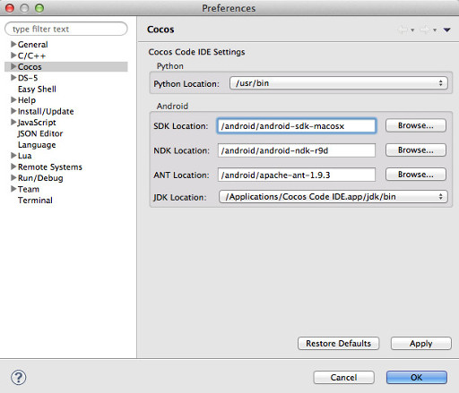
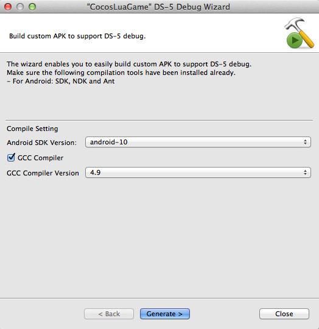
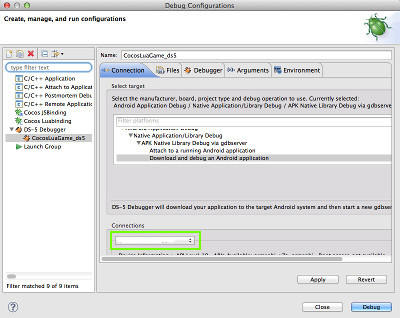

# 用 DS-5 调试 C++ 代码

在 Cocos Code IDE 中调试安卓的 C++ 代码，需要先安装好 ARM DS-5 插件，如果还未安装，[请点击这里](../zh.md)。

用 DS-5 调试安卓的 C++ 代码，需要做一些配置工作，高兴的告诉大家，Cocos Code IDE 从1.1.0版本开始，内置了 DS-5 调试的配置向导，帮助大家自动完成配置 DS-5 调试所需的设置。此外，调试还需要以下工具：

- Cocos2d-x 3.3 或 Cocos2d-JS 3.2 及以上版本
- Android SDK
- Android NDK r10c 及以上版本
- Apache Ant 1.9 及以上版本

## DS-5 调试步骤

-------
1. 首先建立一个包含C++代码的游戏工程，在选择工程之后，点击工具栏。   

2. 如果还没有配置好安卓的编译环境，则会打开设置对话框。如果之前已经设置好，则会跳过此步骤。 

3. 编译设置除了选择安卓SDK的版本之外，还需要设置使用哪个版本的GCC工具链来编译C++代码，因为目前DS-5只支持调试用GCC编译的程序。GCC的版本最好选择高版本的，因为用低版本的GCC编译引擎时可以会出现编译不通过或编译后程序运行不正常的情况。如果在本机的编译环境中工程已配置好了用GCC编译，那么在此页面中可以选择不指定GCC版本。  

4. 设置好编译选项后点击"Generate"就可以开始编译了。编译需要一段时间，编译成功后，点击"Debug..." 进入 DS-5 的配置界面。  

5. 配置界面中所有配置已经被向导设置好了，此时只要用 USB 连接好一个调试模式已打开的安卓设备且被正确识别，就可以点击"Debug"开始调试了。  

6. 调试开始后，DS-5  会自动中断下来，此时可以在左上角的工程管理界面选择需要下断点的文件。  

7. 双击打开后在需要的地方双击代码窗口左边栏就可以设置断点了。  

8. 不过目前 DS-5 安卓调试时还不能中断到程序入口处，所以可能开始部分代码已经运行过去了。断点设置好后，点击"继续执行"或按"F8"继续执行，执行到下断点的函数就会自动停下来调试了。  

9. 停止调试后，可以在 DS-5 的左上角的"Debug"界面重新起动调试。如果修改的C++代码，需要重新编译，此时可以工程上右键菜单中选择"Cocos Tools"->"DS-5 Debug ..."打开向导重新开始编译。当然，以其它方式编译代码也是可以的。  

----------
按上面的步骤就可以在 Cocos Code IDE 中使用 DS-5 在安卓平台调试 C++ 代码啦，那可不可以同时调试游戏的 C++ 代码和脚本代码呢？答案是可以！
很简单，只要在 DS-5 调试启动后，让游戏停留在等待连接界面，然后切换到 Lua 或 JS 的开发界面，通过 "Remote Debug"的方式启动脚本调试就好了。详细步骤请参考[《如何同时调试脚本代码和C++代码》](../../function-guides/debugging/how-to-debug-cpp/zh.md)。

## 小提示

- Cocos Code IDE 中安卓编译相关功能已测试的 Cocos 引擎版本和所需 NDK 版本对应表：

    | 引擎版本 | 编译模拟器 | 打APK包 | DS-5 调试 |
    |:----------|:----------:|:----------:|:----------:|
    |Cocos2d-x 3.3|  r10c | r10c | r10c |
    |Cocos2d-x 3.2|  r9d, r10c | r9d, r10c | r10c |

- 在Cocos2d-x 引擎3.3正式版中对 DS-5 调试做了相应的调整，如是其它版本的引擎用 DS-5 调试时会出现在手机上点击"Play"按钮无法执行游戏的问题，需要修改"<PROJECT>/frameworks/runtime-src/Classes/runtime/Runtime.cpp"中的"lua_cocos2dx_runtime_addSearchPath"为：

        int lua_cocos2dx_runtime_addSearchPath(lua_State* tolua_S)
        {
            ......
        // Modify the 'if' condition, at line: 1090
        #if(CC_TARGET_PLATFORM == CC_PLATFORM_IOS || CC_TARGET_PLATFORM == CC_PLATFORM_ANDROID)
            cobj->addSearchPath(originPath);
        #endif
            ......
        }

- DS-5 识别通过"USB"连接的设备，需要调用安卓 SDK 中的"adb"命令。在Windows系统上Cocos Code IDE已自动把"adb"的路径设置给 DS-5，但在 Mac 系统上无法设置。如果在终端中无法访问"adb"命令，可以在终端执行如下命令解决问题：  

        $>sudo ln <Android SDK>/platform-tools/adb /usr/bin/adb
        
- 想了解更多 DS-5 相关信息，请参考 ARM 官方文档：[《DS-5 社区版 Android 调试》](http://ds.arm.com/zh-cn/developer-resources/tutorials/android-native-app-debug-tutorial/)。

