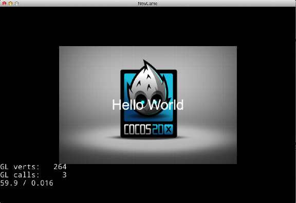

# 3.3 添加内容到场景

在添加内容到场景前，我们需要先了解一下什么是精灵。

Cocos2d-js中的精灵（Sprite）和其他游戏引擎中的精灵相似，它可以移动，旋转，缩放，执行动画，并接受其他转换。如果说Scene和Layer代表了宏观的游戏管理元素，那么Sprite则为微观世界提供了丰富灵活的细节表现。从静态的树木、房屋到奔跑的敌人、旋转的落叶，我们都可以通过Sprite来实现。

这一节我们将展示如何添加一个静态的图片精灵到场景中。

1. 在res目录下添加HelloWorld.png资源文件。
* 打开resource.js，加入HelloWorld.png资源的引用。

	```
	var res = {
    	HelloWorld_png : "res/HelloWorld.png",
	};
	```
	
* 开打firstscene.js，在ctor函数中添加下面的代码。

	```
	var bgSprite = new cc.Sprite(res.HelloWorld_png);
	bgSprite.attr({
		x : size.width / 2,
		y : size.height / 2,
	});
	this.addChild(bgSprite);
	```
	
	`new cc.Sprite`创建一个精灵bgSprite，通过bgSprite.attr来设置bgSprite的熟悉，这是Cocos2d-js 3.x的提供的新方法，更高效简洁。然后addChild到当前Layer。
	
点击运行，可以看到下面的效果。

