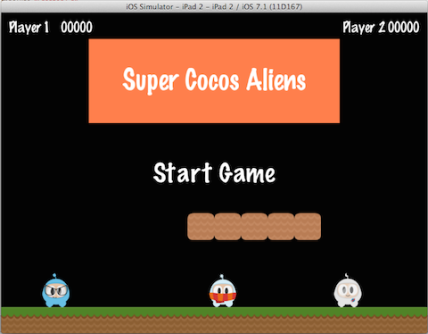
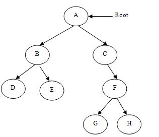
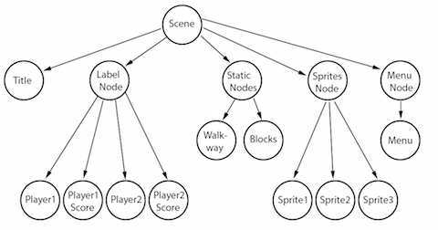
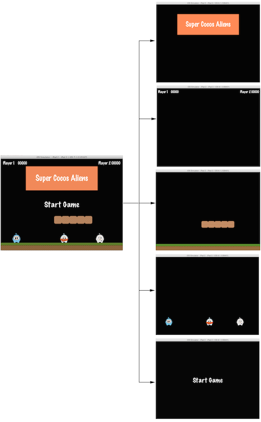

# 4.5 Scene Graph in Cocos2d-JS

## 4.5.1 Scene

In your game you probably want a main menu, a few levels and an ending scene. How do you organize all of these from the separate pieces they are? You guessed it, Scene. When you think about your favorite movie you can see that its distinctly broken down into scenes, or separate parts of the story line. If we apply this same thought process to games, we should be able to come up with at least a few scenes no matter how simple the game is.

Taking another look at one normal game scene:



This is a main menu and it is a single scene. Yes, this scene is made up of several pieces that all fit together to give us the end result. Scenes are drawn by the Renderer. The Renderer is responsible for rendering the sprites and other objects into the scree. To better understand this we need to talk a bit about the Scene Graph.

## 4.5.2 Scene Graph

A scene graph is a data structure that arranges a graphical scene. A scene graph contains Node objects in a tree (yes, it is called screne graph, but it is actually represented by a tree) structure.



It sounds and looks complicated. I'm sure you are asking why should you care about this technical detail if Cocos2d-JS does the heavy lifting for you? It really is important to understand how Scenes are drawn by the renderer. Once you start adding nodes, sprites and animations to your game, you want to make sure you are getting the visual result you are looking for. What if you are not? What if your sprites are in the background and you want them the foremost objects? Take a step back and run through the scene graph on a piece of paper and I bet you find your mistake easily.

Since the Scene Graph is a tree; you can "walk the tree". Cocos2d-JS uses the in-order walk algorithm. An in-order walk is the left side of the tree being walked, then the root node, then the right side of the tree. Since the right side of the tree is rendered last, it is displayed first on the scene graph.


The scene graph is easily demonstrated, let's take a look at the scene in 4.5.1 broken down:



Another point to think about is elements with a negative `zIndex` are on the left side of the tree while elements with a positive `zIndex` are on the right side of the tree. Keep this in consideration when ordering your elements!

Building on this concept, we can think of a Scene as a collection of Node objects. Let's break the scene above down to see How the scene graph uses the `zIndex` to layout out the scene:



The scene on the left is actually made up of multiple Node objects that are given a different `zIndex` to make them "stack" on top of each other.

## 4.5.3 Build up a Scene Graph

In Cocos2d-JS, you build the Scene Graph using the `addChild` API of `cc.Node`, all node classes including `cc.Scene` extend from `cc.Node`.

```
// Create a new scene
var scene = new cc.Scene();

// Adds a node with zIndex of -2, 
// it goes to the "left" side of the tree (because it is negative)
scene.addChild(title_node, -2);

// Adds another node, when you don't specify the zIndex, it will use 0
scene.addChild(label_node);

// Adds a child with the z-order of 1,
// it goes to the "right" side of the tree (because it is positive)
scene.addChild(sprite_node, 1);
```

## 4.5.4 The render of Scene Graph

_TBD_