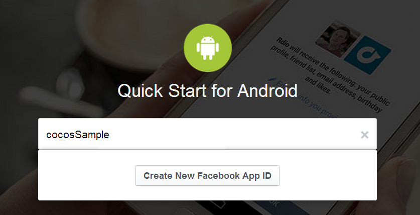
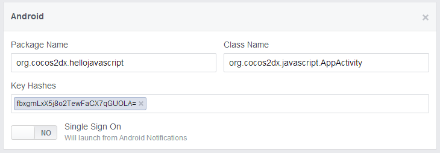

#Android平台上如何集成Facebook SDK for Cocos2d-JS

这篇文档展示如何在Android平台快速地开始使用Facebook SDK for Cocos2d-JS，从创建app，配置SDK到最后的打包成apk。

**注意**: Facebook SDK for Cocos2d-JS需要配合Cocos2d-JS v3.0 RC2及以上版本使用。

##在Facebook上创建应用

在[Facebook开发者页面](https://developers.facebook.com/)点击Apps->Create a New app, 输入应用名，创建自己的新应用。



然后在新创建的app的dashboard页面我们就可以看到它的App ID了。


在app的Settings页面点击add platform,选择Android，然后输入应用的包名，MainActivity的类名以及key hash。



key hash需要使用JDK提供的keytool生成。

在Mac OS X运行：
```
keytool -exportcert -alias <RELEASE_KEY_ALIAS> -keystore <RELEASE_KEY_PATH> | openssl sha1 -binary | openssl base64
```

在Windows运行：
```
keytool -exportcert -alias <RELEASE_KEY_ALIAS> -keystore <RELEASE_KEY_PATH> | openssl sha1 -binary | openssl base64
```

需要输入创建key时的密码。

这样就完成了Facebook App的创建。

##添加Facebook SDK到我们的Cocos2d-JS工程

使用cocos命名行工具创建js工程。然后需要对Android工程做一些修改才可以在js代码中使用Facebook SDK。

**step1**：在frameworks/runtime-src/proj.android/res/values/strings.xml添加app name和app id：

```
<string name="app_name">cocos sample</string>
<string name="app_id">1450063488603945</string>
```

**step2**:在frameworks/runtime-src/proj.android/AndroidManifest.xml添加：

```
<meta-data android:name="com.facebook.sdk.ApplicationId" android:value="@string/app_id" />
<meta-data android:name="PluginUser" android:value="UserFacebook" />
<meta-data android:name="PluginShare" android:value="ShareFacebook" />

<activity android:name="com.facebook.LoginActivity" />
<provider android:authorities="com.facebook.app.NativeAppCallContentProvider1450063488603945"
          android:name="com.facebook.NativeAppCallContentProvider"
          android:exported="true"/>
<receiver android:name="org.cocos2dx.plugin.ShareFacebookBroadcastReceiver">
    <intent-filter>
        <action android:name="com.facebook.platform.AppCallResultBroadcast" />
    </intent-filter>
</receiver>
```

**step3**:在frameworks/runtime-src/proj.android/jni/Android.mk中添加Plugin-x链接库：

```
LOCAL_WHOLE_STATIC_LIBRARIES += jsb_pluginx_static
$(call import-module,cocos2d-x/plugin/jsbindings)
```

**step4**:在frameworks/runtime-src/proj.android/jni/hellojavascript/main.cpp文件中添加:

```
#include "PluginJniHelper.h"
void cocos_android_app_init (JNIEnv* env, jobject thiz) {
    LOGD("cocos_android_app_init");
    AppDelegate *pAppDelegate = new AppDelegate();
    JavaVM* vm;
    env->GetJavaVM(&vm);
    PluginJniHelper::setJavaVM(vm);
}
```

**step5**:在frameworks/runtime-src/proj.android/classes/AppDelegate.cpp中添加：

```
#if (CC_TARGET_PLATFORM == CC_PLATFORM_ANDROID)
#include "jsb_cocos2dx_pluginx_auto.hpp"
#include "jsb_pluginx_extension_registration.h"
#endif

bool AppDelegate::applicationDidFinishLaunching()
{
	//...
#if (CC_TARGET_PLATFORM == CC_PLATFORM_ANDROID)
    sc->addRegisterCallback(register_all_pluginx_protocols);
    sc->addRegisterCallback(register_pluginx_js_extensions);
#endif
	//...
}
```

**step6**:在frameworks/runtime-src/proj.android/build-cg.json文件的`copy_resources`添加：

```
{
    "from": "../../js-bindings/cocos2d-x/plugin/jsbindings/script", 
    "to": ""
},
{
    "from": "../../js-bindings/cocos2d-x/plugin/protocols/proj.android/src", 
    "to": "../src"
},
{
    "from": "../../js-bindings/cocos2d-x/plugin/plugins/facebook/proj.android/src", 
    "to": "../src"
}, 
{
    "from": "../../js-bindings/cocos2d-x/plugin/plugins/facebook/proj.android/sdk", 
    "to": "../libs"
}
```

**step7**:在frameworks/runtime-src/proj.android/project.properties中添加：

```
android.library.reference.2=../../js-bindings/cocos2d-x/plugin/plugins/facebook/proj.android/DependProject
```

**step8**:在frameworks/runtime-src/proj.android/src/org/cocos2dx/javascript/AppActivity.java中添加：

```
import org.cocos2dx.plugin.PluginWrapper;
import com.facebook.Session;
import android.content.Intent;
import android.os.Bundle;

public class AppActivity extends Cocos2dxActivity {

	//...

	@Override
	public Cocos2dxGLSurfaceView onCreateView() {
        Cocos2dxGLSurfaceView glSurfaceView = new Cocos2dxGLSurfaceView(this);
        glSurfaceView.setEGLConfigChooser(5, 6, 5, 0, 16, 8);
        PluginWrapper.init(this);
        PluginWrapper.setGLSurfaceView(glSurfaceView);

        return glSurfaceView;
    }
	
	@Override
	public void onActivityResult(int requestCode, int resultCode, Intent data) {
	    super.onActivityResult(requestCode, resultCode, data);
	    Session.getActiveSession().onActivityResult(this, requestCode, resultCode, data);
	}
	
	@Override
	public void onSaveInstanceState(Bundle outState) {
	    super.onSaveInstanceState(outState);
	    Session session = Session.getActiveSession();
	    Session.saveSession(session, outState);
	}

	//...
}
```

这样就完成了工程的配置，可以开始使用我们的Facebook SDK来编写支持Facebook的应用了

## 如何使用FacebookSDK

如何使用Facebook API 请参考 [Facebook SDK for Cocos2d-JS](../api-reference/zh.md)

## 将项目打包成APK

可以使用Cocos2d-JS自带的console工具在命令行中直接打包项目为Android apk，在项目目录下打开终端或命令行，输入：

```
cocos compile -p android
```

更相信信息请参考[Cocos Console文档](http://www.cocos2d-x.org/docs/manual/framework/html5/v2/cocos-console/zh)