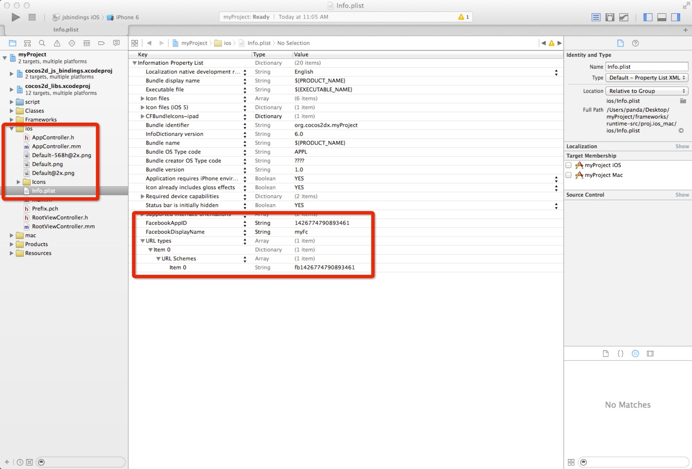

#Facebook Integration for Cocos2d-JS on iOS

This doc walks you through the usage of Facebook Integration for Cocos2d-JS on iOS.

## Create a Facebook App

Please refer to [Step 3. Obtain a Facebook App ID - Getting Started with the Facebook iOS SDK](http://developers.facebook.com/docs/ios/getting-started/#appid) to create a Facebook App on iOS platform.

## Integrate your iOS project

**Step1**: Open the Xcode project file. Assuming the project name is `myProject`, then you can find the it at `myProject/frameworks/runtime-src/proj.ios_mac/`.

**Step2**: Click on the project root, then `target`->`myProject IOS`->`Build Phases`->`Link Binary With Libraries`. Click `+` button to popup a sub window. Then click on `Add Other...` button in the sub window. Then find `FacebookSDK.framework` under `myProject/frameworks/js-bindings/cocos2d-x/plugin/plugins/proj.ios/sdk/` to add it.


**Step3**: Refer to [Step 4: Configure your Xcode Project - Getting Started with the Facebook iOS SDK](http://developers.facebook.com/docs/ios/getting-started/#configure) to add `FacebookAppID`, `FacebookDisplayName`, `URL types` in `Info.plist` file. You can find this file under `ios` folder of your Xcode project. You can see the result below:



**Step4**: Open target `myProject iOS` in the project root, open `Build Settings` page, then search for `Other Linker Flags`, and add `-ObjC` linker flag.


**Step5**: Find `ios/AppController.mm`, add necessary code for Facebook iOS SDK:

- Add header:

	```
	#import <FacebookSDK/FacebookSDK.h>
	```

- Add the following method in the `@implementation` section: 

	```
	- (BOOL)application:(UIApplication *)application openURL:(NSURL *)url sourceApplication:(NSString *)sourceApplication annotation:(id)annotation
	{
	    return [FBSession.activeSession handleOpenURL:url];
	}
	```

- Insert `[FBAppCall handleDidBecomeActive];` in `applicationDidBecomeActive:` function: 

	```
	- (void)applicationDidBecomeActive:(UIApplication *)application {
	    [FBAppCall handleDidBecomeActive];
	    cocos2d::Director::getInstance()->resume();
	}
	```

## Add Plugin-x and PluginFacebook in your project

Because `Facebook Integration for Cocos2d-JS` is based on Plugin-x, you need to add Plugin-x project to your project first.

**Step1**: Right click `myProject`, select `addFiles to "myProject"`, then add `myProject/frameworks/js-bindings/cocos2d-x/plugin/protocols/proj.ios/PluginProtocol.xcodeproj`.

**Step2**: Right click on `myProject`, select `addFiles to "myProject"`, then add `myProject/frameworks/js-bindings/cocos2d-x/plugin/plugins/facebook/proj.ios/PluginFacebook.xcodeproj`.

**Step3**: Click `myProject`, then `target`->`myProject IOS`->`Build Phases`. Then click `+` button of `Target Dependencies` to add `PluginProtocol` and `PluginFacebook` targets. Then click `+` button of `Link Binary With Libraries` list to add `libPluginProtocol.a` and `libPluginFacebook.a`.


## Add Plugin-x for JSB

The next step is to include and register the Javascript bindings code in SpiderMonkey.

**Step1**: Add jsb_pluginx.js (under `myProject/frameworks/js-bindings/cocos2d-x/plugin/jsbindings/script`) into `myProject`, and make sure it is listed in `Copy Bundle Resources` section under `Build Phases` tab.


**Step2**: Find `Classes` folder, add Javascript bindings related header files in `AppDelegate.cpp`, there are two header files: `jsb_cocos2dx_pluginx_auto.hpp` and `jsb_pluginx_extension_registration.h`.

    ```
	#if (CC_TARGET_PLATFORM == CC_PLATFORM_IOS || CC_TARGET_PLATFORM == CC_PLATFORM_ANDROID)
		#include "jsb_cocos2dx_pluginx_auto.hpp"
		#include "jsb_pluginx_extension_registration.h"
	#endif
    ```

**Step3**: As the following code snippet, register Javascript bindings code in `AppDelegate::applicationDidFinishLaunching`function of `AppDelegate.cpp`. **Notice**: Please pay attention to the location of the code.

    ```
    bool AppDelegate::applicationDidFinishLaunching()
	{
	    ...

	    ScriptingCore* sc = ScriptingCore::getInstance();

	    ...

	    // Add these lines before sc->start()
		#if (CC_TARGET_PLATFORM == CC_PLATFORM_IOS || CC_TARGET_PLATFORM == CC_PLATFORM_ANDROID)
			sc->addRegisterCallback(register_all_pluginx_protocols);
			sc->addRegisterCallback(register_pluginx_js_extensions);
		#endif

		sc->start();    
	    
	    ...

	    return true;
	}
    ```


Now we are done with the setup and are ready to use the Facebook API.

To know more details about Plugin-x, please refer to [Plugin-x Architecture](http://www.cocos2d-x.org/docs/manual/framework/html5/jsb/plugin-x/plugin-x-architecture/en) and [Integrate Plugin-x on iOS]().

## How to Use Facebook API

Please visit [Facebook Integration for Cocos2d-JS API Reference](../api-reference/en.md)