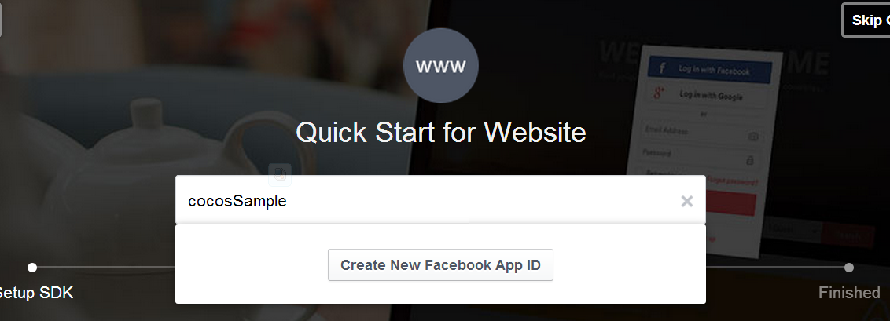
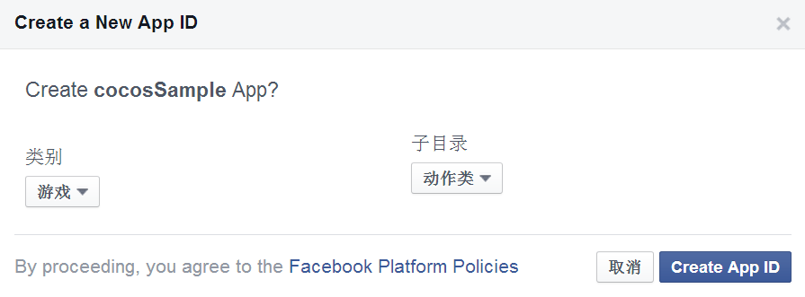
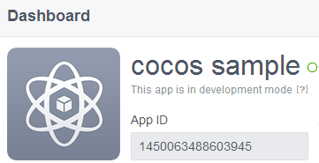

#Web平台上如何集成Facebook SDK Beta for Cocos2d-JS

Web端除了直接使用Facebook提供的Javascript SDK外，Cocos2d-JS也提供了Facebook SDK Beta for Cocos2d-JS插件。
使用Cocos2d-JS的Facebook SDK Beta可以使你的游戏无缝的衔接Android以及iOS平台，你的所有Facebook功能模块可以不修改一行代码就直接运行，使得一份代码能够完整的运行在不同的平台之上。

那么Web端怎么使用Facebook SDK Beta for Cocos2d-JS呢？

##1、在Facebook上创建应用
在[Facebook开发者页面](https://developers.facebook.com/)点击Apps->Add a New app, 选择 网址 平台， 输入应用名，创建自己的新应用。




然后在新创建的app的dashboard页面我们就可以看到它的App ID了。



在app的Settings页面点击add platform,选择"Website", 如果使用的是cocos命令运行web程序那么可以填上如下地址：


## 2. 然后在页面要先引入Facebook SDK Beta

可以有两种方式引入Facebook SDK Beta的依赖：

- 开发者可以在`frameworks/cocos2d-html5/extenrnal`文件夹下找到所有的Facebook SDK Beta的依赖文件，使用下面的代码完成手动加载Facebook SDK Beta（注意JS文件顺序）：

```
cc.loader.loadJs("", [
    "external/pluginx/platform/facebook_sdk.js",
    "external/pluginx/platform/facebook.js"
], function(){
    //do something
});
```

- 或者也直接在project.json文件内modules字段里增加`plugin-facebook`，引擎将会自动加载文件，但是这样可能会造成游戏初始化速度变慢，大家根据自己实际情况做取舍吧。

## 3. 加载完成之后，还必须要配置Facebook传入的参数

还是在`project.json`文件内增加plugin字段,其中appid属性需要添加Facebook提供的应用id：

```
{
    "module" : ["cocos2d", "pluginx", "plugin-facebook"],
    "plugin" : {
        "facebook": {
            "appId" : "", 
            "xfbml" : true,
            "version" : "v2.0"
        }
    }
}
```

## 4. 如何使用Facebook SDK Beta

关于如何使用Facebook API 请参考 [Facebook SDK Beta for Cocos2d-JS](../api-reference/zh.md)