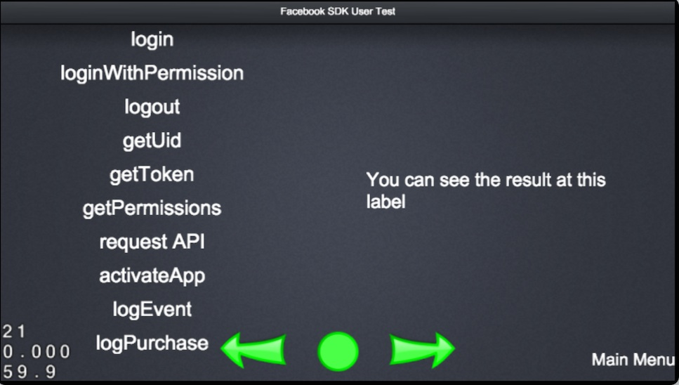

# Explorer Facebook SDK for Cocos2d-JS

## A full featured test case

To make it eaiser for all developers to start developing games with the Facebook SDK, we have provided a complete test case. It have covered all APIs in the SDK and demonstrated how to correctly use them.

If you are not until familiar with Facebook SDK for Cocos2d-JS, we strongly suggest you to take a look at the [Facebook SDK for Cocos2d-JS API Reference](../api-reference/zh.md) document.

## How to run test case

First of all, you need the Cocos2d-JS engine package which can be downloaded [here](http://www.cocos2d-x.org/download).

- Follow the [Cross native / browser game with Cocos Console](http://cocos2d-x.org/docs/manual/framework/cocos2d-js/2-working-environment-and-workflow/2-2-cross-native-browser-game-with-cocos-console/en) document to install the Cocos Console tool.
- Open your terminal / command line tool, open the directory `samples/js-tests/`.
- Run the following command : 
    + `cocos run -p web --port 8080` to run the test case on web.
    + `cocos run -p ios` to run the test case on an iOS simulator (Mac enviroment and Xcode required).
    + `cocos run -p android` to run the test case on an Android device or Android simulator.

## Explorer the Facebook test case

By running the test case project, you will find a `Facebook SDK Test` in the list of test cases.

There are two test cases which demostrate how to use the Facebook SDK.

1. Facebook SDK Sharing Test

    

    All test in this page do not require user to login, you can test the following functionalities:

    - Share different links, an open graph story, a photo to your timeline or to your friends.
    - Send a message to your friends with links, an open graph story or a photo.
    - Send different app requests to your friends.

    APIs covered in this test page:

    - [.getInstance()](../api-reference/get-instance.md)
    - [.canPresentDialog(info)](../api-reference/can-present-dialog.md)
    - [.dialog(info, callback)](../api-reference/dialog.md)
    - [.appRequest(info, callback)](../api-reference/app-request.md)

2. Facebook SDK User Test

    

    In the second test page, you can test other functionalities of the Facebook SDK:

    - Login or logout an user to Facebook.
    - Retrieve the user id.
    - Retrieve the access token.
    - Invoke Open Graph API.
    - Retrieve permissions of your app via Open Graph API.
    - Send an activation event to Facebook.
    - Send an app event log to Facebook.
    - Send an in app purchase log to Facebook.
    - Invoke Facebook payment in canvas app.

    The last four tests can be invoked only in a Facebook Canvas App, and you can test them [on this test page](https://apps.facebook.com/cocostestmyfc/).

    APIs covered in this test page:

    - [.getInstance()](../api-reference/get-instance.md)
    - [.isLoggedIn()](../api-reference/isloggedin.md)
    - [.login(permissions, callback)](../api-reference/login.md)
    - [.logout(callback)](../api-reference/logout.md)
    - [.getUserId()](../api-reference/get-userid.md)
    - [.getAccessToken()](../api-reference/get-accesstoken.md)
    - [.api(path, method, params, callback)](../api-reference/api.md)
    - [.activateApp()](../api-reference/activate-app.md)
    - [.logEvent(eventName, valueToSum, parameters)](../api-reference/log-event.md)
    - [.logPurchase(amount, currency, parameters)](../api-reference/log-purchase.md)
    - [.canvas.pay(info, callback)](../api-reference/pay.md)

## Online test

Besides the test cases in Cocos2d-JS package, we also have a Facebook Canvas App for you to test our Facebook SDK.

[Facebook Canvas Test Case](https://apps.facebook.com/cocostestmyfc/)

## The next step

Next up, I believe you can not wait to create your own Facebook games, so please follow the integration guides to create your Cocos2d-JS project with Facebook SDK integrated.

- [Integrate the Facebook SDK Beta2 for Cocos2d-JS on Android](../facebook-sdk-on-android/en.md)
- [Integrate the Facebook SDK Beta2 for Cocos2d-JS on iOS](../facebook-sdk-on-ios/en.md)
- [Integrate the Facebook SDK Beta2 for Cocos2d-JS on Web](../facebook-sdk-on-web/en.md)