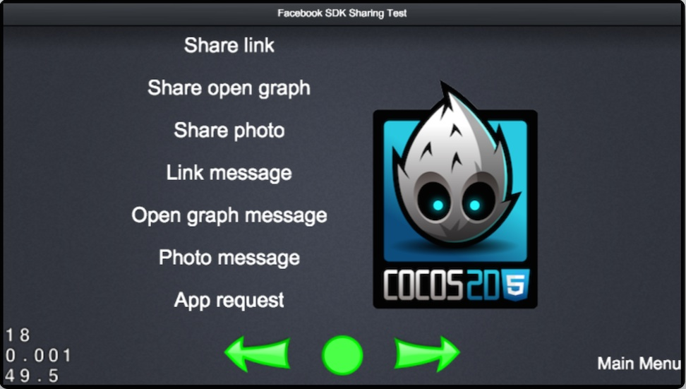

# 探索Cocos2d-JS上接入Facebook Integration

## 全功能测试例项目

为了让更多的游戏开发者更容易的使用Facebook Integration，我们提供了一个完整的测试例项目。其中涉及SDK中所有的API和演示了怎么正确的使用它们。

如果目前还不熟悉 Facebook Integration for Cocos2d-JS，强烈建议你去查看 [Facebook Integration for Cocos2d-JS API Reference](../api-reference/zh.md)文档。

## 如何运行测试例项目

首先，你需要Cocos2d-JS引擎包，你可以从[here](http://www.cocos2d-x.org/download)下载。
- 根据[Cross native / browser game with Cocos Console](http://cocos2d-x.org/docs/manual/framework/cocos2d-js/2-working-environment-and-workflow/2-2-cross-native-browser-game-with-cocos-console/en)文档安装Cocos Console工具。
- 打开终端/命令行工具，进入`samples/js-tests/` 目录。
- 执行以下命令：
    + `cocos run -p web --port 8080`  在web上运行。（设置端口为8080很重要）
    + `cocos run -p ios`  在IOS模拟器上运行（要求Mac环境和Xcode)。
    + `cocos run -p android` 在安卓设备或安卓模拟器上运行。

## 探索Facebook测试例项目

运行测试例项目，你可以看到`Facebook SDK Test`的测试例列表。

下面2个例子演示了如何使用Facebook API

1. 分享测试

    

    此页面的测试例项目不需要用户登入，你就可以测试以下功能：

    - 分享不同的链接，open graph故事，照片到你的timeline或者给你的朋友。
    - 向你的朋友发送带有链接，open graph 故事，照片的消息。
    - 向你的朋友发送应用请求消息。

    本页面所使用到的API：

    - [.getInstance()](../api-reference/get-instance.md)
    - [.canPresentDialog(info)](../api-reference/can-present-dialog.md)
    - [.dialog(info, callback)](../api-reference/dialog.md)
    - [.appRequest(info, callback)](../api-reference/app-request.md)

2. 用户测试

    

    在第二个测试例页面中，你可以测试Facebook的API：

    - 登录或注销Facebook账户。
    - 获取用户id。
    - 获取访问令牌。
    - 调用Open Graph API。
    - 通过Open Graph API获取应用权限。
    - 向Facebook发送激活事件。
    - 向Facebook发送应用事件日志。
    - 向Facebook发送应用内付费日志。
    - 在Canvas App中调用Facebook购买方法。

    最后四个测试例只能在Facebook Canvas App中调用,现在你可以在[ on this test page](https://apps.facebook.com/cocostestmyfc/)测试它们。

    本页面所使用的API:

    - [.getInstance()](../api-reference/get-instance.md)
    - [.isLoggedIn()](../api-reference/isloggedin.md)
    - [.login(permissions, callback)](../api-reference/login.md)
    - [.logout(callback)](../api-reference/logout.md)
    - [.getUserId()](../api-reference/get-userid.md)
    - [.getAccessToken()](../api-reference/get-accesstoken.md)
    - [.api(path, method, params, callback)](../api-reference/api.md)
    - [.activateApp()](../api-reference/activate-app.md)
    - [.logEvent(eventName, valueToSum, parameters)](../api-reference/log-event.md)
    - [.logPurchase(amount, currency, parameters)](../api-reference/log-purchase.md)
    - [.canvas.pay(info, callback)](../api-reference/pay.md)

## 在线测试

除了在Cocos2d-JS包里的测试，同时我们也为你提供了Facebook Canvas App来测试Facebook Integration for Cocos2d-JS。

[Facebook Canvas Test Case](https://apps.facebook.com/cocostestmyfc/)

## 下一步

接下来，相信你已经迫不及待地想去创建自己的Facebook游戏，那么根据集成指南去创建支持Facebook的Cocos2d-JS项目吧。

- [Facebook Integration for Cocos2d-JS on Android](../facebook-sdk-on-android/zh.md)
- [Facebook Integration for Cocos2d-JS on iOS](../facebook-sdk-on-ios/zh.md)
- [Facebook Integration for Cocos2d-JS on Web](../facebook-sdk-on-web/zh.md)
