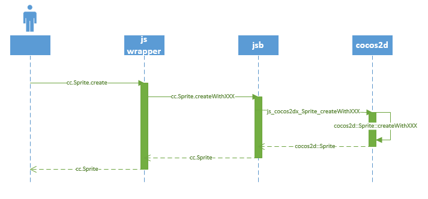
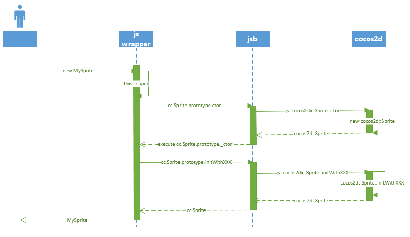

#Cocos2d-js v3.0的对象构造和类继承#

在Cocos2d-JS中，对象的构造方式和Cocos2d-x一样，使用各个类的`create`函数来构造。在Cocos2d-JS v3.0我们还将为你带来一种传统的方式，即使用`new`操作符。另外，在v3.0 alpha1版本中，因为我们还没有找到较好的解决办法，所以不能继承JSB中的引擎类。但是在v3.0 alpha2中，这个问题已经解决了。由于使用`new`操作符，编写继承代码也更加容易了。

在这篇文档中，我们将会介绍如何使用它们，以及简要的实现原理。
##在Cocos2d-js如何构造一个对象##

我们以使用最多的Sprite类作为例子。

开发者有两种方式构造一个Sprite对象：统一的`create`函数和`new`操作符调用构造函数，它们接受相同的参数。在html5和jsb中都支持这2种方式，但是他们的实现原理大不相同。

###1.1 统一的create函数###

在Cocos2-html5 2.x中，我们需要使用不同的create函数来构造精灵，例如：

	var sprite = cc.Sprite.create(filename, rect);
	var sprite = cc.Sprite.createWithTexture(texture, rect);
	var sprite = cc.Sprite.createWithSpriteFrameName(spriteFrameName);

这确实很痛苦，但是在Cocos2d-js 3.0 alpha中，我们只需要一个统一的create函数：

	var sprite = cc.Sprite.create(filename, rect);
	var sprite = cc.Sprite.create(texture, rect);
	var sprite = cc.Sprite.create(spriteFrameName);

为了使它在JSB中同样有效，我们在js层为cc.Sprite.create做了一些包装，所以如果我们使用cc.Sprite.create，将会根据参数的数量和类型调用对应的C++层的create函数。

| Javascript | JSB | Cocos2d-x |
| ---------- |-----|-----------|              
| cc.Sprite._create | js_cocos2dx_Sprite_create | cocos2d::Sprite::create |
| cc.Sprite.createWithSpriteFrame | js_cocos2dx_Sprite_createWithSpriteFrameName | cocos2d::Sprite::createWithSpriteFrameName |
| cc.Sprite.createWithTexture | js_cocos2dx_Sprite_createWithTexture | cocos2d::Sprite::createWithTexture |

如果我们这样使用：
    
    var sprite = cc.Sprite.create(texture,cc.rect(0,0,480,320));

事实上我们调用的c++代码是:

	cocos2d::Sprite* ret = cocos2d::Sprite::createWithTexture(arg0, arg1);

这个过程的顺序图如下:

###2.构造函数###

另一个重要的改进是我们现在可以直接使用`new`操作符来调用类的构造函数了。例如，我们可以这样来构造一个Sprite对象：

	var sprite = new cc.Sprite(filename, rect);
	var sprite = new cc.Sprite(texture, rect);
	var sprite = new cc.Sprite(spriteFrameName);

在html5引擎中，我们重构了所有引擎类的`ctor`函数，使它们可以接受和create函数相同的参数。

在JSB中如果使用new操作符来调用cc.Sprite的构造函数，我们实际上在C++层会调用js\_cocos2dx\_Sprite\_constructor函数。在这个C++函数中，会为这个精灵对象分配内存，并把它添加到自动回收池，然后调用js层的`_ctor`函数来完成初始化。在`_ctor`函数中会根据参数类型和数量调用不同的init函数，这些init函数也是C++函数的绑定：

| Javascript | JSB | Cocos2d-x |
| ---------- |-----|-----------|              
| cc.Sprite.initWithSpriteFrameName | js_cocos2dx_Sprite_initWithSpriteFrameName | cocos2d::Sprite::initWithSpriteFrameName |
| cc.Sprite.initWithSpriteFrame | js_cocos2dx_Sprite_initWithSpriteFrame | cocos2d::Sprite::initWithSpriteFrame |
| cc.Sprite.initWithFile | js_cocos2dx_Sprite_initWithFile | cocos2d::Sprite::initWithFile |
| cc.Sprite.initWithTexture | js_cocos2dx_Sprite_initWithTexture | cocos2d::Sprite::initWithTexture |

这个过程的顺序图如下:

##继承##

在Cocos2d-html5 2.x中，当我们继承一个类时，我们需要在`create`函数中使用不同的init函数，例如：

	var MySprite = cc.Sprite.extend({
		ctor:function(){
			this._super();
			// 自定义初始化
		}
		// 添加自己的属性和方法
	});
	MySprite.create = function(filename,rect){
		var sprite = new MySprite();
		// 使用材质和矩形区域初始化
		sprite.initWithTexture(fileName, rect);
		return sprite;
	};
    
    // 创建你的精灵
    var sprite = MySprite.create(texture,cc.rect(0,0,480,320));

在Cocos2d-JS中，我们只需要编写带有正确参数的ctor函数，并调用_super函数就可以了。

	var MySprite = cc.Sprite.extend({
		ctor:function(filename,rect){
			this._super(filename,rect);
			// 自定义初始化
		}
		// 添加自己的属性和方法
	});
    
    // 创建你的精灵
    var sprite = new MySprite(texture,cc.rect(0,0,480,320));

在html5引擎中这很好理解，因为我们支持使用`new`操作符。

但在JSB中这有点复杂，在`_super`函数中我们会调用Sprite的C++层ctor函数：`js_cocos2dx_Sprite_ctor`，这个函数不仅实例化精灵对象，也会调用`cc.Sprite.prototype._ctor`并传递参数。`_ctor`函数对精灵类真正的初始化函数做了封装，会根据传递的参数来调用不同的初始化函数，这样我们最终就完成了自定义ctor函数的执行。

这个过程的顺序图如下：

