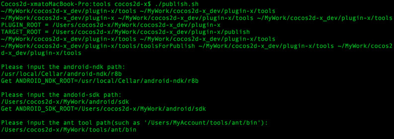
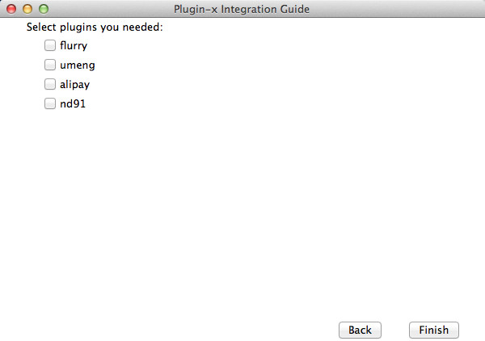

#如何在Android上使用plugin-x

##需要的环境
- python 2.7 [http://www.python.org](http://www.python.org)
- Ant [http://ant.apache.org](http://ant.apache.org)
- Cygwin (如果使用windows)

##编译插件
首先，我们需要编译libPluginProtocal和所有我们需要的插件。在`frameworks/js-bindings/cocos2d-x/plugin/tools/config.sh`文件中，删掉`ALL_PLUGINS`里我们不需要的插件。然后在终端（windows上需要使用cygwin）运行`frameworks/js-bindings/cocos2d-x/plugin/tools/publish.sh`脚本，它会要求输入一些环境变量的配置。



在windows上，我们需要输入Linux风格的路径。例如，你应该输入`C:/adt-bundle-windows/sdk`，而不是`C:\adt-bundle-windows\sdk`。

所有编译完成以后，会在plugin-x的根目录下生成一个publish文件夹。如果你的publish文件夹看起来和下图一样，说明你的编译成功了！


##修改你的游戏工程

###我们需要做哪些修改?

- 修改.mk文件(Android.mk & Application.mk)来链接plugin-x生成的C++静态库。
- 修改android工程配置链接plugin-x和第三方SDK库的jar包。
- 修改AndroidManifest.xml，增加一些插件需要的权限。
- 对一些特定的插件，还要添加外部依赖项目和资源。
- 增加一些初始化代码。

###使用脚本工具
如果你是一个android开发的专家，你完全可以自己完成这些修改。这很容易，不是吗？不，一点也不！幸运的是我们有一个脚本工具来完成大部分的修改。在你的终端（windows上使用cygwin）里运行`frameworks/js-bindings/cocos2d-x/plugin/tools/gameDevGuide.sh`脚本，它会有一个python写的UI界面，看起来像这样：


输入你的工程路径，注意不能含有空格，然后点击'Next'。



选择你需要的插件，然后点击'Finish',程序会自动完成需要做的修改。

###一些手工修改

- 把publish文件夹路径添加到NDK\_MODULE\_PATH环境变量，例如: NDK\_MODULE\_PATH=${PLUGIN_ROOT}/publish

- 在jni/main.cpp中添加代码:

```
#include "PluginJniHelper.h"
void cocos_android_app_init (JNIEnv* env, jobject thiz) {
    LOGD("cocos_android_app_init");
    AppDelegate *pAppDelegate = new AppDelegate();
    JavaVM* vm;
    env->GetJavaVM(&vm);
    PluginJniHelper::setJavaVM(vm);
}
```

- 在AppActivity.java中添加代码:

```
import org.cocos2dx.plugin.PluginWrapper;

public class AppActivity extends Cocos2dxActivity {
    public Cocos2dxGLSurfaceView onCreateView() {
        Cocos2dxGLSurfaceView glSurfaceView = new Cocos2dxGLSurfaceView(this);
        glSurfaceView.setEGLConfigChooser(5, 6, 5, 0, 16, 8);

        PluginWrapper.init(this);
        PluginWrapper.setGLSurfaceView(glSurfaceView);
        return glSurfaceView;
    }
}
```
##在js代码中使用plugin-x

###装载和卸载插件
所有的插件都是使用PluginManager管理，通过插件名来装载/卸载，例如：

```
// load plugin AnalyticsFlurry
var g_pAnalytics = plugin.PluginManager.getInstance().loadPlugin("AnalyticsFlurry");

// unload plugin AnalyticsFlurry
plugin.PluginManager.getInstance().unloadPlugin("AnalyticsFlurry");
```

###使用插件功能

你可以通过方法名和参数直接调用插件中定义的方法，例如：

```
// enable the debug mode
g_pAnalytics.setDebugMode(true);
g_pAnalytics.startSession(s_strAppKey);
g_pAnalytics.setCaptureUncaughtException(true);

// call function with params
g_pAnalytics.callFuncWithParam("setUserId", new plugin.PluginParam(plugin.PluginParam.ParamType.TypeString, "123456"));
```