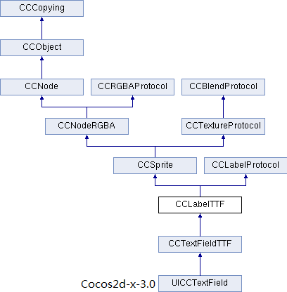
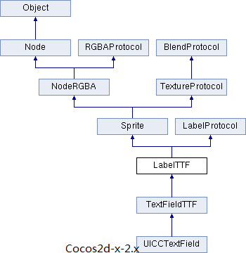

#Improve Label in Cocos2d-x-3.0

Before the Cocos2d-x-3.0, there are three classes that can add text label on layers and sprites,which are CCLabelTTF, CCLabelBMFont and CCLabelAtlas.

Cocos2d-x 3.0 makes some improvements, it keeps compatible with previous version, keep LabelTTF, LabelBMFont and LabelAtlas with minor changes and also provides another class named Label to handling text rendering.

So there are four classes that can add text label: Label, LabelTTF, LabelBMFont and LabelAtlas. The new Label in v3.0 works with freetype and gives you the same visual effect
on different platforms. It's quicker than previous version with cache strategy.

And also it offers tracing, shadow and many more features to be ready to put aside your LabelTTF and LabelBMFont.


Changes:

1. Remove the CC prefix of class, struct and macro. Remove Hungarian naming convention, such as m, p, etc.
2. Change certain data type of parameters and return type in the member functions. For example, char was replaced by string, unsigned int was replaced by long, etc.
3. Change the name and attribute values ​​of some enum types;
4. Add const modifier to member function, such as `float getFontSize() const;`, improving the robustness of the program.

## Similar changes

### 1.Comparison of the inheritance relationship
1.In v3.0 version ,all classes have removed the CC prefix and also remove the CCCopying class. Such as:

CCLabelTTF and LabelTTF 






### 2.The definition of Horizontal alignment and vertical alignment are changed

In V2.x version

```
	static CCLabelTTF * create(const char *string, const char *fontName, float fontSize,
	　　                               const CCSize& dimensions, CCTextAlignment hAlignment, 
	　　                               CCVerticalTextAlignment vAlignment);
```

In V3.0 version
```
	static LabelTTF * create(const std::string& string, const std::string& fontName, float fontSize,
	　　                             const Size& dimensions, TextHAlignment hAlignment,
	　　                             TextVAlignment vAlignment);
```


As the example above, you can see a number of changes in the function of the upgrade version. Firstly, there isn't CC prefix any more;

Secondly, char array has been replaced by a string type(The string is relatively  more advanced and more convenient to use. The char array operation is much more error prone,
but the efficiency is higher); In addition, the type of last two parameters(horizontal and vertical alignment of the text) are also changed,
but they have the similar efficiency as the previous version, only the name has changed as follows:


| |*cocos2d-x-2.x*|*cocos2d-x-3.0*|
|---------------|---------------|---------------|
|horizontal alignment|`typedef enum{kCCTextAlignmentLeft,kCCTextAlignmentCenter,kCCTextAlignmentRight,} CCTextAlignment;`|`enum class TextHAlignment{LEFT,CENTER,RIGHT};`|
|vertical alignment|`typedef enum{kCCVerticalTextAlignmentTop, kCCVerticalTextAlignmentCenter,kCCVerticalTextAlignmentBottom,} CCVerticalTextAlignment;`|`enum class TextVAlignment{TOP,CENTER,BOTTOM};`|


## Different changes
 
LabelBMFont removed the function:

``` 
	CCBMFontConfiguration* getConfiguration() const;
```

So you can't call this function to get _configuration(FNT file configuration properties) in v3.0 version any more.


## Extension
### New Label class


Let's look at the hierarchy chart of the Label class :


In the above chart, LabelTextFormatProtocol is also a new class, it is  similar as LabelProtocol,  they are all pure virtual classes which provide a interface to store strings.

Here is the inheritance graph:


-----------------------------


Static Public Member Functions of Label class:
```
	static Label* createWithTTF(const std::string& label, const std::string& fontFilePath, int fontSize, int lineSize = 0, TextHAlignment alignment = TextHAlignment::CENTER, GlyphCollection glyphs = GlyphCollection::NEHE, const char *customGlyphs = 0);    
	static Label* createWithBMFont(const std::string& label, const std::string& bmfontFilePath, TextHAlignment alignment = TextHAlignment::CENTER, int lineSize = 0);
```

 
* CreateWithTTF () function can create Label directly from TTF file(TTF is a file extension for a font file developed by Apple. TTF stands for True Type Font.
TTF files are currently used by both Apple and Microsoft as a raster font format).

The way of creating Label with this function is similar to the way of creating LabelTTF(previous CCLabelTTF). The difference is LabelTTF class create font label from font name,
but Label class create font label directly through a ttf file.

Look at a piece of code as follows, creating a label with LabelTTF and Label: 
```
	auto label1 = LabelTTF::create("Creating label through LabelTTF class by file name", "myFontName", 24);
	label1->setPosition(Point(origin.x, origin.y + visibleSize.height - label1->getContentSize().height));
	label1->setAnchorPoint(Point(0.0f, 0.0f));
    this->addChild(label1);

	auto label2 = Label::createWithTTF("Create label through Label class by .ttf file","fonts/myFontName.ttf", 32);
	label2->setPosition(Point(origin.x, origin.y + visibleSize.height - 80));
	label2->setAlignment(TextHAlignment::LEFT);
	label2->setAnchorPoint(Point(0.0f, 0.0f));
	this->addChild(label2);
```
Run the program and you will get the following screenshot:


LabelTTF class uses the system font to generate the correct font.

Here is a method to set the alignment of a label:
```
	label2->setAlignment(TextHAlignment::LEFT)；	//Set the text level alignment is aligned to the left
```

* CreateWithBMFont() can create Label with FNT file,it is similar to LabelBMFont. Look at a piece of code as follows, creating a label through LabelBMFont and Label: 

```
	auto label3 = LabelBMFont::create("Create label through LabelBMFont class by .fnt file", "fonts/helvetica-32.fnt");
	label3->setAnchorPoint(Point(0.0f, 0.0f));
	label3->setPosition(Point(origin.x, origin.y + visibleSize.height - 120));
	addChild(label3);

	auto label4 = Label::createWithBMFont("Create label through Label class by .fnt file", "fonts/konqa32.fnt");
	label4->setAnchorPoint(Point(0.0f, 0.0f));
	label4->setPosition(Point(origin.x, origin.y + visibleSize.height - 160));
	addChild(label4 );
```

Run the program and you give get the following screenshot:


To use the LabelBMFont class, you need to add the font files into your project, including a PNG file and a FNT file. The Label class has the same requirement.
FNT file contains the name of the corresponding image (Image contains all  characters that you want to draw), the corresponding unicode  of characters,
the coordinates, width and height of characters in the image.

You can change some attributes of your label4 by simply calling the member function like the following:

	auto size = label4->getLabelContentSize();
	CCLOG("Label content size: %.2fx%.2f", size.width, size.height);
	auto lineWidth = label4->getMaxLineWidth();
	CCLOG("lineWidth: %.2f", lineWidth);
	auto s = label4->getStringLenght();
	CCLOG("string lenght:%.2f", s);
	label4->setScale(2.0f);							//Changes both X and Y scale factor of the label4
	label4->setColor(Color3B::GREEN);				//Changes the color
	label4->setOpacity(127);						//Changes the opacity. 
	auto CChar = (Sprite*)label4->getLetter(0);		//get the frist letter of label, each letter of the label can be treated like an CCSprite.
	auto jump = JumpBy::create(0.5f, Point::ZERO, 60, 1);
	auto jump_4ever = RepeatForever::create(jump);
	CChar->runAction(jump_4ever);


Run the program to see the difference:


