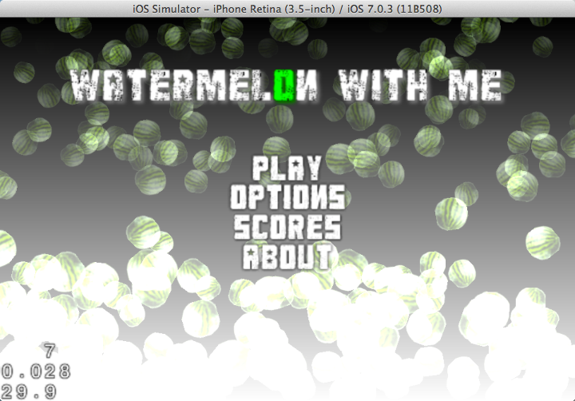
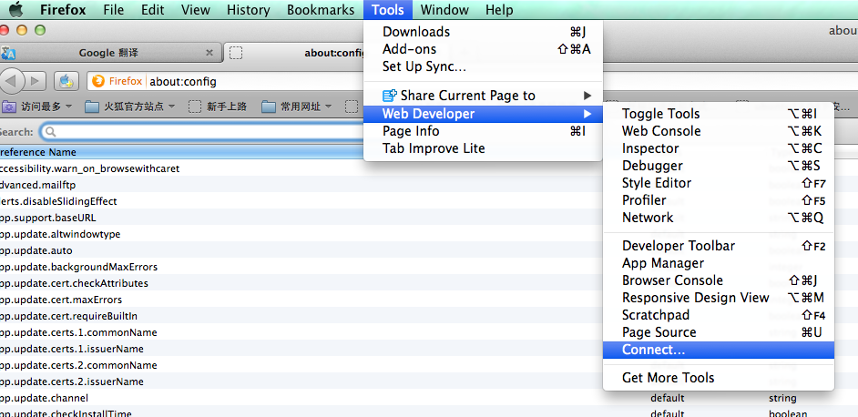
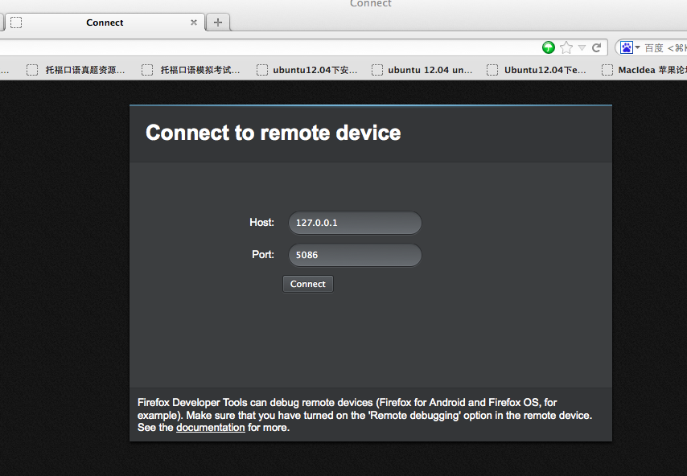
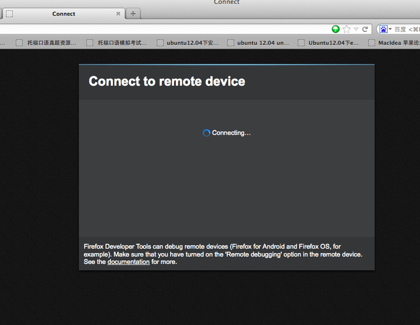
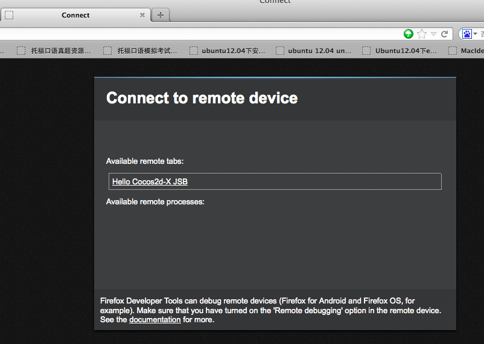
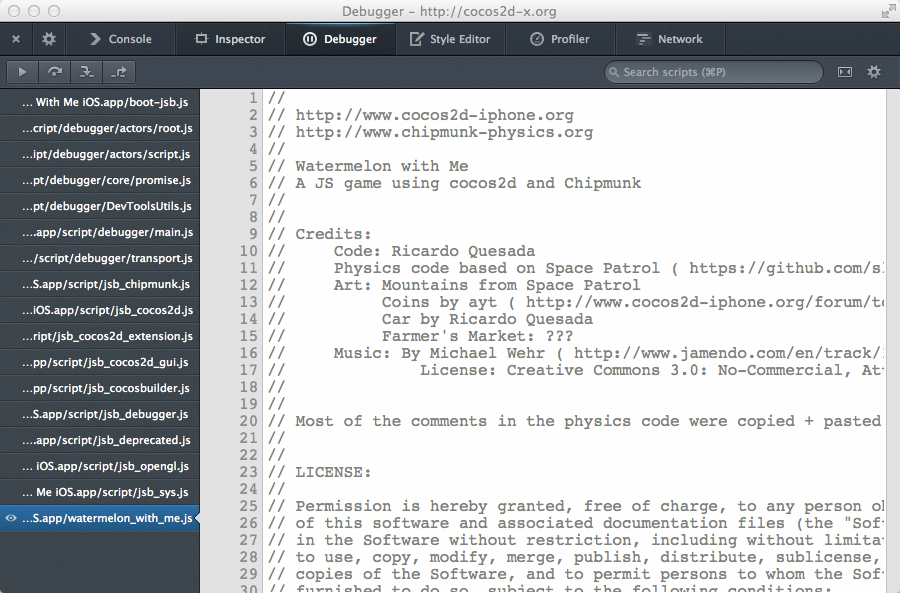
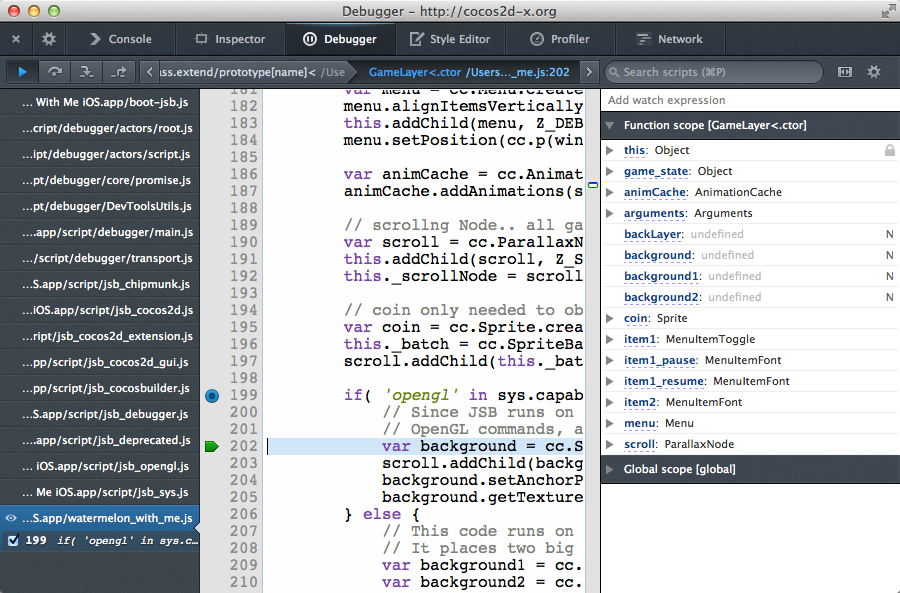

Javascript Remote Debugging by Firefox
======================================

Cocos2d-x JSB is a good way for build a 2d game. It's easier and cost less time than C++ to develop a game. However, before Version 3.0aplha1 you can not debug JSB project as C++. It's annoying that we can do nothing when issues appared. Now we introduced a solution that allows you debugging JSB project just like C++, it's convinent and efficient.

### Requirement

* Cocos2d-x Version 3.0 alpha1
* Firefox   Version 24 and above

**Debugging Enviroment** (This debug solution is also applicable to other enviroments)

* Mac OS X 10.9
* Xcode 5.02

### Preparation

1. Open the Firefox and input **about:config** in address bar to change some default options.

2. You have to change three default options as follow:

Preference Name                  | Status   | Type    | Value 
---------------------------------|----------|---------|-------
devtools.debugger.remote-enabled | user set | boolean | true
devtools.debugger.remote-host    | user set | string  | 127.0.0.1
devtools.debugger.remote-port    | user set | string  | 5086

### Turn to project code

Before you can debug JSB project by this mean, you have to enable this function in your project. Add following codes in **AppDelegate.cpp**:

```
bool AppDelegate::applicationDidFinishLaunching()
{
    ...
    
    ScriptingCore* sc = ScriptingCore::getInstance();
    sc->addRegisterCallback(register_all_cocos2dx);
    sc->addRegisterCallback(register_all_cocos2dx_extension);
    sc->addRegisterCallback(register_cocos2dx_js_extensions);
    sc->addRegisterCallback(jsb_register_chipmunk);
    sc->addRegisterCallback(register_all_cocos2dx_extension_manual);
    sc->addRegisterCallback(register_CCBuilderReader);
    sc->addRegisterCallback(jsb_register_system);
    sc->addRegisterCallback(JSB_register_opengl);
    
    sc->start();
    
    // These codes should be added in here
#if defined(COCOS2D_DEBUG) && (COCOS2D_DEBUG > 0)
    sc->enableDebugger();   // Enable debugger here
#endif

   ...
}
```

### Time to check out the JSB remote-debugger

There are three steps before achieving your goal. This debugging method is based on Firefox's Web Developer Tools, so you have to connect your project with Firefox.

#### Run your project

First thing you have to do is run your project in Xcode. Then you can connect the Firefox to it. Here we take **WatermelonWithMe** as example to show you how to debug JSB project. You can open the project in this path **cocos2d-x-3.0alpha1/build/cocos2d_samples.xcodeproj**, and select right project to run as follow:





#### Connect Firefox to your project

As you run the project in Xcode, connect Firefox with it by select **Tools->Web Developer->Connect...**



Then you'll see following pictures:



Click **Connect**, and select **Hello Cocos2d-X JSB**





Now you can use debugger to debug your JSB project. 



### Debug your Project

There are two way you can use to debug your JSB project by this mean-Set BreakPoints and Step Over.

#### Set Breakpoints

Select a js file that you are going to debug, then set breakpoints just like what you do with C++. Press **F8** to start debug, you'll see some informations about the variables and arguments as follow:


#### Step Over

Sometime you need to jump to a loop or a method to find the issue, so in this circumstance you want to use **Step Over** debugging. Luckily JSB remote-debugger provide this function, which can help you find bugs easier.



#### Step In

Although we haven't implemented **Step In** in remote-debugger, but we can set breakpoint in loop for method to achieve the same goal.
