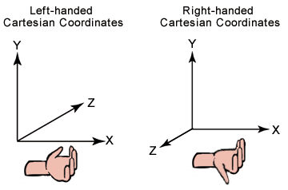
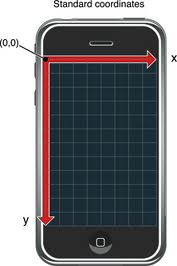
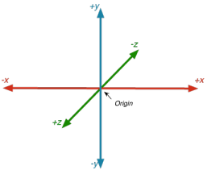
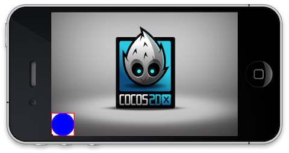
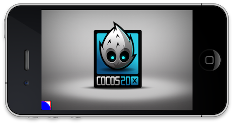
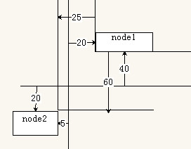

# Coordinate System 坐标系统

## 不同坐标系统介绍
### 笛卡尔（Cartesian）坐标系统

你可能在学校就听过著名的“笛卡尔坐标系统”，这个系统在几何课中大量用到。如果忘了，以下图像会很快让你回想起来。

在移动游戏开发中你会遇到3种坐标系统。

### UI坐标系统

一般来说UI坐标系统用于iOS/Android/Windos平台SDK中：

- 原点（x=0, y=0）位于屏幕左上角
- X轴向屏幕左侧向右侧延伸
- Y轴从屏幕顶部向底部延伸

如图所示

### Direct3D坐标系统

DirectX坐标系统使用的是左手式的笛卡尔坐标（参考笛卡尔坐标图）。

### OpenGL及Cocos2d坐标系统

Cocos2d-x/-html5/-iphone使用的坐标系统与OpenGL坐标系统一样，为“右手式的笛卡尔坐标系统”（参考笛卡尔坐标图）。          

在2D游戏开发中我们只用到X轴和Y轴。所以在cocos2d游戏中：

- 原点（x=0, y=0）位于屏幕左下角，也就是说屏幕位于右手式笛卡尔坐标系统的第一个四分位。
- X轴始于屏幕左侧，向右侧延伸
- Y轴始于屏幕底部，向顶部延伸

下图会有助于你更好地了解cocos2d-x坐标系统。

注意：本坐标与常用的UI坐标系统和DirectX坐标系统不同。

## 父类和子类

每个从“**CCNode**”（最后cocos2d-x类）继承的类都会有锚点（anchorPoint）属性。
在决定从哪开始画对象（精灵、层等等）时，cocos2d-x会结合属性位置和锚点。此外在旋转对象时，cocos2d-x也会随着锚点而旋转。
我们创建一个精灵作为灰色父类，再创建一个精灵作为蓝色子类，将父类的位置设置为“cpp(100, 100)”，将子类的锚点设在圆中心。

    CCSprite* parent = CCSprite::create("parent.png");
    parent->setAnchorPoint(ccp(0, 0));// Anchor Point
    parent->setPosition(ccp(100, 100));
    parent->setAnchorPoint(ccp(0, 0));
    addChild(parent);

    //create child 
    CCSprite* child = CCSprite::create("child.png");
    child->setAnchorPoint(ccp(0.5, 0.5));
    child->setPosition(ccp(0, 0));
    parent->addChild(child);//add child sprite into parent sprite.

子类位置设在“cpp(0, 0)”，父类位置为cpp(100, 100)，子类位置如图所示。

## 锚点

在定位和旋转对象时都会用到锚点。锚点坐标是相对坐标，通常对应对象内的某个点。例如，锚点cpp(0.5, 0.5)对应对象的中心。在设置对象位置时，锚点的位置会位于“setPosition()”函数中指定的坐标中。同理，旋转对象时，对象也会围绕锚点而旋转。

例如，这个精灵锚点为cpp(0, 0)，位置为cpp(0, 0)。

那么精灵的位置如图所示，而锚点（左下角）的位置位于父层的左下角。

	// create sprite
	CCSprite* sprite = CCSprite::create("bottomleft.png");
	sprite->setAnchorPoint(ccp(0, 0));// Anchor Point
	sprite->setPosition(ccp(0,0));
	addChild(sprite);

从以下样例中可以看出锚点坐标的相对性。锚点位置为cpp(0.5, 0.5)，对应精灵的中心点。

	// create sprite
	CCSprite* sprite = CCSprite::create("center.png");
	sprite->setAnchorPoint(ccp(0.5, 0.5));// Anchor Point
	sprite->setPosition(ccp(0,0));
	addChild(sprite);

如图所示，精灵中心位置为cpp(0, 0)，此外锚点并不是一个像素值。锚点的X值和Y值与节点的大小有关。

## getVisibleSize，getVisibleOrigin及getWinSize 

*   [getVisibleSize](http://www.cocos2d-x.org/reference/native-cpp/db/d7f/classcocos2d_1_1_c_c_director.html#a7cc45ff42a969700f878bb2485adf3b1)
*   [getVisibleOrigin](http://www.cocos2d-x.org/reference/native-cpp/db/d7f/classcocos2d_1_1_c_c_director.html#af991a412cb6621bf25ec655a95deddaa)
*   [getWinSize](http://www.cocos2d-x.org/reference/native-cpp/db/d7f/classcocos2d_1_1_c_c_director.html#aa78f85a3666553d0d4fe73118e0c82ac)

“VisibleSize”返回OpenGL视图的可视大小。如果不调用“CCEGLView::setDesignResolutionSize()”，其返回值等于“getWinSize”。

“getVisibleOrigin”返回OpenGL点视图的可视原点。欲了解更多信息，请参考多分辨率支持。

## 如何转换坐标
### convertToNodeSpace

“convertToNodeSpace”会在基于大型瓷砖地图的游戏中用到。           
“convertToNodeSpace”会将你的OpenGL触摸坐标转换为“.tmx”地图坐标或类似坐标。       

例如：

下图显示节点1（note1）锚点（0,0）及节点2（node2）锚点（1,1）。
这时调用CCPoint point = node1->convertToNodeSpace(node2->getPosition()); 将节点2的SCREEN屏幕坐标转换为节点1的本地坐标。因此节点2坐标变为（-25,-60）。

### convertToWorldSpace

convertToWorldSpace(const CCPoint& nodePoint)会将节点上（on-node）坐标转换为SCREEN屏幕坐标。“convertToWorldSpace”会一直返回精灵的SCREEN屏幕坐标，如果你想捕获落到精灵上的点击事件，这点可能会有所帮助，但你需要移动或改变层大小。
一般来说，父类节点对子类使用这个方法，返回子类在屏幕上的位置。如果调用方不是父类的话，那调用这个方法就没有意义。
例如：

	CCPoint point = node1->convertToWorldSpace(node2->getPosition()); 

上述代码将会将节点2的坐标转换为屏幕上的坐标。
例如，如果节点1的锚点位置为（0,0），即锚点在节点1的左下角，但不一定会在屏幕上。这种方法会将节点2的位置（-5, -20）转换到屏幕坐标上，（-5, -20）的屏幕坐标与节点1（这里为（15, 20））相对。结果如图所示：

### convertToWorldSpaceAR

“convertToWorldSpaceAR”会返回与锚点相对的位置：所以如果场景中，根层有个锚点为cpp（0.5f, 0.5f），默认情况下，“convertToWorldSpaceAR”应该会返回相对于屏幕中心的位置。

“convertToNodeSpaceAR”函数的逻辑与“convertToWorldSpaceAR”相同。

### 样本代码：

	CCSprite *sprite1 = CCSprite::create("CloseNormal.png");
	sprite1->setPosition(ccp(20,40));
	sprite1->setAnchorPoint(ccp(0,0));
	this->addChild(sprite1);
	CCSprite *sprite2 = CCSprite::create("CloseNormal.png");
	sprite2->setPosition(ccp(-5,-20));
	sprite2->setAnchorPoint(ccp(1,1));
	this->addChild(sprite2);
	CCPoint point1 = sprite1->convertToNodeSpace(sprite2->getPosition());
	CCPoint point2 = sprite1->convertToWorldSpace(sprite2->getPosition());
	CCPoint point3 = sprite1->convertToNodeSpaceAR(sprite2->getPosition());
	CCPoint point4 = sprite1->convertToWorldSpaceAR(sprite2->getPosition());
	CCLog("position = (%f,%f)",point1.x,point1.y);
	CCLog("position = (%f,%f)",point2.x,point2.y);
	CCLog("position = (%f,%f)",point3.x,point3.y);
	CCLog("position = (%f,%f)",point4.x,point4.y);

结果：

	position = (-25.000000,-60.000000)
	position = (15.000000,20.000000)
	position = (-25.000000,-60.000000)
	position = (15.000000,20.000000)

## 参考

-   [Coordinate Systems (Direct3D 9) Windows](http://msdn.microsoft.com/zh-cn/library/windows/desktop/bb204853(v=vs.85).aspx) from Microsoft MSDN
-   [How to make a simple iphone game with cocos2d tutorial](http://www.raywenderlich.com/352/how-to-make-a-simple-iphone-game-with-cocos2d-tutorial) written by Ray Wenderlich
-   [Coordinate Systems of cocos2dx](http://blog.163.com/zjf_to/blog/static/201429061201292193855498/)
