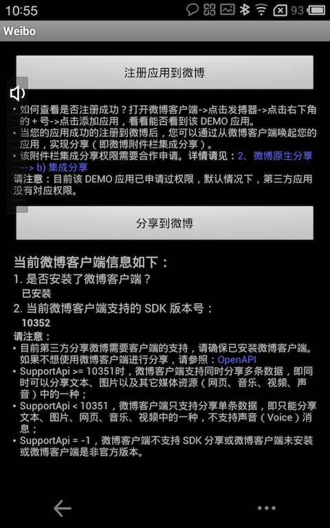

# cocos2d-x如何调用android接口

- [写在前面的话](# 写在前面的话)
- 关于新浪SDK
- jni详解
- jnihelper使用
- android调试指南
- cocos2d-x集成新浪微博

## 写在前面的话

对于cocos2d-x开发者而言，游戏对多平台的支持是一个刚需，一般而言需要支持Android和iOS。然而，在开发过程中，android平台遇到的一系列问题着实让人头疼，本文以集成新浪微博分享SDK为例，从3个方面讲解Cocos2d-x在Android平台开发遇到的问题和解决方法。

ps. 如果你是新手，请先阅读[Cocos2d-x的Android环境搭建]()

## 关于新浪SDK

目前微博SDK为开发者提供 Oauth2.0 Web 授权认证，并集成 SSO 登录功能。你可以在这里下载android版本的SDK：
[https://github.com/sinaweibosdk/weibo_android_sdk](https://github.com/sinaweibosdk/weibo_android_sdk)

在 'readme.md' 中，可以看到普通JAVA应用程序的集成方式，所以，Oauth2.0和如何申请AppKey等问题，我们就不再啰嗦。但是对于Cocos2d-x游戏而言，坑爹的问题就出现了：SDK是用Java实现，那我们怎样在C++程序中调用Java接口呢？

接下来主角就出现了：JNI

## jni详解

### 介绍

JNI是JVM实现中的一部分，因此Native语言和Java代码都运行在JVM的宿主环境。JNI的出现使得开发者既可以利用Java语言跨平台、类库丰 富、开发便捷等特点，又可以利用Native语言的高效。

JNI是一个双向的接口：开发者不仅可以通过JNI在Java代码中访问Native模块，还可以在 Native代码中嵌入一个JVM，并通过JNI访问运行于其中的Java模块。可见，JNI担任了一个桥梁的角色，它将JVM与Native模块联系起来，从而实现了Java代码与Native代码的互访。

如下图：


缺点：由于Native模块的使用，Java代码会丧失其原有的跨平台性和类型安全等特性。但是这不是我们应该担心的，不是吗？哈哈

也就是说，JNI是帮助游戏在Java代码中调用Native接口和在Native代码中调用Java接口。

### 方法1. 基本使用

#### c++接口

一般来说，要在Native代码中访问Java对象，有如下几个步骤：

1.  得到该Java对象的类定义。JNI定义了jclass 这个类型来表示Java的类的定义，并提供了FindClass接口，根据类的完整的包路径即可得到其jclass 。

2.  根据jclass 创建相应的对象实体，即jobject 。在Java中，创建一个新对象只需要使用new 关键字即可，但在Native代码中创建一个对象则需要两步：首先通过JNI接口GetMethodID得到该类的构造函数，然后利用NewObject接口构造出该类的一个实例对象。

3.  访问jobject 中的成员变量或方法。访问对象的方法是先得到方法的Method ID，然后使用Call<Type>Method 接口调用，这里Type对应相应方法的返回值——返回值为基本类型的都有相对应的接口，如CallIntMethod；其他的返回值（包括String） 则为CallObjectMethod。可以看出，创建对象实质上是调用对象的一个特殊方法，即构造函数。访问成员变量的步骤一样：首先 GetFieldID得到成员变量的ID，然后Get/Set<Type>Field读/写变量值。

所以，Native端的登陆接口实现如下：

```
int WebAbility_WeiboLogin(const char *clientID, const char *redirector) {
    *pEnv = getVMEnvironment();
    jclass JavaClass;
    JavaClass = (*pEnv)->FindClass(pEnv,"com/Tyran/weiboSDK");
	jmethodID methId = getMethodID(pEnv,JavaClass,"WeiboLogin", JNI_TRUE);
	jstring idStr = (*pEnv)->NewString(pEnv,clientID, getUcsLen(clientID));
	jstring redirectorStr = (*pEnv)->NewString(pEnv,redirector, getUcsLen(redirector));
    (*pEnv)->CallStaticVoidMethod(JavaClass, methId,idStr,redirectorStr);
    return JNI_TRUE;
}
```

要注意的地方：


1.  FindClass要写明Java类的完整包路径，并将 “.”以“/”替换；

2.  GetMethodID的第三个参数是方法名（对于构造函数一律用“<init>”表示），第四个参数是方法的“签 名”，需要用一个字符串序列表示方法的参数（依声明顺序）和返回值信息。

#### java接口

同样的，我们需要在java端创建一个登陆接口，用于调用验证框的webview：

```
public static void WeiboLogin(String clientID, String redirector) {
        Url = HEAD_URL + CLIENT_ID + clientID + RESPONSE_TYPE + REDIRECT_URI
                + redirector;
        redirectorStr = redirector;
        Intent i = new Intent(LaunchActivity.getInstance(),
                WebViewActivity.class);
        LaunchActivity.getInstance().startActivity(i);
    }
```
这样，再继续实现webview相关接口，我们就能够调用微博的相关功能了，实现代码会开源出来，这里就不一一贴出来了。

#### 问题

以上是实现jni的基本方法，看起来很复杂，不是吗？所以Cocos2d-x对jni进一步封装了一次，可以实现更简单的调用方式。

### 方法2. jnihelper

#### 简介

2dx里面为我们提供了一个JniHelper类，来满足与Java层的数据交互，JniHelper可以很方便的调用java层的动静态方法。

#### 使用步骤：

1. 再使用JniMethodInfo的env调用执行Java的静态方法
2. getStaticMethodInfo，获取需要调用的java方法信息


#### 最重要的两个方法：
getStaticMethodInfo、getMethodInfo

##### getStaticMethodInfo

getStaticMethodInfo调用Java静态方法的方法:

`getStaticMethodInfo(JniMethodInfo &methodinfo, const char *className, const char *methodName, const char *paramCode)`

- 第一个参数为JniMethodInfo，为一个容器类，表示当前调用的方法

- 第二个参数为调用Java方法类的全名

- 第三个参数为调用java的方法名，也就是参数为方法的参数类型

java与Jni对应的参数类型如下：

ava类型 | 对应的签名
------------ | ------------- 
boolean  | Z   
byte  | B 
char  | C 
short  | S 
int  | I 
long  | J 
float  | F 
double  | D 
void  | V 
Object  | Ljava/lang/String
Array  | Ljava/lang/String
  

- 第四个参数为返回类型

##### getMethodInfo  
getMethodInfo类似与第一个函数，只是对应非静态函数；此函数主要用于获取Java定义的类非静态函数是否存在，返回bool；

#### JniMethodInfo  

此类型主要用户保存类结构体，可以通过JniHelper类的getStaticMethodInfo函数实例化JniMethodInfo对象，从而使用实例的env属性调用CallStaticVoidMethod，CallVoidMethod，CallStaticIntMethod等函数进行对保存的类结构调用函数；


#### 示例代码：

```
JniMethodInfo t;
bool isHave = JniHelper::getStaticMethodInfo(t,
                                             "com/weibo/test/WeiboHelper",	//需要调用的Java文件
                                             "toast",//调用的方法名
                                             "()V");//参数
```

#### 效果
工程中，我们简单复用新浪微博demo中的java代码，所以，弹出的webview效果如下：



##结语

虽然Jni在cocos2d-x android工程中的运用很广泛，但是Android项目中，Activity主线程跟c++层是不同的，两者分属不同线程，也就是说，Android的UI线程并不安全，通过Jni直接调用java层方法来做刷新界面等操作是极度危险的。所以在集成一些第三方支付SDK的时候应该非常小心。