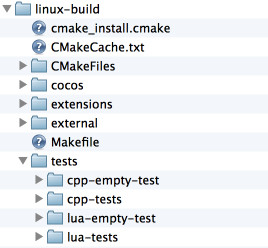
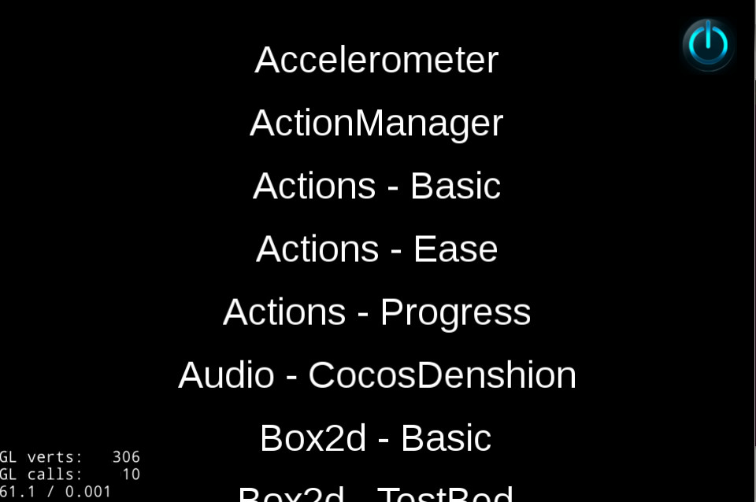

# How to run cpp-tests on Linux #

* [Overview](#anchor1)
* [Document Scope](#anchor2)
* [Steps](#anchor3)
	* [Install Dependences](#anchor4)
	* [Generate MakeFile](#anchor5)
	* [Compiling](#anchor6)
	* [Run cpp-tests](#anchor7)

## [Overview](id:anchor1)##
The document will show you how to compile & run `cpp-tests` on Linux.  
In the document, the variable `cocos2dx_root` means the root path of cocos2d-x.  

## [Document Scope](id:anchor2) ##
The document is suitable for version v3.0rc or newer.

## [Steps](id:anchor3) ##

* **[Install Dependences](id:anchor4)**

	The dependenced libraries are:

		libx11-dev
		libxmu-dev
		libglu1-mesa-dev
		libgl2ps-dev
		libxi-dev
		g++
		libzip-dev
		libpng12-dev
		libcurl4-gnutls-dev
		libfontconfig1-dev
		libsqlite3-dev
		libglew*-dev
		libssl-dev

	If you are using Ubuntu/Debian, there is a shell script **_(build/install-deps-linux.sh)_** for you to install the dependences easily. Run commands below in terminal:  

    	$ cd $cocos2dx_root/build
    	$ ./install-deps-linux.sh

	Otherwise, you should install the depences by yourself.

* **[Generate makefile](id:anchor5)**

	After the dependened libs are installed, run `cmake` to generate `makefile`:

    	$ mkdir linux-build
    	$ cd linux-build
    	$ cmake ../..

	When `cmake` returns correctly, many files & folders will be generated in  `coocs2dx_root/build/linux-build`:
	
	
	
* **[Compiling](id:anchor6)**

	Run `make` to compile

    	$ make

	Application will be generated in `cocos2dx_root/build/linux-build/bin/cpp-tests/` if compile correctly.

* **[Run cpp-tests](id:anchor7)**

		$ cd bin/cpp-tests/
		$ ./cpp-tests
	
	You will see the application is running like this:
	

