# Mac搭建cococs2d-x v3.x Android开发环境

#准备工作

到Cocos2d-x官方网站下载最新版本[v3.0beta2](http://cocos2d-x.org/download)


到Android官方网站下载[Android SDK](http://developer.android.com/sdk/index.html)

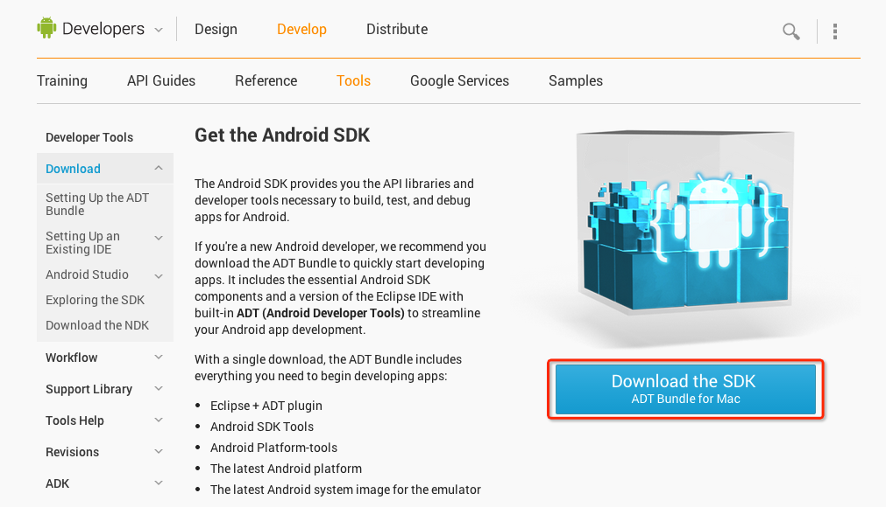

最后还需要在Android官方网站下载[Android NDK](http://developer.android.com/tools/sdk/ndk/index.html)

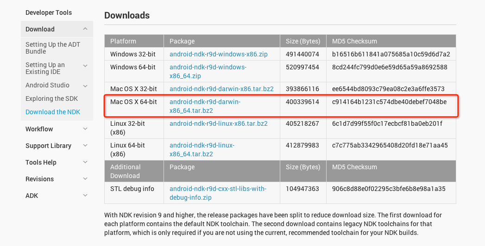

## JDK

检测JDK是否安装，版本是否大于1.6.0。打开终端，输入：    
```
1java -version
```

MacOS X会自动下载JDK，如图所示。    
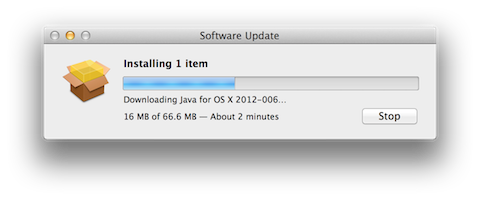       
你会看到如下所示信息：         
```
java version "1.6.0_37" 
Java(TM) SE Runtime Environment (build 1.6.0_37-b06-434-11M3909)
Java HotSpot(TM) 64-Bit Server VM (build 20.12-b01-434, mixed mode)
```

检查完后，便可开始设置Mac的Android开发环境。

##配置Android SDK环境

解压ZIP文件（名字为“adt-bundle-<os_platform>.zip”），保存至适当位置如主目录的“Development”（开发）目录。

打开adt-bundle-<os_platform>/eclipse/目录并启动Eclipse。
就这样！至此集成开发环境已经加载了Android开发人员（Android Developer Tools）工具插件，SDK已经准备就绪。

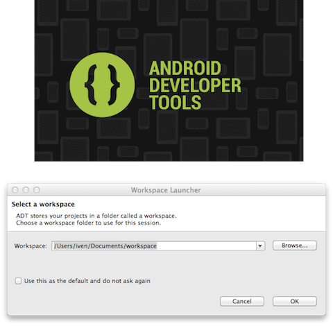      
 
### 在MBP Retina电脑中安装Eclipse

如果你用的是配备Retina显示屏的MacBook Pro电脑，注意原装Eclipse不支持Retina显示屏，但是可以使用简单的技巧启动Retina支持功能。（本方法来自：[https://bugs.eclipse.org/bugs/show_bug.cgi?id=382972](https://bugs.eclipse.org/bugs/show_bug.cgi?id=382972)）

1. 在Eclipse.app上执行“Show package contents”
2. 编辑Contents/Info.plist文件。
3. 就在以下代码上方        
```
</dict>
</plist>
```     
增加以下代码         
```
<key>NSHighResolutionCapable</key>
<true/>
```
4. 将Eclipse.app应用移至一个新文件夹（清除OS X中info.plist文件的缓存），然后再移回旧文件夹。
5．启动Eclipse即可，已支持Retina显示屏。

打开Eclipse，选择”ADT->偏好设置”，然后选择Android项来指定Android SDK的安装目录。如下图所示：

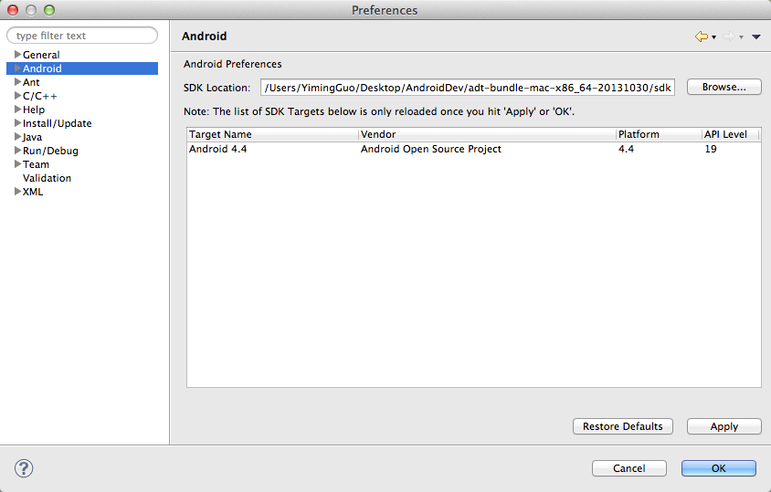

##配置NDK环境

将iOS项目源文件编译成项目时需要用到NDK来生成native文件。

先解压下载的NDK和ADT放在同一个父文件夹里。

按如下操作添加NDK环境变量：

```
export NDK_ROOT="/Users/yiming/Desktop/android-ndk-r9"
```

重启终端。

##创建HelloWorld项目

将刚才下载的压缩包解压到你指定的文件夹里。

进入到目录**cocos2d-x-3.0beta2/tools/project-creator**

打开终端运行**create_project.py**脚本创建文件

```
./create_project.py

或者

python create_project.py
```

此版本项目创建脚本支持图形界面方式创建项目，执行以上脚本后会出现图形界面:

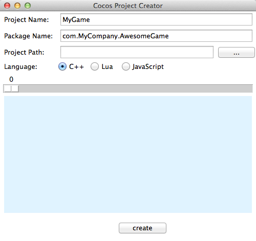

填写项目名称，包名称以及项目路径后选择开发语言，即可点击**create**开始创建项目:

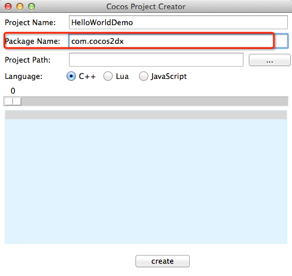

**注:**包名一定要写成cocos2dx

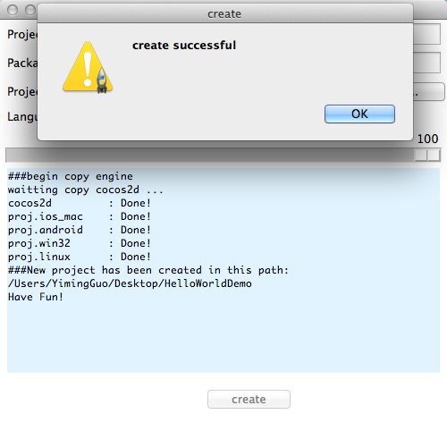

##生成Android项目文件

执行**HelloWorldDemo/proj.android**下的*build_native.py*脚本进行编译

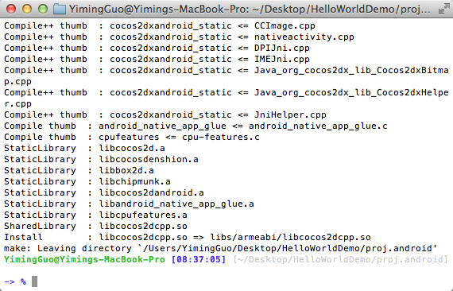

编译成功！

并将**HelloWorldDemo/cocos2d/cocos/2d/platform/android/java/src/org/cocos2dx/lib**文件夹拷贝到**HelloWorldDemo/proj.android/src/org/cocos2dx**下。

##导入Android项目到Eclipse

通过导入一个已存在的Android项目的方法将生成的HelloWorldDemo导入到Eclipse中如下：

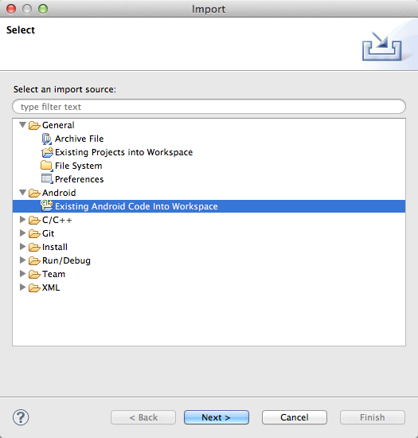

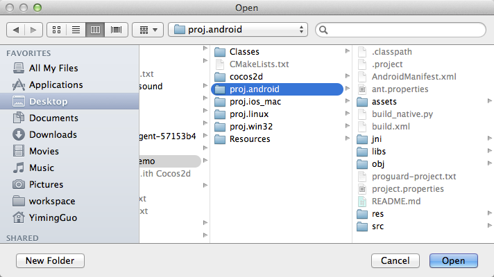

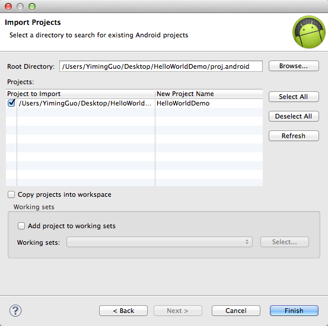

你可能看到如下错误提示:

```
The import org.cocos2dx.lib cannot be resolved HelloWorld.java /HelloWorld/src/com/young40/test line 26 Java Problem Cocos2dxActivity cannot be resolved to a type HelloWorld.java /HelloWorld/src/com/young40/test line 30 Java Problem Cocos2dxActivity cannot be resolved to a type HelloWorld.java /HelloWorld/src/com/young40/test line 33 Java Problem
```

你需要将

```
/opt/cocos2d-2.1beta3-x-2.1.1/cocos2dx/platform/android/java
```

按照上面的方法导入到Eclipse里面。然后在HelloWorldDemo项目上单击右键刷新，错误就会消失。

将您的手机设置成调试模式并用USB线连接到电脑, 在Eclipse中运行HelloWorld, 然后就能在手机上看到已经运行的HelloWorld了！


