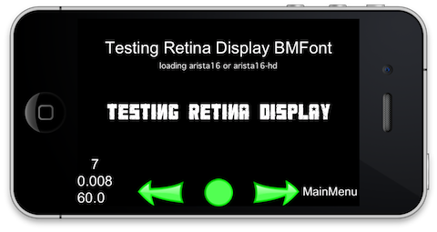
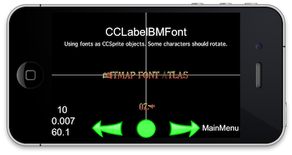
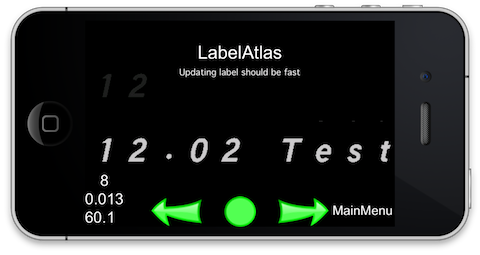

**本章由 浅底 （泰然教程组）翻译，转载请注明出处并通知泰然。**

# Text Labels #
## 介绍 ##

cocos2d的支持TTF（True Type字体）标签和纹理地图集标签。

TTF标签的优点和缺点：（CCLabelTTF）

 所有的TTF字体的优点：任何大小，字距支持，等等。

 易于使用。无需使用外部编辑器。

 创建/更新速度非常慢，因为会创建一个新的纹理，尤其是在Android系统中。

 纹理地图集标签的优点和缺点：（CCLabelAtlas，CCLabelBMFont）

 创建/更新速度非常快，因为他们不创造一个新的纹理。

 字体可以进行定制（阴影，渐变，模糊等）

 依赖于外部编辑器：AngelCode/ Hiero编辑器，GIMP/软件

 如果调整大小，文本可能失去效果。

## 标签对象 ##

 **创建标签：简单的方法**

 创建一个标签，最简单的方法是通过使用CCLabelTTF对象。示例：

	CCLabelTTF* ttf1 = CCLabelTTF::create("Hello World", "Helvetica", 12,   CCSizeMake(245, 32), CCTextAlignmentCenter);

fontname是TTF字体所用的名字。您也可以使用自己的自定义TTF文件。您只需要添加ttf文件到项目。
 如果它不能加载的字体，它会使用UIFont的类。

 重要提示：OpenGL纹理的大小将自动计算基础上的字体大小和字体名称。

**创建标签：复杂的方式**

 您也可以使用下面的API创建的纹理：

	CCLabelTTF* CCLabelTTF::create(const char *string, const char *fontName, float fontSize,const CCSize 
	&dimensions, CCTextAlignment hAlignment,CCVerticalTextAlignment vAlignment)

如果你用这种方式，你必须通过使用OpenGL纹理的尺寸。如果纹理不够大，只有部分的标签将被渲染。

可能的对齐方式：

	kCCTextAlignmentLeft (left alignment)
	kCCTextAlignmentCente (center alignment)
	kCCTextAlignmentRight (right alignment)

与实现了CCLabel协议的任何对象一样，你可以使用setString方法更新它。示例：

	label->setString("Hello World 2");

重要提示：每次调用SetString一个新的OpenGL纹理将被创建，这意味着SetString与创建一个新的CCLabel一样慢。所以，如果你需要经常更新CCLabel对象，不要使用它，而是考虑使用CCLabelAtlas或CCBitmapFontAtlas来代替。

## 颜色 ##
 通过简单地调用像这样的颜色参数，来改变您的字体颜色：

	label.color = ccc3(0,0,0); 
	//or
	label.color = ccc4(0,0,0,0);

ccc3 示例颜色

	white - (255,255,255)
	black - (0,0,0)
	blue - (0,0,255)
	green- (0,255,0)
	red - (255,0,0)
	Grey – (84,84,84)
	Brown – (165,42,42)
	Pink – (255,192,203)
	Purple – (160,32,240)
	Yellow – (255,255,0)
	Gold – (255,215,0)

## 对齐 ##

如果你要修改对齐方式，你可以使用anchorPoint属性。示例：

	//left alignment
	label->setAnchorPoint(ccp(0,0.5f));
	// right alignment
	label->setAnchorPoint(ccp(1,0.5f));
	// center aligment (default)
	label->setAnchorPoint(ccp(0.5f,0.5f));

## 纹理地图集标签 ##

有2种类型的标签是基于纹理图集的：

- CCLabelBMFont
- CCLabelAtlas

### CCLabelBMFont ### 

**介绍**

建议使用CCLabelBMFont的方式来快速创建标签，原因有下面几点：

 可定制的编辑位图（图片）

 您可以更新/初始化标签而没有消耗

 这是非常灵活的。每一个标签的字符可以被看作一个CCSprite

**字距支持**

CCLabelBMFont标签解析天使代码格式来创建一个标签。要创建这些类的标签，你可以用这些编辑器：

http://www.n4te.com/hiero/hiero.jnlp（Java版）

http://slick.cokeandcode.com/demos/hiero.jnlp（Java版）

http://www.angelcode.com/products/bmfont/（仅适用于Windows）

http://glyphdesigner.71squared.com/（仅限于Mac）

http://www.bmglyph.com（仅限于Mac）

http://tinyfont.com（仅限于Mac）

Java编辑器与Windows的编辑器：

Windows编辑器是官方的代码编辑器

Java编辑器：在Mac上运行

Java编辑器：有额外的功能，如阴影，渐变，模糊

**创建CCLabelBMFont**

要创建一个CCLabelBMFont的对象，你需要做的：

	CCLabelBMFont *label =CCLabelBMFont::create(LongSentencesExample, "fonts/markerFelt.fnt", size.width/1.5, kCCTextAlignmentCenter);

因为字体大小是固定的，你需要仔细考虑你需要的字体大小。由于纹理存储器，单独的每个大小的字体可能是低效的。在这种情况下，它缩小标签可能是有意义的，以实现不同的尺寸的大字体。由于标签仅仅是一个CCNode，你可以做到这一点通过scale属性。

**操作每个字符**

 由于CCLabelBMFont是CCSpriteSheet的子类，你可以像一个CCSprite一样操纵的每个字符。第一个字符将用tag= 0添加，第二个字符将用tag= 1添加，依此类推。示例：

	CCLabelBMFont *label =CCLabelBMFont::create("Bitmap Font Atlas" , "bitmapFontTest.fnt");
	CCSprite *char_B = label->getChildByTag(0); // character 'B'
	CCSprite *char_m = label->getChildByTag(3); // character 'm'

### LabelAtlas ###

**介绍**

CCLabelAtlas是最快添加到cocos2d的标签，但它被CCBitmapFontAtlas所取代。CCLabelAtlas保持向后兼容性，但是你应该使用CCBitmapFontAtlas代替。

**创建一个 LabelAtlas**

	CCLabelAtlas* CCLabelAtlas::create(const char *string, const char *charMapFile, unsigned int itemWidth, int unsigned itemHeight, unsigned int startCharMap)

例子：

	CCLabelAtlas *label1 = CCLabelAtlas::create ("Hello World","tuffy_bold_italic-charmap.png",48,64 ,' ');

charMapFile是一个包含了所有的字符的图像文件，每个字符根据其ASCII值排序，图像不能包含超过256个字符。

itemWidth是字符的宽度（以像素为单位）

itemHeight是字符的高度（以像素为单位）

startCharMap是在地图的第一个字符。

更新一个LabelAtlas/ BitmapFontAtlas。

 如同任何对象，你可以使用setString方法更新它。

	label->setString("Hello World 2");

值得指出，更新一个CCLabelAtlas或一个CCBitmapFontAtlas的，几乎没有消耗。
LabelAtlas/ BitmapFontAtlas的对齐方式

 如果你要修改对齐方式，你可以使用的anchorPoint属性。示例：
	//left alignment
	label->setAnchorPoint:(ccp(0, 0.5f));
	// right alignment
	label->setAnchorPoint( ccp(1, 0.5f));
	// center aligment (default)
	label->setAnchorPoint(ccp(0.5f, 0.5f));

### CCLabelTTF与CCLabelAtlas ###
 CCLabelTTF和CCLabelAtlas之间的主要区别是地图集版本（像所有其他的地图集类），使用一个预渲染所有字符的大纹理来绘制一个字符串。这意味着，绘图的速度要快得多，因为如果你画100个标签，图形处理器不会读取100个纹理，但只是在内存中保持一个纹理。但是，这也意味着，所有的字母将有一个固定的大小。如果你想要避开固定大小的限制，使用CCBitmapFontAtlas。

CCLabelTTF为每个标签创建一个纹理，因而CCLabelAtlas使用所提供的纹理（包含所有字符），能快速地渲染文字，因此使用CCLabelAtlas降低了内存消耗。

**参考文献**

Labels and Fonts(http://www.cocos2d-iphone.org/wiki/doku.php/prog_guide:labels)
