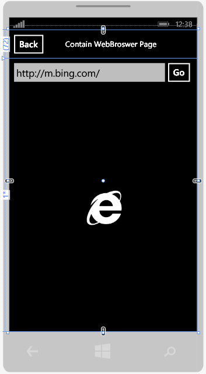

# WebBrowser控件

## 简介

目前在wp8平台中没有支付宝支付SDK，可以采用WAP+服务端方式进行第三方支付。这种情况下，需要添加包含WebBrowser控件的Windows Phone Page页面。以下介绍如何响应CCMenuItem单击以添加C#类的方法示例，其实即是在WinRT组件（C++）中调用C#类库的一种解决方案。

## 新建Windows Phone XAML and Direct3D App工程

目前在Github上已提供了支持XAML的混合托管模式,https://github.com/cocos2d/cocos2d-x/tree/master/cocos2dx/platform/wp8-xaml,Git下来之后打开cocos2d-wp8.vc2012.sln可以看到工程结构如下：


我们将在这个工程里面添加示例。

## 在HelloWorld里面添加一个CCMenuItemFont ##

在HelloWorld::init()中添加CCMenuItemFont，并添加响应函数HelloWorld::menuCallPageTest()，当单击按钮时调用HelloWorld::menuCallPageTest()

``` c++
#if (CC_TARGET_PLATFORM == CC_PLATFORM_WP8)
	// add a menu item to add a xaml page
	CCMenuItemFont::setFontName("Marker Felt");
	CCMenuItemFont *pNextItem = CCMenuItemFont::create("Add Xaml Page", this, menu_selector(HelloWorld::menuCallPageTest));
	pNextItem->setPosition(ccp(origin.x + visibleSize.width - pNextItem->getContentSize().width / 2, 
		origin.y + pCloseItem->getContentSize().height/2 + pNextItem->getContentSize().height + 10));

	// create menu, it's an autorelease object
	CCMenu* pPageMenu = CCMenu::create(pNextItem, NULL);
	pPageMenu->setPosition(CCPointZero);
	this->addChild(pPageMenu, 1);
#endif

```

``` c++
void HelloWorld::menuCallPageTest( CCObject* sender )
{
#if (CC_TARGET_PLATFORM == CC_PLATFORM_WP8)
	BroswerEventHelper^ helper = ref new BroswerEventHelper(); 
	helper->ShowWebBroswer();
#endif
}

```

menuCallPageTest( CCObject* sender )函数里面有调用ShowWebBroswer()，这个函数里面调用了一个回调函数。请看下一个步骤。

## 定义C++托管类BroswerEventHelper ##

可以在Runtime Component项目里面添加实现BroswerEventHelper这个类，这里我们在HelloWorldScene.h声明方法，HelloWorldScene.cpp实现该类成员函数。

``` c++
#if (CC_TARGET_PLATFORM == CC_PLATFORM_WP8)
namespace PhoneDirect3DXamlAppComponent
{
	public delegate void ShowWebBroswerDelegate();
	public ref class BroswerEventHelper sealed
	{
	public:
		BroswerEventHelper(void);
		void SetShowWebBroswerDelegate(ShowWebBroswerDelegate^ delegate);
		bool ShowWebBroswer();
	private:
		property static ShowWebBroswerDelegate^ m_broswerDelegate;
	};

}
#endif

```

其中，SetShowWebBroswerDelegate方法在C#代码中调用，设置一个代理类，这里我们将该代理类设置为static，这样在不仅在C++代码中并且在C#代码中的BroswerEventHelper实例包含该静态变量，方便调用。ShowWebBroswer()方法在C++代码中调用m_broswerDelegate代理，即回调。这样下一步就可以在C#代码中以实现该代理方法。

``` c++
#if (CC_TARGET_PLATFORM == CC_PLATFORM_WP8)
namespace PhoneDirect3DXamlAppComponent
{

	BroswerEventHelper::BroswerEventHelper(void)
	{
	}

	void BroswerEventHelper::SetShowWebBroswerDelegate(ShowWebBroswerDelegate^ delegate)
	{
		m_broswerDelegate = delegate;
	}

	bool BroswerEventHelper::ShowWebBroswer()
	{
		if (m_broswerDelegate)
		{
			m_broswerDelegate->Invoke();
			return true;
		}
		return false;
	}
}

using namespace PhoneDirect3DXamlAppComponent;
#endif

```

## C#中实现代理方法 ##

在MainPage.xaml.cs的DrawingSurface_Loaded()方法中设置代理。添加以下代码：

``` c++
BroswerEventHelper helper = new BroswerEventHelper();
helper.SetShowWebBroswerDelegate(ShowWebBroswer);

```

其中，ShowWebBroswer为代理方法，在MainPage类中实现。如下：

``` c++
        public void ShowWebBroswer()
        {
            Dispatcher.BeginInvoke(() =>
            {
                this.NavigationService.Navigate(new Uri("/WebBroswerPage.xaml", UriKind.Relative));
            });
            return;
        }

```

这里以this.NavigationService.Navigate来实现页面跳转，添加一个XAML页面下一个步骤。

## WebBroswerPage.xaml页面添加 ##

右键工程，选择Visual C#下的Windows Phone Portrait Page页面，改Name为WebBroswerPage.xaml，添加。
设计页面，如下。



这样就整个页面跳转流程即制作完毕了，其它页面具体功能则自己进行设计了，比如当跳转到WebBroswerPage.xaml页面时，我们可以添加Back的单击事件响应函数（双击该按钮自动添加响应函数），单击时跳转回上一个界面。代码如下：

``` c++
        private void Button_Click(object sender, RoutedEventArgs e)
        {
            this.NavigationService.GoBack();
        }

```
