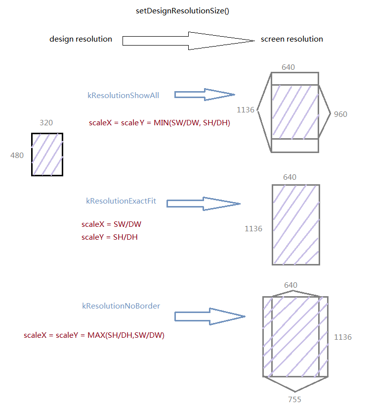
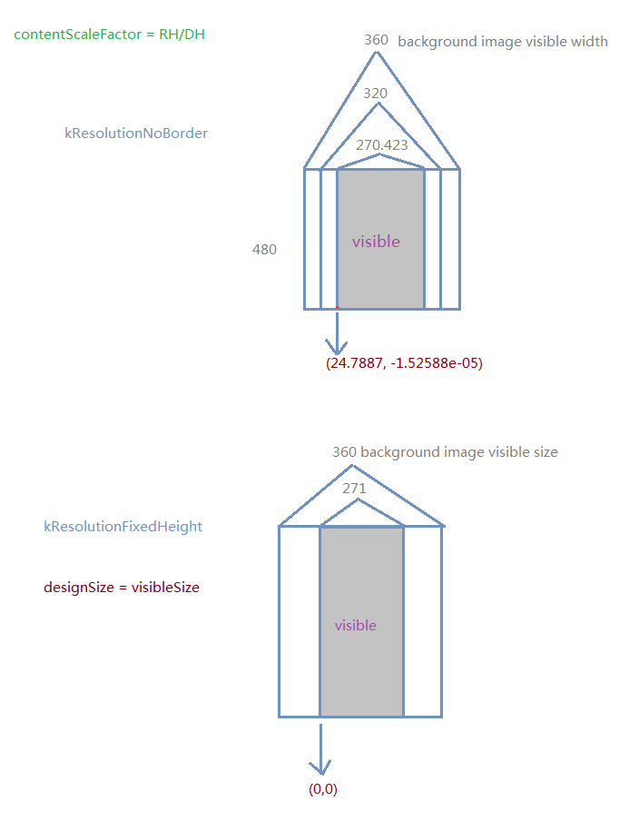

#Cocos2d-x 多分辨率适配完全解析
---
本文出自[作者：u0u0(泰然教程组)](http://www.ityran.com/archives/5185)

##overview
从Cocos2d-x 2.0.4开始，Cocos2d-x提出了自己的多分辨率支持方案，废弃了之前的retina相关设置接口，提出了design resolution概念。

有以下相关接口：

	CCEGLView::sharedOpenGLView()->setDesignResolutionSize() //设计分辨率大小及模式
	CCDirector::sharedDirector()->setContentScaleFactor() //内容缩放因子
	CCFileUtils::sharedFileUtils()->setResourceDirectory() //deprecated
	CCFileUtils::sharedFileUtils()->setSearchPaths() //资源搜索路径
	CCEGLView::sharedOpenGLView()->getFrameSize() //屏幕分辨率
	CCDirector::sharedDirector()->getWinSize() //设计分辨率
	CCDirector::sharedDirector()->getVisibleSize() //设计分辨率可视区域大小
	CCDirector::sharedDirector()->getVisibleOrigin() //设计分辨率可视区域起点

从cocos2d-2.1beta3-x-2.1.1开始，

`CCFileUtils::sharedFileUtils()->setResourceDirectory()`

被新接口

`CCFileUtils::sharedFileUtils()->setSearchPaths(searchPath)`

替代

从Cocos2d-x 2.1.3开始，新加入了两种ResolutionPolicy（kResolutionFixedHeight， kResolutionFixedWidth），共5中模式。

官方分别在[Multi_resolution_support](http://www.cocos2d-x.org/projects/Cocos2d-x/wiki/Multi_resolution_support) 和 [Mechanism_of_loading_resources](http://www.cocos2d-x.org/projects/Cocos2d-x/wiki/Mechanism_of_loading_resources)有介绍。

本文从引擎使用者角度分析Cocos2d-x的多分辨率适配技术。

##从Retina 到 design resolution
在Cocos2d-x 2.0.4之前，有Retina的概念，这个是从cocos2d-iphone过来的概念。

cocos2d-iphone为了支持Retina iphone 设备，使用了-hd等后缀来区分iphone和Retine iphone的图片资源。在设计游戏的时候，使用point 坐标系，而非真正的pixel坐标系。这点和iOS native应用开发提出的point概念一至，不用修改代码，就能在640×960的设备上跑之前320×480的程序，只是图片会看起来模糊，一旦加入@2x的图片，iOS自动加载@2x的图片，实现对Retna iphone的支持。

point坐标系，在一定范围内能解决多分辨率支持的问题。但是当iphone5，ipad 3出来以后，iOS总共有5个分辨率需要支持，如果做一个universal的程序，是相当痛苦的。point坐标系并不能完全解决问题，android上的分辨率情况更加复杂。

design resolution应该是从point坐标系进化过来的概念，目的是屏蔽设备分辨率，精灵坐标都在design resolution上布局，但要实现这个目标并不简单。Cocos2d-x提供了一组相关的接口和5种分辨率适配策略，哪种策略才是我们需要的，下面我们一同探寻。

##资源分辨率，设计分辨率，屏幕分辨率
>Resources width 以下简写为RW，Resources height 以下简写为RH

>Design width 以下简写为DW，Design height 以下简写为DH

>Screen width 以下简写为SW，Screen height 以下简写为SH

在SDK的samples中有个HelloCpp项目。展示了如何使用多分辨率方案。

以下以HelloCpp的AppMacros.h配置基本相同，但是交换了宽高的数值，以竖屏游戏为例子。

Cocos2d-x图片显示有下面两个逻辑过程。
资源布局到 到 设计分辨率，设计分辨率 布局到 屏幕。

如下图所示：

接口setContentScaleFactor()和setSearchPaths()控制着第一个转换过程。

而setDesignResolutionSize()控制第二个过程。两个过程结合在一起，影响最终的显示效果。

##从资源分辨率到设计分辨率
setSearchPaths()需要根据当前屏幕分辨率做恰当的设置，HelloCpp展示了一套简单方案，但可能不是最佳的。

setContentScaleFactor()决定了图片显示到屏幕的缩放因子，但是这个接口的参数不是通过资源图片的宽、高比屏幕宽、高得来。Cocos2d-x引擎设计试图屏蔽游戏开发者直接去关注屏幕，所以这个因子是资源宽、高比设计分辨率宽、高。

setContentScaleFactor()通常有两个方式来设置参数。
RH/DH或RW/DW，不同的因子选择有不同的缩放负作用。
先看一张图:

用高度比作为内容缩放因子，保证了背景资源的垂直方向在设计分辨率范围内的全部显示。

用宽度比作为内容缩放因子，保证了背景资源的水平方向在设计分辨率范围内的全部显示。

##从设计分辨率到屏幕分辨率
setDesignResolutionSize(DW, DH, resolutionPolicy)

有三个参数，设计分辨率宽，设计分辨率高，分辨率策略。

前两个很好理解，复杂点在分辨率策略的选择上。

先来看kResolutionExactFit，kResolutionNoBorder，kResolutionShowAll这三种情况，2.1.3新加入的策略稍后分析。

三种策略的设计分辨率都是传入值，内部不做修正。

先看一张图：

###kResolutionShowAll

> 屏幕宽、高分别和设计分辨率宽、高计算缩放因子，取较(小)者作为宽、高的缩放因子。保证了设计区域全部显示到屏幕上，但可能会有黑边。

###kResolutionExactFit

> 屏幕宽 与 设计宽比 作为X方向的缩放因子，屏幕高 与 设计高比 作为Y方向的缩放因子。保证了设计区域完全铺满屏幕，但是可能会出现图像拉伸。

###kResolutionNoBorder

> 屏幕宽、高分别和设计分辨率宽、高计算缩放因子，取较(大)者作为宽、高的缩放因子。保证了设计区域总能一个方向上铺满屏幕，而另一个方向一般会超出屏幕区域。

kResolutionNoBorder是之前官方推荐使用的方案，他没有拉伸图像，同时在一个方向上撑满了屏幕，但是2.1.3新加入的两种策略将撼动kResolutionNoBorder的地位。

kResolutionFixedHeight和kResolutionFixedWidth都是会在内部修正传入设计分辨率，以保证屏幕分辨率到设计分辨率无拉伸铺满屏幕。
如图：

###kResolutionFixedHeight

> 保持传入的设计分辨率高度不变，根据屏幕分辨率修正设计分辨率的宽度。

###kResolutionFixedWidth

> 保持传入的设计分辨率宽度不变，根据屏幕分辨率修正设计分辨率的高度。

**结合两个过程**

第一过程有两种情况，第二过程有5种情况，在一个分辨率下会有10种可能的方案组合。
如何选择自己需要的？

我们需要作出选择，是牺牲效果还是牺牲部分显示区域。

这里我们选者牺牲一个方向的显示区域为例，结果说明两个过程。

在我的游戏里面，背景图的高需要全部显示，而宽方向可以裁减。

要实现这个目的，需要保证两个过程都是在宽方向裁减。

- 第一过程选择 setContentScaleFactor(RH/DH)
- 第二过程有两个选择：kResolutionNoBorder和kResolutionFixedHeight

为了说明两者的区别，需要结合VisibleOrigin和VisibleSize。
看图

kResolutionNoBorder情况下，设计分辨率并不是可见区域，我们布局精灵需要根据VisibleOrigin和VisibleSize来做判断处理。

而kResolutionFixedHeight则不同，设计分辨率就是可见区域，VisibleOrigin总是(0,0)

getVisibleSize() = getWinSize()，kResolutionFixedHeight达到了同样的目的，但是却简化了代码。

kResolutionFixedHeight和kResolutionFixedWidth是kResolutionNoBorder的进化，新项目中建议立即开始使用这两种方式。

##小结
###kResolutionFixedHeight

> 适合高方向需要撑满，宽方向可裁减的游戏，结合setContentScaleFactor(RH/DH)使用。

###kResolutionFixedWidth

> 适合宽方向需要撑满，高方向可裁减的游戏，结合setContentScaleFactor(RW/DW)使用。

tip:正确设置AppMacros.h里面的宽高，注意横屏游戏和竖屏游戏的不同。