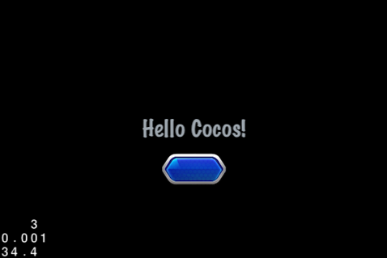

# 新 GUI 系统

## 简介

在没有 GUI 系统框架之前，我们想要设计复杂的 UI 非常困难，更甚者手动写出来的效果并不是我们想要的，如果开发类似 MMORPG 游戏，那些丰富的 UI 更是让我们无从下手。只是因为没有一个统一的 UI 框架，当然我们可以自己实现，但是工作量却非常大，写好了 UI 库，还需要设计工具。现在这一切官方都已经给出了完整的解决方案。下面就对新 GUI 做个系统介绍。

## 哪些 GUI Widget

首先大概了解一下有哪些控件，请看如下表格。从显示内容的 Label 到 Button 按钮实现，入库框、ListView、滚动条等常用的控件，基本都已实现。后面将会详细介绍他们的使用方法，以及每个控件的常用属性。

 名称 				| 说明				| 名称			| 说明
--------------------|-------------------|---------------|-------------------
 **UIWidget**		| 所有 GUI 元素的基类	| UILoadingBar	| 加载进度条
 **UILayout**		| 层控件，基本容器	| UIScrollView	| 滚动视图
 **UIRootWidget**	| 根控件			| UIListView	| 列表视图
 UIButton			| 按钮，实现点击操作	| UISlider		| 滑动条控件
 UICheckBox			| 复选框按钮			| UITextField	| 输入框
 UIImageView		| 用于显示图片		| UILabelBMFont	| 图片标签
 UILabel			| 文字标签			| UIPageView	| 页视图
 **UIHelper**		| 帮助类			| UILabelAtlas	| atlas 格式标签
 **UILayer**		| 层

## 常用的控件使用

### 从 Hello Cocos 开始

GUI 中的每一个元素都是 **UIWidget** 元素，UIWidget 是直接继承自 cocos2d::Object 类型，虽然 UIWidget 元素也可以组成一个树结构，但它是独立于以 Node 为节点创建的结构的。通过 **UILayer** 将两者关联起来，UILayer 继承自 Layer 类型，同样是 Node 节点，在 UILayer 内部，自成一个体系，UILayer 首先会有一个根节点 **UIRootWidget** ,所有被添加到 UILayer 的 UIWidget 会以 UIRootWidget 作为最上层，构建 GUI。首先通过代码在一个场景中间显示 "Hello Cocos!" 字样。

``` c++
    auto size = Director::getInstance()->getWinSize();
    
    auto uLabel = UILabel::create();
    uLabel->setText("Hello Cocos!");
    uLabel->setFontName("Marker Felt");
    uLabel->setFontSize(30);
    uLabel->setColor(Color3B(159, 168, 176));
    uLabel->setPosition(Point(size.width / 2, size.height / 2));

    auto uLayer = UILayer::create();
    uLayer->addWidget(uLabel);
    addChild(uLayer);

```


注意：前文说道，通过 UILayer 将当前运行场景和所需 UI 控件管理起来，如果将 UILabel 直接添加到一个运行的 Node （如当前场景），是不可行的，类型匹配不了。

出了以上属性，UILabel 还有一些其它常用属性：

常用属性/方法								|	说明
--------------------------------------------|--------------------
setText(const std::string& text)			| 设置 label 显示文字
getStringValue()							| 获取显示文字
getStringLength()							| 获取字符串长度(注意中文占多个长度，ios 下占长度3)
setFontName(const std::string& name)		| 设置字体
setFontSize(int size)						| 设置字体大小
setScale(float fScale)						| 设置缩放大小
setAnchorPoint(const cocos2d::Point &pt)	| 设置锚点位置
setTouchEnabled(bool enable)				| 是否启用点击
setTouchScaleChangeEnabled(bool enable)		| 启用点击时放大，需要先启用点击

UILabel 常用于显示静态文字，但也能通过添加 `addTouchEventListener` 实现 Label 按钮功能。点击操作请看下面 UIButton 的使用。

### UIButton 的使用

上面显示了一个 UILabel ，这里我们将添加一个 UIButton 按钮，实现的功能呢，点击按钮然后修改 UILabel 内容。

``` c++
    auto uButton = UIButton::create();
    uButton->setTouchEnabled(true);
    uButton->loadTextures("cocosgui/animationbuttonnormal.png", "cocosgui/animationbuttonpressed.png", "");
    uButton->setPosition(Point(size.width / 2, size.height / 2) + Point(0, -50));
    uButton->addTouchEventListener(this, toucheventselector(HelloWorld::touchEvent));
    uLayer->addWidget(uButton);

```

以上是 UIButton  的实现，其中使用了 `addTouchEventListener` 添加触摸回调函数，_lbl 是私有变量也及时前文中的 UILabel 的引用，以下是 `touchEvent` 函数的具体实现，它可以监听到 按钮的各种状态，点击，移动，结束和取消时，可以分别实现不同的处理逻辑：

``` c++
	void HelloWorld::touchEvent(Object *pSender, TouchEventType type)
	{
	    switch (type)
	    {
	        case gui::TOUCH_EVENT_BEGAN:
	            _lbl->setText("UIButton Click.");
	            break;
	        case gui::TOUCH_EVENT_MOVED:
				// TODO
	            break;
	        case gui::TOUCH_EVENT_ENDED:
				// TODO
	            break;
	        case gui::TOUCH_EVENT_CANCELED:
				// TODO
	            break;
	        default:
				// TODO
	            break;
	    }
	}
	
```



常用属性/方法								|	说明
--------------------------------------------|-------------------------
setTouchEnabled(bool enable)				| 启用点击触摸，默认不可触摸
loadTextures(const char* normal,const char* selected,const char* disabled,TextureResType texType = UI_TEX_TYPE_LOCAL);					   	| 加载按钮图片资源，如普通状态，按下状态，禁用等
setPosition(const Point &pos)		| 设置控件的位置
addTouchEventListener(Object *target, SEL_TouchEvent selector)	| 设置按钮回调函数


注意有些控件是可以不用启用 "可触摸" 操作的，如 UILabel 和 UIImageView 等，而按钮，滚动框等需要启用可触摸属性 `setTouchEnabled`，此函自 UIWidget 继承而来。

### UIImageView 的常用属性及使用方法

为了丰富我们的显示效果，决定添加一个图片显示控件，UIImageView，使用方式如下：

``` c++
	UIImageView *imageView = UIImageView::create();
    imageView->loadTexture("cocosgui/ccicon.png");
    imageView->setPosition(Point(size.width / 2, size.height / 2) + Point(0, 50));
    uLayer->addWidget(imageView);

```


常用属性/方法								|	说明
--------------------------------------------|-------------------------
loadTexture(const char* fileName,TextureResType texType = UI_TEX_TYPE_LOCAL);		| 图片显示控件加载的图片资源的方法
setTextureRect(const Rect& rect)			| 设置图片的矩形区域
setScale9Enabled(bool able)					| 设置9图显示


## 从 CocoStudio 中导入资源

通过以上的内容，我们了解了使用控件的大致步骤，首先需要一个 **UILayer** 作为 UI 容器，然后向其中添加其它控件，并设置常用的属性，如果需要交互操作，如点击，实现点击方法，以上只是简单的几个控件，我们控制起来很简单，但是如果界面上的控件很多，在记住那么多繁杂的控件属性，就麻烦非常了，所以这里开始了解从 CocoStudio 中读取 UI 资源，来使用 UI 控件的方法。

使用 CocoStudio 能为我们节省那些事情？使用 CocoStudio 的 UI 编辑器，可以所见即所得的看到 UI 编辑效果，直接通过编辑器拖动控件设置好位置，省却了我们手动调整坐标的步骤，除此之外还能通过编辑器设置一些基本属性，如为 UIImageView 设置显示图片，为 UILable 设置显示文字，为 UIButton 设置按钮图片，启用可触摸属性等。使用 CocoStudio 配合 GUI 库，才能体现它的强大。

## 读取 GUI 资源

我们使用 `cocostudio::GUIReader` 所提供的方法从 json 文件加载 ui 控件：

``` c++
	UILayer* m_pLayer = UILayer::create();
	addChild(m_pLayer);
	
	UILayout* m_pLayout = dynamic_cast<UILayout*>(cocostudio::GUIReader::shareReader()->widgetFromJsonFile("cocosgui/UITest/UITest.json"));

	m_pLayer->addWidget(m_pLayout);

	UILabel* m_pSceneTitle = dynamic_cast<UILabel*>(m_pLayer->getWidgetByName("UItest"));

```

注意这里我们通过加载器加载的 ui 资源是 UILayout 类型的，如前文所言，如果我们想将它添加到当前运行的场景，我们还是需要一个 UILayer 过度，首先创建一个 UILayer 对象，然后将从 ui json 文件获取的资源添加到这个 UILayer 中去，才能正确的显示。可以说 UILayer 是一座桥梁，链接着游戏 ui 控件和当前场景之间的关系。


注：这里的 UITest.json 文件是由 CocoStudio UI 编辑器，自动生成，一般不手动修改其内容，通过 UI 编辑器修改各属性等。CocoStudio 的具体使用方法，请参考 CocoStudio 官方文档。

**UITest.json** 文件包含了所有的 UI 定义，UI 的布局，里面各种控件的属性值的设置等，在使用 GUIReader 加载读取之后，可以为我们自动创建相应的控件，并填充其对应的属性，这就把很多原来在代码中写的内容 "搬" 了 CocoStudio UI 编辑器之中。

### UI 资源的使用流程

我们前面说过，从 UI 资源里面获取到的首先使一个 UILayout 资源，这对应着 CocoStudio 的 Panel 控件，我们通常使用它来作为 UI 控件的根控件，做布局之用，在 Panel 上面，我们添加按钮，标签，文本框，图片框，滚动条等控件，当然也可以再次添加 Panel 来进行 "子区域" 的布局。这个 json 文件是一个 字典数据结构，key 保存属性名称，value 保存其值，我们不用太过关心 GUIReader 的内部细节实现。

在将 UILayout 添加到 UILayer 里面之后，我们使用 `m_pLayer->getWidgetByName("UItest")` 来从 UILayer 里面获取一个 UI 资源里面已经存在的控件。**注意，这里的 getWidgetByName() 方法是属于 UILayer 的，而不是 UILayout 的**，UILayout 只是控件中的一种，而 UILayer 是做桥梁，链接游戏场景和 UI 系统，所有的 UI 控件都可以通过 UILayer 获取得到。一个 UILayer 里面的所有控件都能且应该从 UILayer 获取，`getWidgetByName()` 或者 `getWidgetByTag()` 方法。

