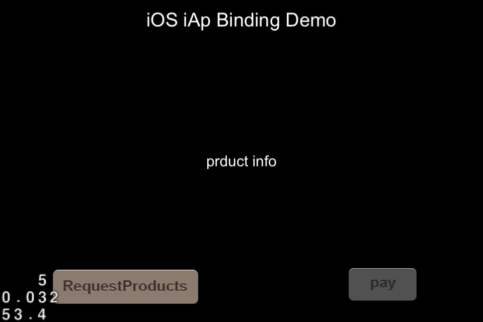
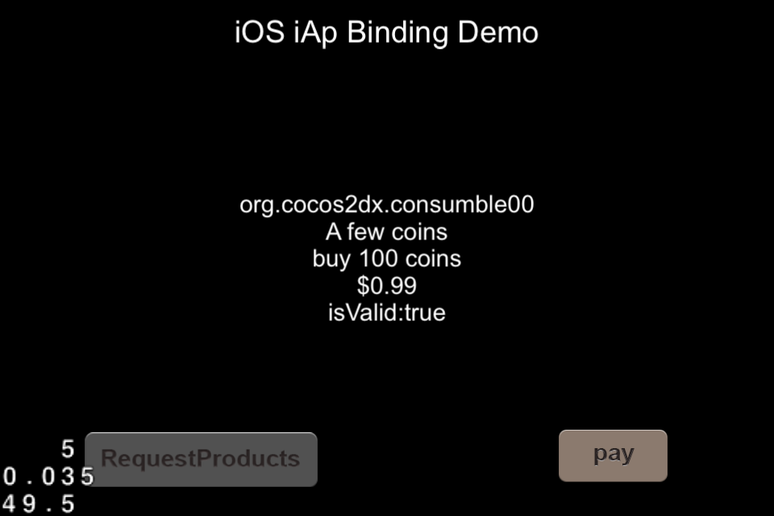
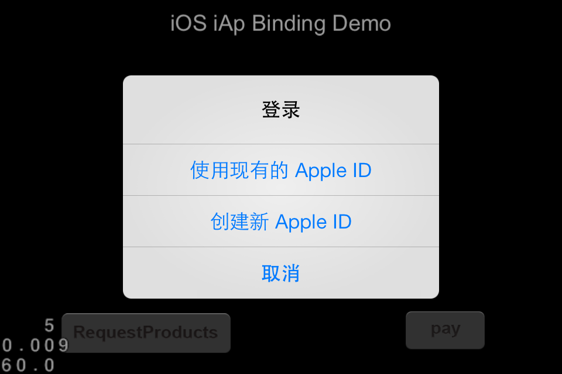
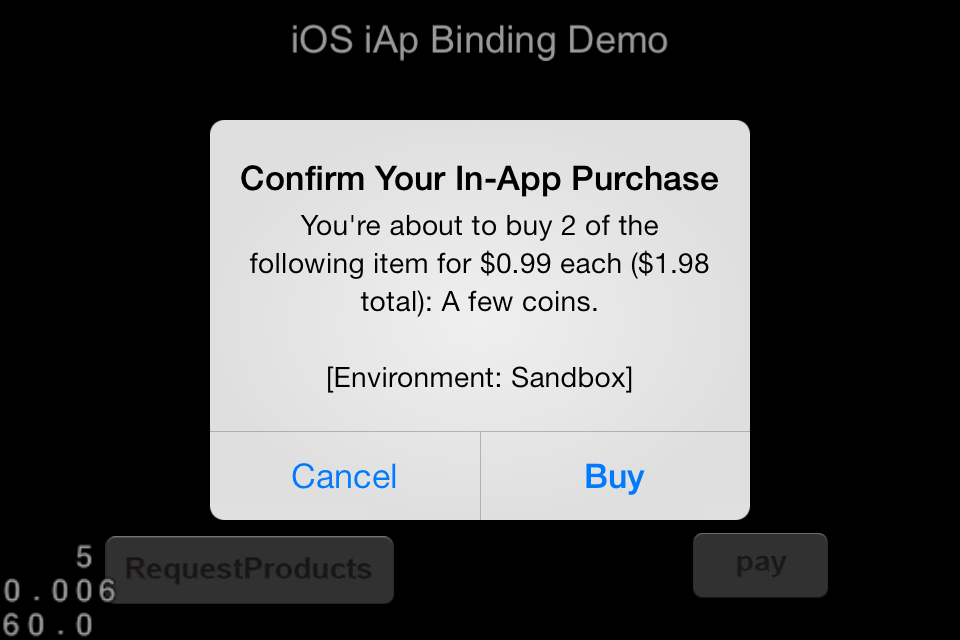
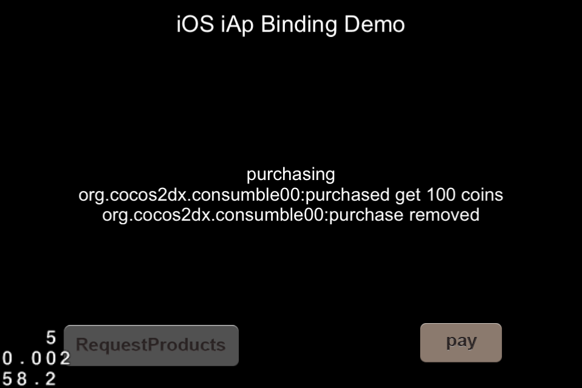

# Cocos2d-x使用iOS游戏内付费IAP(JSB篇)

在C＋＋篇中我们学会了如何创建IAP项目以及如何使用StoreKit接口。接下来我们要把C＋＋接口绑定映射到JavaScript。Cocos2d-x内置了一套JavaScript的解析引擎[SpiderMonkey](https://developer.mozilla.org/en-US/docs/Mozilla/Projects/SpiderMonkey?redirectlocale=en-US&redirectslug=SpiderMonkey)，SpiderMonkey提供一套静态注册机制来扩展JS接口。


## 添加IOSiAP_JSB.h

JavaScript binding对外的接口只有一个，如下：

```
void JSB_register_iOSiAP(JSContext* cx, JSObject* obj);

```

这个函数在AppDelegate.h中被作为RegisterCallback函数指针添加到ScriptingCore。

```
sc->addRegisterCallback(JSB_register_iOSiAP);
```

## 添加IOSiAP_JSB.cpp

### IOSiAP_Bridge桥接类

由于SpiderMonkey提供的是C接口，使用我们的C＋＋接口依然会不方便，所以我们需要一个桥接类来接收回调信息。

```
class IOSiAP_Bridge : public IOSiAPDelegate
{
public:
    IOSiAP_Bridge();
    ~IOSiAP_Bridge();
    IOSiAP *iap;
    JSObject *jsobj;
    
    virtual void onRequestProductsFinish(void);
    virtual void onRequestProductsError(int code);
    virtual void onPaymentEvent(std::string &identifier, IOSiAPPaymentEvent event, int quantity);
};
```

IOSiAP_Bridge需要public继承IOSiAPDelegate，并重写onRequestProductsFinish，onRequestProductsError和onPaymentEvent。

IOSiAP_Bridge的构造函数创建IOSiAP（C＋＋篇我们封装好的接口），虚构函数释放这个对象。

```
IOSiAP_Bridge::IOSiAP_Bridge()
{
    iap = new IOSiAP();
    iap->delegate = this;
}

IOSiAP_Bridge::~IOSiAP_Bridge()
{
    delete iap;
}
```

三个回调函数需要callback回js，我们以onRequestProductsError为例做解析。

```
void IOSiAP_Bridge::onRequestProductsError(int code)
{
	// 1.
    JSContext *cx = ScriptingCore::getInstance()->getGlobalContext();
    
    // 2.
    jsval param[] = {
        INT_TO_JSVAL(code)
    };
    jsval retval;
    
    // 3.
    JSBool ok = JS_AddValueRoot(cx, param);
    if (!ok) {
        CCLOG("scheduleFunc: Root value fails.");
        return;
    }
    // 4.
    ScriptingCore::getInstance()->executeFunctionWithOwner(
                                                           OBJECT_TO_JSVAL(this->jsobj),
                                                           "onRequestProductsError", 1, param, &retval);
	// 5.
    JS_RemoveValueRoot(cx, param);
}
```

1. 获取全局的JS运行上下文。
2. 创建一个jsval数组，作为参数传递给调用的js函数。
3. JS_AddValueRoot保护param这个jsval不被垃圾回收掉。
4. ScriptingCore的助手函数，C＋＋调用到JS代码。 
5. 解除param的垃圾回收保护。

executeFunctionWithOwner有5个参数，含义如下：

1. JS对象，IOSiAP可能有多个。
2. JS对象的方法名。
3. 参数个数。
4. 参数。
5. C＋＋端可以获取JS端的返回值。


### JSB_register_iOSiAP

整个IOSiAP_JSB.cpp对外的接口只有一个，它的实现如下：

```
void JSB_register_iOSiAP(JSContext* cx, JSObject* obj)
{
    // define name space
    JSObject *myBinding = JS_NewObject(cx, NULL, NULL, NULL);
    JS::RootedValue myBindingVal(cx);
    myBindingVal = OBJECT_TO_JSVAL(myBinding);
	JS_SetProperty(cx, obj, "MyBinding", myBindingVal);
    // register class
    JSB_IOSiAP_createClass(cx, myBinding, "IOSiAP");
    JSB_Product_createClass(cx, myBinding, "Product");
}
```

这里定义了一个新的js名字空间“MyBinding”，然后在这个名字控件下，注册了两个JS类：“IOSiAP”和“Product”。

### IOSiAP类的定义

SpiderMonkey注册一个类通过JS_InitClass函数来实现，它有很多参数，初次使用会觉得很复杂，再次使用它依然复杂，下面对几个需要特别关注的地方做解析。

首先定义两个静态对象：

```
static JSClass *JSB_IOSiAP_class = NULL;
static JSObject *JSB_IOSiAP_object = NULL;
```

JSB_IOSiAP_class的初始化

```
JSB_IOSiAP_class = (JSClass *)calloc(1, sizeof(JSClass));
JSB_IOSiAP_class->name = name;
JSB_IOSiAP_class->addProperty = JS_PropertyStub;
JSB_IOSiAP_class->delProperty = JS_DeletePropertyStub;
JSB_IOSiAP_class->getProperty = JS_PropertyStub;
JSB_IOSiAP_class->setProperty = JS_StrictPropertyStub;
JSB_IOSiAP_class->enumerate = JS_EnumerateStub;
JSB_IOSiAP_class->resolve = JS_ResolveStub;
JSB_IOSiAP_class->convert = JS_ConvertStub;
// 1.
JSB_IOSiAP_class->finalize = JSB_IOSiAP_finalize;
// 2.
JSB_IOSiAP_class->flags = JSCLASS_HAS_PRIVATE;
```

1. 我们指定自定义的finalize函数JSB_IOSiAP_finalize，不使用默认的，js对象被回收前会调用这个函数。
2. flags设置为JSCLASS_HAS_PRIVATE，我们需要使用JS_SetProperty来实现JS与C＋＋对象的绑定。

接下来定义三个成员函数：

```
static JSFunctionSpec funcs[] = {
	// param: array[string] to hold identifier of iAp items
	JS_FN("requestProducts", JSB_IOSiAP_requestProducts, 1, JSPROP_PERMANENT  | JSPROP_ENUMERATE),
	// param: string of identifier
	JS_FN("iOSProductByIdentifier", JSB_IOSiAP_iOSProductByIdentifier, 1, JSPROP_PERMANENT  | JSPROP_ENUMERATE),
	// param[0] : js object of Product
	// param[1] : quantity (Option, Default value = 1)
	JS_FN("paymentWithProduct", JSB_IOSiAP_paymentWithProduct, 2, JSPROP_PERMANENT  | JSPROP_ENUMERATE),
	JS_FS_END
};
```

JS_FN有4个参数，意义如下：

1. JS函数名
2. 对应的本地调用方法
3. 参数个数
4. flags设置，这里使用JSPROP_PERMANENT  | JSPROP_ENUMERATE即可。

JS_InitClass有10个参数，1个返回值。

```
	JSB_IOSiAP_object = JS_InitClass(
		cx,
		globalObj,
		NULL,
		// 1.
		JSB_IOSiAP_class,
		// 2.
		JSB_IOSiAP_constructor,
		0,
		properties,
		funcs,
		NULL,
		st_funcs);
```

需要关注的如下：

1. 前面创建的JSB_IOSiAP_class对象。
2. 指定JS构造函数（new IOSiAP的时候被调用）。

### JS构造函数

JS构造函数，在这里我们创建本地对象IOSiAP_Bridge，把它设置为JS对象的private属性。

```
static JSBool JSB_IOSiAP_constructor(JSContext *cx, unsigned argc, JS::Value *vp)
{
    if (argc == 0) {
        JSObject *jsobj = JS_NewObject(cx, JSB_IOSiAP_class, JSB_IOSiAP_object, NULL);
        IOSiAP_Bridge *bridge = new IOSiAP_Bridge();
        bridge->jsobj = jsobj;
        JS_SetPrivate(jsobj, (void *)bridge);
        JS_SET_RVAL(cx, vp, OBJECT_TO_JSVAL(jsobj));
        return JS_TRUE;
    }
    JS_ReportError(cx, "Wrong number of arguments: %d, was expecting: %d", argc, 0);
    return JS_FALSE;
}
```

JS_NewObject函数用于新建一个js的对象。

JS_SET_RVAL用来设置返回值。

### JS虚构函数

从private获取到对象后，delete本地对象。

```
static void JSB_IOSiAP_finalize(JSFreeOp *fop, JSObject *obj)
{
    IOSiAP_Bridge *bridge = (IOSiAP_Bridge *)JS_GetPrivate(obj);
    JS_SetPrivate(obj, NULL);
    delete bridge;
}
```

### 映射函数的实现

我们以JSB_IOSiAP_requestProducts为例说明如何调用本地JS，再把返回值传回JS。

```
static JSBool JSB_IOSiAP_requestProducts(JSContext *cx, uint32_t argc, jsval *vp)
{
	// 1.
    JSB_PRECONDITION2(argc==1, cx, JS_FALSE, "Invalid number of arguments");
    jsval *argv = JS_ARGV(cx,vp);
    
    // 2.
    JSObject *obj = (JSObject *)JS_THIS_OBJECT(cx, vp);
    // 3.
    IOSiAP_Bridge *bridge = (IOSiAP_Bridge *)JS_GetPrivate(obj);
    
    // 4.
    // JSObject like a array which hold jsval
    JSObject *arrayObj = JSVAL_TO_OBJECT(argv[0]);
    // safety check for type
    if (JS_FALSE == JS_IsArrayObject(cx, arrayObj)) {
        JS_SET_RVAL(cx, vp, BOOLEAN_TO_JSVAL(JS_FALSE));
        return JS_TRUE;
    }
    
    // 5.
    std::vector <std::string> productIdentifiers;
    uint32_t length = 0;
    JS_GetArrayLength(cx, arrayObj, &length);
    for(int index = 0; index < length; index++)
    {
        // jsval ==> JSString ==> char *
        jsval argVal;
        JS_GetElement(cx, arrayObj, index, &argVal);
        JSString *jsIdentifier = JSVAL_TO_STRING(argVal);
        JSStringWrapper wrapper(jsIdentifier);
        // fill into C++ vector
        productIdentifiers.push_back(std::string(wrapper.get()));
    }
    // 6.
    bridge->iap->requestProducts(productIdentifiers);

	// 7.
    JS_SET_RVAL(cx, vp, BOOLEAN_TO_JSVAL(JS_TRUE));
    return JS_TRUE;
}
```

1. 检查参数个数，并解析出参数数组。
2. 获取当前JS对象。
3. 从JS对象取出C＋＋本地对象。
4. 解析JS参数，由于这个JS函数的参数是个string数组，首先把参数1转换为JSObject。
5. 从JSObject中依次取出每个jsval，然后转换为JSString，最后转换了C字符串并存入C＋＋的array。
6. 调用C＋＋本地方法。
7. 设置JS返回值。

到此，IOSiAP的要点我们就分析完了，Product稍有不同。

### Product的属性定义

Product是一个纯属性类，没有函数接口，所用它的初始化和IOSiAP有些不同。

首先我们定义几个enum值来代表每个属性:

```
enum {
    PROPERTY_PRODUCT_IDENTIFIER = 10,
    PROPERTY_PRODUCT_TITLE,
    PROPERTY_PRODUCT_DESCRIPTION,
    PROPERTY_PRODUCT_PRICE,
    PROPERTY_PRODUCT_ISVALID,
};
```

JSB_Product_class的初始化需要指定getProperty为自定义方法。
我们没有设置setProperty是因为Product的属性是只读的。

```
JSB_Product_class->getProperty = JSB_Product_getProperty;
```

当然还需要设置properties数组：

```
static JSPropertySpec properties[] = {
	{"productIdentifier", PROPERTY_PRODUCT_IDENTIFIER, JSPROP_ENUMERATE | JSPROP_READONLY },
	{"localizedTitle", PROPERTY_PRODUCT_TITLE, JSPROP_ENUMERATE | JSPROP_READONLY },
	{"localizedDescription", PROPERTY_PRODUCT_DESCRIPTION, JSPROP_ENUMERATE | JSPROP_READONLY },
	{"localizedPrice", PROPERTY_PRODUCT_PRICE, JSPROP_ENUMERATE | JSPROP_READONLY },
	{"isValid", PROPERTY_PRODUCT_ISVALID, JSPROP_ENUMERATE | JSPROP_READONLY },
	{0, 0, 0, 0, 0}
};
```

每个JSPropertySpec有三个参数，如下：

1. 属性名称
2. 属性对应的本地index值。
3. flags，这里使用JSPROP_READONLY只读，JSPROP_ENUMERATE可被枚举。

最后我们看下JSB_Product_getProperty的实现：

```
static JSBool JSB_Product_getProperty(JSContext *cx, JS::Handle<JSObject*> obj, JS::Handle<jsid> id, JS::MutableHandle<JS::Value> vp)
{
	// 1.
    IOSProduct *product = (IOSProduct *)JS_GetPrivate(obj);
    jsval property;
    // 2.
    JS_IdToValue(cx, id, &property);
    switch (JSVAL_TO_INT(property))
    {
        case PROPERTY_PRODUCT_IDENTIFIER:
        	// 3.
            vp.setString(JS_InternString(cx, product->productIdentifier.c_str()));
            break;
        case PROPERTY_PRODUCT_TITLE:
            vp.setString(JS_InternString(cx, product->localizedTitle.c_str()));
            break;
        case PROPERTY_PRODUCT_DESCRIPTION:
            vp.setString(JS_InternString(cx, product->localizedDescription.c_str()));
            break;
        case PROPERTY_PRODUCT_PRICE:
            vp.setString(JS_InternString(cx, product->localizedPrice.c_str()));
            break;
        case PROPERTY_PRODUCT_ISVALID:
            vp.setBoolean(product->isValid);
            break;
    }
    return JS_TRUE;
}
```

1. 依然先获取JS对象对应的本地C＋＋对象。
2. 把JS ID转换为jsval，通过JSVAL_TO_INT转换为int值，这样我们就知道是哪个property了。
3. getProperty函数的返回值设置和之前的稍有不同。JS::MutableHandle如其名，可以是各种返回值，具体是哪种由set方法决定。

## JS测试代码

测试是最后也是最重要的一步。

### 初始化

IOSiAP在JS下的初始化如下：

```
// 1.
this.testIdentifier = "org.cocos2dx.consumble00";

// 2.
this.iAP = MyBinding.IOSiAP();
// 3.
this.iAP.onRequestProductsFinish = function () {
	cc.log("==requestFinish");

	// enable buttons
	this.payItem.setEnabled(true);

	// get product info and dispaly on UI
	var product = this.iAP.iOSProductByIdentifier(this.testIdentifier);
	this.productLabel.setString(product.productIdentifier + "\n"
		+ product.localizedTitle + "\n"
		+ product.localizedDescription + "\n"
		+ product.localizedPrice + "\n"
	+ "isValid:" + product.isValid);
}.bind(this);

// 4.
this.iAP.onRequestProductsError = function (code) {
	cc.log("==requestError:" + code);
	this.requestItem.setEnabled(true);
}.bind(this);

// 5.
this.iAP.onPaymentEvent = function (identifier, eventCode, quantity) {
	var eventString = "";
	switch (eventCode) {
		case 0:
			eventString = "purchasing";
			break;
		case 1:
			eventString = "purchased get 100 coins";
			break;
		case 2:
			eventString = "purchase Failed";
			break;
		case 3:
			eventString = "purchase restored";
			break;
		case 4:
			eventString = "purchase removed";
			this.payItem.setEnabled(true);
			break;
	}
	this.productLabel.setString(this.productLabel.getString() + "\n"
		+ identifier + "_" + eventString + "_" + quantity);
}.bind(this);
```

1. 定义IAP product ID，这个ID需要在苹果iTunes Connect后台设置好。
2. 创建IOSiAP类。
3. 设置onRequestProductsFinish回调函数。
	在这里我们使用iOSProductByIdentifier获取product information，并展示在UI上。
4. 设置onRequestProductsError回调函数
5. 设置onPaymentEvent回调函数。

> Note：bind(this)这个是必须的，js中回调函数this指针是不确定的，必须指定。

### 获取product information

requestProducts的使用如下：

```
this.iAP.requestProducts(new Array(this.testIdentifier));
```

new Array创建只有一个对象的数组作为参数传递给requestProducts。
product的获取需要在onRequestProductsFinish调用之后。

### 支付

paymentWithProduct的参数1是product对象，这个对象不能直接new出来，只能通过iOSProductByIdentifier获取。第二个参数是购买的数量。

```
var product = this.iAP.iOSProductByIdentifier(this.testIdentifier);
this.iAP.paymentWithProduct(product, 2);
```
### Demo运行流出接图展示

启动界面


点击“RequestProducts”按钮，成功返回数据。


点击“pay”按钮后提示登录


请输入SandBox测试Apple ID账号。


购买信息确认。


支付成功后状态更新。


## Demo获取

你可以在这里获取文章配套Demo的完整[代码](../iOS-StoreKit-intergation-in-C++/code)。
把整个code目录拷贝到Cocos2d-x 3.0 beta下的projects目录下即可运行。