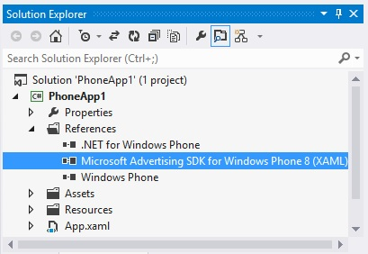
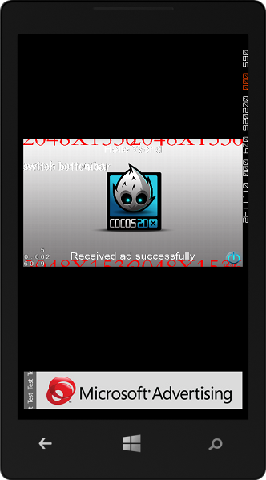

# integrate third SDK in Windows Phone 8

## introduction

 With the support of xaml in cocos2d-x wp8，it's much convenient to invoke third SDK. I will show you how to integrate third SDK using Microsoft's advertise system as a example，integrae in the XAML project. Microsoft offical doc：

[http://msdn.microsoft.com/en-US/library/advertising-mobile-windows-phone-8-adcontrol-visual-designer%28v=msads.20%29.aspx](http://msdn.microsoft.com/en-US/library/advertising-mobile-windows-phone-8-adcontrol-visual-designer%28v=msads.20%29.aspx " Integrating the AdControl")

but this page just show how to add control deirectly in the xaml page，I will show you how to add control in the c# page by C++ invocation，and how to deal with the C# controls response and call back in c++, that is c++ and c# to call each other. The example are all in myselve's adcontrol branch in github, link：

[https://github.com/koowolf/cocos2d-x/tree/adcontrol](https://github.com/koowolf/cocos2d-x/tree/adcontrol "adcontrol")

detail tutorial as following.

## download Microsoft Advertising SDK for Windows Phone 

link：[http://www.microsoft.com/en-us/download/details.aspx?id=8729](http://www.microsoft.com/en-us/download/details.aspx?id=8729 "SDK ")

Install the .msi file while download ok. Open HelloCpp project，right click and select "Add Reference", select "Extensions"　in Reference Mangager like as following：




## setting WMAppManifest.xml
find **Solution Explorer**=〉**Properties**，open **WMAppManifest.xml**


select **Capabilities **，check the item of **ID_CAP_IDENTITY_USER**, **ID_CAP_MEDIALIB_PHOTO**, **ID_CAP_PHONEDIALER**


## add AdControl invoke interface

Add ICallback.h file to HelloCppComponent，and add ICallback interface. Add call back event and invoke interface as following：

``` c++
namespace PhoneDirect3DXamlAppComponent
{
	namespace AdControlHelper
	{
		// An asynchronous completed event argument
		public ref class CompletedEventArgs sealed
		{
		public:
			CompletedEventArgs(bool ReturnValue, int ErrorCode, Platform::String^ ErrorMessage)
			{
				this->ReturnValue = ReturnValue;
				this->ErrorCode = ErrorCode;
				this->ErrorMessage = ErrorMessage;
			}

			property bool ReturnValue;
			property int ErrorCode;
			property Platform::String^ ErrorMessage;
		};
		// A callback interface for C# code to implement.
		public interface class ICallback
		{
			// Submit a score completed event.
			event Windows::Foundation::EventHandler<CompletedEventArgs^>^ OnBannerRefreshed;
			event Windows::Foundation::EventHandler<CompletedEventArgs^>^ OnBannerReceivedFailed;

			// switch bottombar in mainpage to add or remove panel
			void SwitchBottomBar();

			//... other event and other function
		};
	}
}
```

CompletedEventArgs is the encapsulation of responds information，contain error code and error information. SwitchBottomBar() is the function of c++ invoke c#. OnBannerRefreshed and OnBannerReceivedFailed is call back event handler，invoke in C#，respond such event handler and finish call back.

## implement ICallback interface in c# 

add AdControlCallback.cs in HelloCpp project，implement AdControlCallback and derive from ICallback interface as following：

``` c++

namespace PhoneDirect3DXamlAppComponent
{
    /// <summary>
    /// A callback class that implements the WinRT Component interface ICallback.
    /// All methods provided will be called throught the ICallback interface in native code.
    /// </summary>
    public class AdControlCallback : ICallback
    {
        public event EventHandler<CompletedEventArgs> OnBannerRefreshed;
        public event EventHandler<CompletedEventArgs> OnBannerReceivedFailed;

        public void SwitchBottomBar()
        {
            m_MainPage.SwitchBottomBar();
            if (bAdCreated == false)
            {
                 CreateBannerAd();
                 bAdCreated = true;
            }            
        }

        //Create the Ad at runtime and add to the container
        private void CreateBannerAd()
        {
            Deployment.Current.Dispatcher.BeginInvoke(() =>
            {
                // ApplicationID = "test_client", AdUnitID = "Image480_80", 

                AdControl adControl = new AdControl("test_client",   // ApplicationID
                                                    "Image480_80",   // AdUnitID
                                                    true);           // isAutoRefreshEnabled
                // Make the AdControl size large enough that it can contain the image
                adControl.Width = 480;
                adControl.Height = 80;
                adControl.AdRefreshed += new EventHandler(adControl_AdRefreshed);
                adControl.ErrorOccurred += new EventHandler<Microsoft.Advertising.AdErrorEventArgs>(AdView_AdRequestFailed);

                m_MainPage.AddBannerAd(adControl);
            });
        }

        private void adControl_AdRefreshed(object sender, EventArgs e)
        {
            if (OnBannerRefreshed != null && m_d3dInterop != null)
            {
                m_d3dInterop.OnAdControlEvent(sender, new CompletedEventArgs(true, 200, "Received ad successfully"), OnBannerRefreshed);
            }
        }
    }
}
```

note：

1.AdControl is the class in Microsoft.Advertising.Mobile.UI，you need to add the need namespace: using Microsoft.Advertising.Mobile.UI;.

2.AdControlCallback must derive memeber function and member variables from ICallback， you can add C# implement in the SwitchBottomBar() function，it call private function CreateBannerAd() to deal with AdControl.

3.you can use Deployment.Current.Dispatcher.BeginInvoke to enclose C# control，let c# control and C++ game interface in the difference thread，so if call thirdSDK with long time respond，it will not slow down the game interface，and if you call any control in MainPage.xaml you must place it in the main thread. We can find from debug that，MainPage.xaml.cs and native c++ interface is in the difference thread，MainPage is in the MainThread，but c++ game interface is working in the worker thread.

4.adControl_AdRefreshed is the response of AdControl，using this responds function we can judge as if we succeed to add the AdControl.

5.we can not directly call C++ method in adControl_AdRefreshed， or we will face with some unexpected errors，because the responds locate in the main thread（as the third point described above）, we need to attention to the problem of thread safe. I will describe how to deal with responds later.

## modify MainPage.xaml

When c++ call SwitchBottomBar() function， we need to adjust the MainPage.xaml page，make it show game UI in the upper place，and show advertisement in the down place. Ajust as following：

open MainPage.xaml page directly，modify code in ContentPanel，add StackPanel，set stackContainer's Visibility property as Collapsed，will add AdControl in stackContainer later.

``` c++
		<!--ContentPanel - place additional content here-->
        <Grid x:Name="ContentPanel" Grid.Row="1" Margin="12,0,12,0">

            <DrawingSurface x:Name="DrawingSurface" Loaded="DrawingSurface_Loaded" Margin="0,0,0,0"  />

            <!-- Container where the adcontrol will be added at run time-->
            <StackPanel x:Name="stackContainer" Height="0" VerticalAlignment="Bottom" Visibility="Collapsed">
            </StackPanel>

        </Grid>
```

when add SwitchBottomBar function in MainPage.xaml.cs，will show stackContainer while invoke，we modify the size of  DrawingSurface. Add AddBannerAd function，and add AdControl in stackContainer to show.

``` c++
        // add to the container
        public void AddBannerAd(AdControl adView)
        {
            Dispatcher.BeginInvoke(() =>
            {
                this.stackContainer.Children.Add(adView);
            });            
        }

        public void SwitchBottomBar()
        {
            Dispatcher.BeginInvoke(() =>
            {
                bool bIsVisible = Visibility.Visible == this.stackContainer.Visibility;
                this.stackContainer.Visibility = (bIsVisible ? Visibility.Collapsed : Visibility.Visible);

                // reMargin DrawingSurface
                Thickness srcMargin = this.DrawingSurface.Margin;
                srcMargin.Bottom = bIsVisible ? 0 : 100;
                this.DrawingSurface.Margin = srcMargin;

                // reHeight stackcontainer
                this.stackContainer.Height = bIsVisible ? 0 : 100;
            });
        }
```

note that SwitchBottomBar() in MainPage.xaml.cs invoked in SwitchBottomBar() in AdControlCallback， we need to add a MainPage instance as a memeber variable in AdControlCallback class， and set SwitchBottomBar()'s property as public in MainPage.xaml.cs.

## implement invoke delegate in WinRT component

add managed class **AdControlDelegate** in HelloCppComponent，convinent to call between C++ and C#.

``` c++

namespace PhoneDirect3DXamlAppComponent
{
	namespace AdControlHelper
	{
		public ref class AdControlDelegate sealed
		{
		public:
			AdControlDelegate(void);

			void SetCallback(ICallback^ callback);

			property static ICallback^ GlobalCallback;
		};
	}
}
```
we use static instance to save **ICallback's instance**，SetCallback function invoked in c# code. Set GlobalCallback as callback in SetCallback implement. If we use **AdControlDelegate** class many time，use singleton to create AdControlDelegate. Call SetCallback in the DrawingSurface_Loaded function in HelloCpp as following：

``` c++
				AdControlDelegate adDelegate = new AdControlDelegate();
				AdControlCallback adObj = new AdControlCallback();
                adDelegate.SetCallback(adObj);
```

## deal with call back function in the game logic

test and call sdk in menuCallbackBottom，implement call back event handler OnBannerReceivedFailed in C# code 

``` c++
	AdControlDelegate^ AdControlObj = ref new AdControlDelegate();
	AdControlObj->GlobalCallback->OnBannerReceivedFailed += ref new Windows::Foundation::EventHandler<CompletedEventArgs^>(
		[this](Platform::Object^ sender, CompletedEventArgs^ args){
			Platform::String ^platform_string = args->ErrorMessage;
			const wchar_t* wide_chars = platform_string->Data();
			char chars[512];
			wcstombs(chars, wide_chars, 512);
			pResponseLabel->setString(chars);
	});
	AdControlObj->GlobalCallback->SwitchBottomBar();
```

implent OnBannerReceivedFailed responds in the function and call SwitchBottomBar to invoke C# sdk. Using GlobalCallback to get the instance that created in c# code.

## handle in difference thread 

we can use main thread to invoke Sdk and can create a task to invoke too. Like   Deployment.Current.Dispatcher.BeginInvoke described above to invoke，
Deployment.Current.Dispatcher.BeginInvoke can get the main thread，and call sdk in it. We can use task to call too. As following：

``` c++
        //Create the Ad at runtime and add to the container
        public void CreateBannerAd()
        {
            //common worker thread
            System.Threading.Tasks.Task.Run(async () =>
            {
                // ApplicationID = "test_client", AdUnitID = "Image480_80", 

                AdControl adControl = new AdControl("test_client",   // ApplicationID
                                                    "Image480_80",   // AdUnitID
                                                    true);           // isAutoRefreshEnabled
                // Make the AdControl size large enough that it can contain the image
                adControl.Width = 480;
                adControl.Height = 80;
                adControl.AdRefreshed += new EventHandler(adControl_AdRefreshed);
                adControl.ErrorOccurred += new EventHandler<Microsoft.Advertising.AdErrorEventArgs>(AdView_AdRequestFailed);

                m_MainPage.AddBannerAd(adControl);
            });
        }

```

It has better to return to the game thread, so we have to deal with the call back.

## deal with call back

in the Direct3DInterop implement，we can find that，all the click and keyboad event handle by the mInputEvents queue，just throw event to the thread， and use ProcessEvents function to handle. So we define a AdControlEvent  class and derived from InputEvent as following：

``` c++
namespace PhoneDirect3DXamlAppComponent
{
	class AdControlEvent : public InputEvent
	{
	public:
		AdControlEvent(Object^ sender, CompletedEventArgs^ args, Windows::Foundation::EventHandler<CompletedEventArgs^>^ handler);
		virtual void execute(Cocos2dRenderer ^ renderer);

	private:
		Object^ m_sender;
		CompletedEventArgs^ m_args;
		Windows::Foundation::EventHandler<CompletedEventArgs^>^ m_handler;
	};
}

```
in the contrustor in AdControlEvent function，the last param is type of EventHandler，we handle it directly not to use Cocos2dRenderer. As we implement the call back in handler， invoke it in the execute function as following：

``` c++
	void AdControlEvent::execute( Cocos2dRenderer ^ renderer )
	{
		m_handler->Invoke(m_sender, m_args);
	}
```

in the class of Direct3DInterop，add the OnAdControlEvent responds function as following：

``` c++
void Direct3DInterop::OnAdControlEvent(Object^ sender, CompletedEventArgs^ args, Windows::Foundation::EventHandler<CompletedEventArgs^>^ handler)
{
	std::lock_guard<std::mutex> guard(mMutex);
	std::shared_ptr<AdControlEvent> e(new AdControlEvent(sender, args, handler));
	mInputEvents.push(e);
}
```

according to different implement in different handler instance，just call the only OnAdControlEvent function， such as implement another OnBannerReceivedFailed to invoke. We modify the code in call back function AdView_AdRequestFailed：
``` c++
        private void AdView_AdRequestFailed(object sender, Microsoft.Advertising.AdErrorEventArgs e)
        {
            //if (OnBannerReceived != null)
            //{
            //    OnBannerReceived(sender, new CompletedEventArgs(true, 200, "Received ad successfully"));                
            //}

            if (OnBannerReceivedFailed != null && m_d3dInterop != null)
            {
                m_d3dInterop.OnAdControlEvent(sender, new CompletedEventArgs(true, (int)e.ErrorCode, "Received ad failed" + e.Error.Message), OnBannerReceivedFailed);
            }
        }      
```

add SetDirect3DInterop function in AdControlCallback to save the Direct3DInterop instance
``` c++
		public void SetDirect3DInterop(Direct3DInterop d3dInterop)
        {
            m_d3dInterop = d3dInterop;
        }
```

we finish the procedure of call and call back, and if you we want to invoke other XAML page in MainPage, add SetMainPage function in AdControlCallback to save the MainPage instance as following:
``` c++
        public void SetMainPage(MainPage mainPage)
        {
            m_MainPage = mainPage;
        }

        private void CallToShowPage()
        {
            // get the UI thread (ie. the Main Thread) to let the worker thread (ie. opengl thread) work normally.
            Deployment.Current.Dispatcher.BeginInvoke(() =>
            {
                m_MainPage.NavigationService.Navigate(new Uri("/Page1.xaml", UriKind.Relative));
            });
        }
```
you can add button and use CallToShowPage above to popup a full-screen xaml page.

## Results in windows phone


