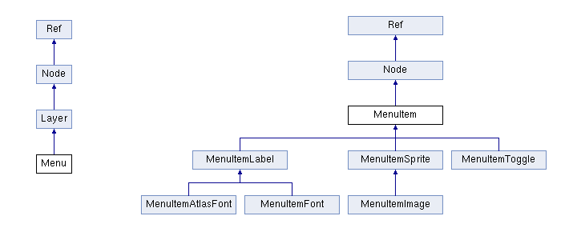

#菜单(Menu)

##继承关系



##原理介绍

Cocos2d-x中有一个内置的菜单系统，可以为你的游戏创建菜单。Menu类驱动一个菜单的主类，它包含描述文字、按钮和触发器的菜单列表。在使用过程中，首先你需要创建一个或多个菜单项(MenuItem)，然后用这些菜单项初始化菜单(Menu)对象，最后将这个初始化了的菜单对象添加到Layer中。

##基本用法

###文字菜单项(Font Item)

一个菜单项类，可以将你想要显示在屏幕上的文字串作为文字按钮显示。以下代码用来创建一个文字菜单项，并将其添加到菜单里面：

```
	auto item1 = MenuItemFont::create("Item Font Test", [&](Ref* sender)
                                      { log("Item Font Callback called!");}
                                      );
    item1->setFontSize(40);
    item1->setFontName("Marker Felt");
    item1->setPosition(Point(origin.x + visibleSize.width / 2, origin.y + visibleSize.height / 2));
    
    auto menu = Menu::create(item1, NULL);
    menu->setPosition(Point(0, 0));
    addChild(menu);
```


以上代码创建了一个MenuItemFont的菜单项对象，并用C++11新增的Lambda表达式初始化了该对象。为其设置好字体、字体大小和位置坐标后添加到菜单类menu中，单击该菜单在控制台上会看到如下输出：


`注意：`Menu的默认位置是屏幕右上角，而MenuItem的默认位置是Menu的中央。

###图片菜单项(Image Item)

由一个正常图片和一个激活/按下图像组成的图像按钮。以下代码用来创建一个图片菜单项，并将其添加到菜单里面：

```
	auto item2 = MenuItemImage::create("score-2.png", "score-1.png", [&](Ref* sender)
                                       { log("Image selected!");}
                                       );
    item2->setPosition(Point(origin.x + visibleSize.width / 2, origin.y + visibleSize.height / 2));
    
    auto menu = Menu::create(item2, NULL);
    menu->setPosition(Point(0, 0));
    addChild(menu);
```


以上代码创建了一个MenuItemImage的菜单项对象，并用两张不同的图片初始化了该对象。为其设置位置坐标后添加到菜单类menu中，单击该菜单会看到不同的效果以及在控制台上会看到如下输出：


###标签菜单项(Label Item)

使用Label显示文字的按钮。以下代码用来创建一个标签菜单项，并将其添加到菜单里面：

```
	auto item3 = MenuItemLabel::create(LabelTTF::create("Lable Test", "Arial", 40), [&](Ref* sender)
                                       { log("Label Callback called!");}
                                       );
    item3->setPosition(Point(origin.x + visibleSize.width / 2, origin.y + visibleSize.height / 2));
    
    auto menu = Menu::create(item3, NULL);
    menu->setPosition(Point(0, 0));
    addChild(menu);
```


以上代码创建了一个MenuItemLabel的菜单项对象，并用LableTTF初始化了该对象。为其设置位置坐标后添加到菜单类menu中，单击该菜单会看到不同的效果以及在控制台上会看到如下输出：


###触发器菜单项(Toggle Item)

触发器菜单项可以将任意的菜单项传进去，作为一个触发器按钮式的开关。以下代码用来创建一个触发器菜单项，并将其添加到菜单里面：

```
	auto item6 = MenuItemToggle::createWithCallback([&](Ref*){ log("Toggle touched!");}, MenuItemFont::create("On"), 	MenuItemFont::create("Off"), NULL);
    MenuItemFont::setFontName("Marker Felt");
    MenuItemFont::setFontSize(40);
    item6->setPosition(Point(origin.x + visibleSize.width / 2, origin.y + visibleSize.height / 2));
    
    auto menu = Menu::create(item6, NULL);
    menu->setPosition(Point(0, 0));
    addChild(menu);

```


以上代码创建了一个MenuItemToggle的菜单项对象，并用两个MenuItemFont初始化了该对象。为其设置位置坐标后添加到菜单类menu中，单击该菜单会看到不同的效果:


###菜单(Menu)类常用方法简介

菜单类提供了不同几种方法来排列菜单项，使用它们你可以垂直排列你的菜单项，也可以水平排列，一下简单介绍这些方法的参数和用法：

使用`void alignItemsVertically();`和 `void alignItemsVerticallyWithPadding(float padding);`可以使菜单项在垂直方向排列。其中`padding`参数为每个菜单项在垂直方向上的间距，如果没有该参数，则以默认间距排列。

使用`void alignItemsHorizontally();`和`void alignItemsHorizontallyWithPadding(float padding);`可以使菜单项在水平方向排列。其中`padding`参数为每个菜单项在水平方向上的间距，如果没有该参数，则以默认间距排列。 

使用`void alignItemsInColumns(unsigned int columns, ...);`和`void alignItemsInColumns(unsigned int columns, va_list args);`可以将菜单项按照列分组排列，参数`colums`为每列所包含的菜单项数。`...`和`args`都表示可以传人多个参数。
 
使用`void alignItemsInRows(unsigned int rows, ...);`和`void alignItemsInRows(unsigned int rows, va_list args);`可以将菜单项按照行分组排列，参数`colums`为每行所包含的菜单项数。`...`和`args`都表示可以传人多个参数。

##高级用法

游戏中，我们有时需要给菜单添加一些效果，例如某个菜单需要提醒玩家点击，那么我们可以给菜单添加动态高亮效果来提醒他们。下面我们来用两个例子展示如何给菜单添加自定义效果。

###动态高亮效果

使用LabelItem菜单项和TintBy动作结合实现菜单的动态高亮效果：

```
	auto item4 = MenuItemFont::create("Notice This Menu", [&](Ref* sender)
                                      { log("MenuItem touched!");}
                                      );
    item4->setPosition(Point(origin.x + visibleSize.width / 2, origin.y + visibleSize.height / 2));
    
    auto color_action = TintBy::create(0.5f, 0, -255, -255);
    auto color_back = color_action->reverse();
    auto seq = Sequence::create(color_action, color_back, NULL);
    item4->runAction(RepeatForever::create(seq));
    
    auto menu = Menu::create(item4, NULL);
    menu->setPosition(Point(0, 0));
    addChild(menu);

```


以上代码首先使用MenuItemLable初始化一个菜单项，然后为该菜单项增添了一个TintBy的颜色渐变动作，并永久播放，单击菜单后菜单颜色不再变化，控制台还能看到一下输出：


###移动动画效果

使用LabelItem菜单项和MoveTo动作结合实现菜单的移动效果：

```
	auto item5 = MenuItemFont::create("Move MenuItem", [&](Ref* sender)
                                      { log("Move Item called!");}
                                      );
    item5->setPosition(Point(-20, origin.y + visibleSize.height / 2));
    
    auto moveTo = MoveTo::create(0.25f, Point(origin.x + visibleSize.width / 2, origin.y + visibleSize.height / 2));
    item5->runAction(moveTo);
    
    auto menu = Menu::create(item5, NULL);
    menu->setPosition(Point(0, 0));
    addChild(menu);
```

以上代码首先使用MenuItemLable初始化一个菜单项，然后为该菜单项增添了一个MoveTo动作，这样菜单慧聪屏幕左边移动至中央。