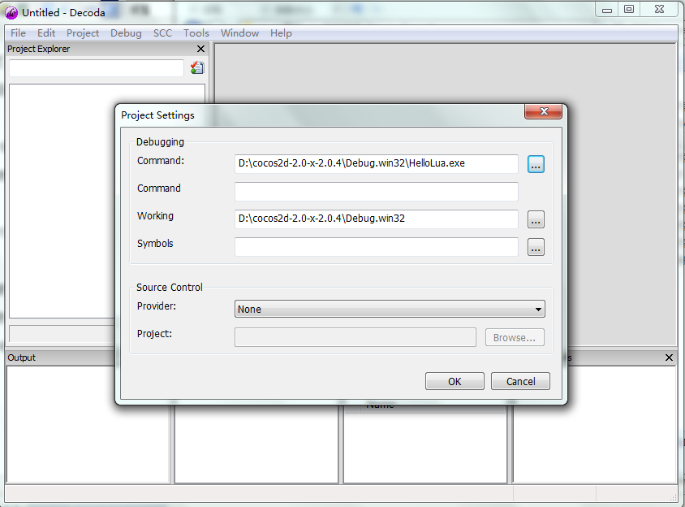

#如何调试 cocos2d-x 游戏

调试是任何项目都不可缺少的。cocos2d-X支持多种平台但是每个平台上使用的工具是不同的，有不同的功能。正因为这样一些平台可能会比其他平台更容易开发和调试。 

Xcode是非常好，提供了出色的调试工具和和优良的模拟器。 

Win32也不错，有良好的调试工具。 

Android对于缺乏经验的Android开发者往往是困难的。用户抱怨用Eclipse调试要么模拟器不运行，要么需要很长的时间才能执行的问题。这使得它很难调试。

##移植到Android平台

移植Cocos2D-X游戏从一个平台到另一个平台很简单： 

从一个平台移植到Android的主要步骤为： 

- 修改Android.mk下proj.android文件夹。 
运行cocos `cocos run -s path-to-your-project -p android` 构建项目和安装apk文件到您的手机。 
（注：当您修改Android.mk文件，试图包括所有的编译单元中的LOCAL_SRC_FILES，并包括所需的模块）


##调试 Cocos2d-x Lua 游戏

调试lua的代码需要第三方工具，如Decoda或LuaEdit。这两个工具都仅适用于Windows。

###Decoda

Decoda是一个商业软件，而不需要修改代码可以调试Lua。 

调试步骤： 

- 使用debug模式在VS2010建立的Cocos2D-X LUA项目。 

- 根据项目\testlua\资源的所有文件复制到项目\testlua\proj.win32\Debug.win32 

- 开始Decoda。 

选择菜单“调试” ->“开始调试[F5]键”。在打开的对话框中，设置的命令和工作。



- 在Decoda打开Lua的源文件并设置断点。 

- 使用键盘快捷键F5来重新启动程序，使断点工作。

###LuaEdit

LuaEdit是一个开源软件，它可以调试LUA，但你可能需要修改的代码。 

请参考[官方文档](http://luaedit.sourceforge.net/support.html#faq-002)获取更多信息。


##使用控制台日志(console log) 调试

作为补充的调试工具，控制台日志是非常有用的。

C++:

```
void Log(const char * pszFormat, …)
```

Lua:

```
    print
```

使用下列代码制作你自己的 cclog :

    local cclog = function(...)
        print(string.format(...))
    end
JSB:

    cc.log();
或者

    log();