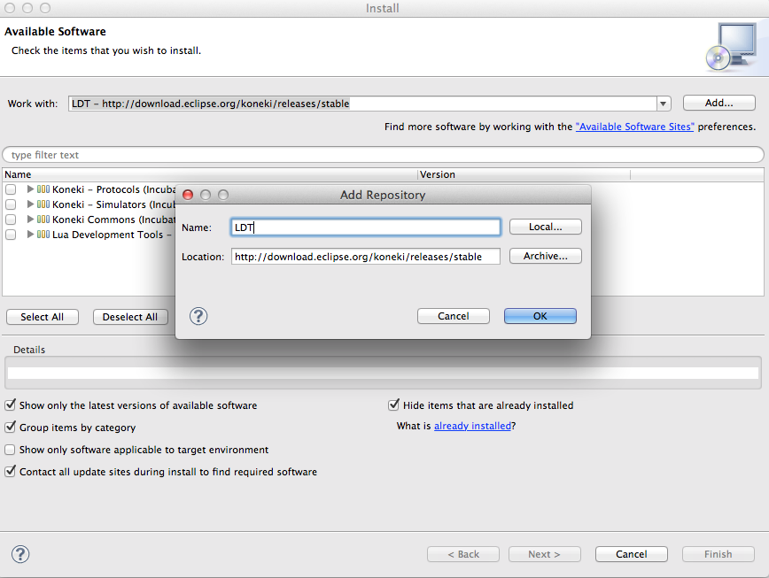
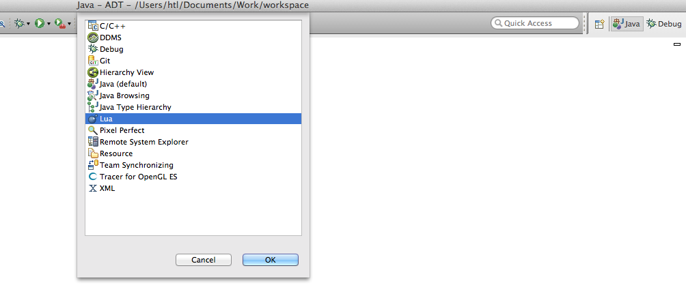
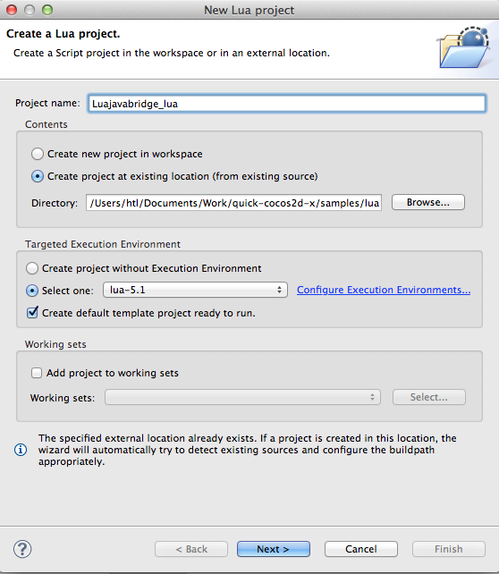
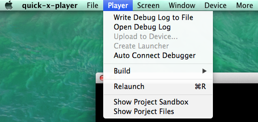
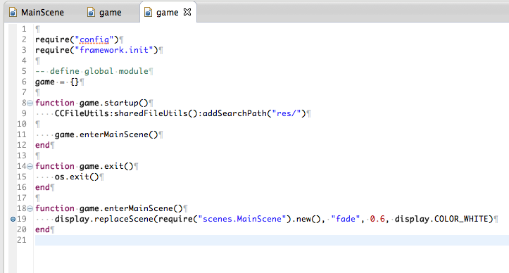
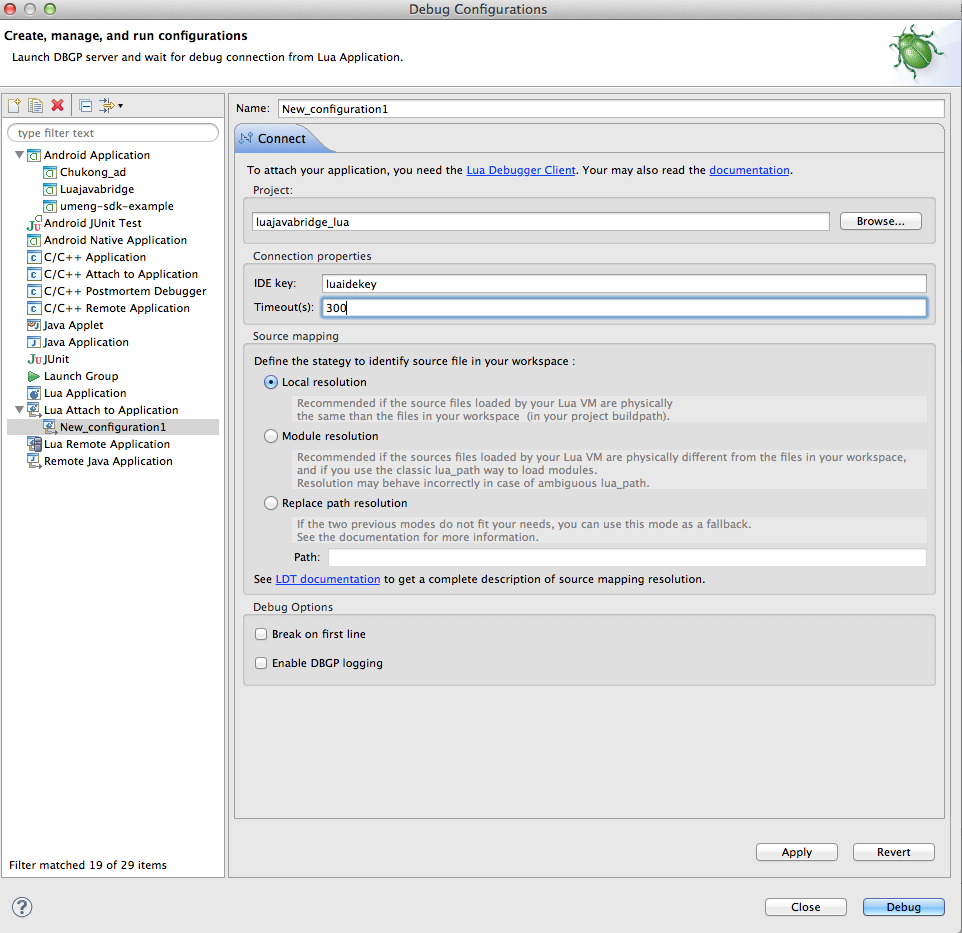
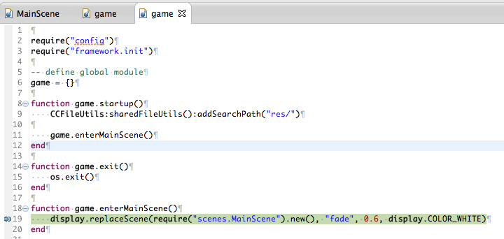

# 用 Eclipse LDT 调试 quick-cocos2d-x 游戏 #

目前，quick-cocos2d-x 已经内置了对 Eclipse LDT 的调试器支持，要用 LDT 进行调试需要以下几步:

1. 在Eclipse中安装 ** LDT **
2. 创建一个lua工程
3. 开启Player的 ** debugger ** 功能
4. 在Eclipse LDT设置断点
5. 配置LDT的 ** Debug Configuration **
6. 刷新Player
7. 再次开启调试

## 在Eclipse中安装LDT ##

1.选中Eclipse的菜单Help-->Install New Software, 输入

~~~

LDT - http://download.eclipse.org/koneki/releases/stable

~~~

2.选择Lua Development Tools项，点next,一路开始安装

3.安装好后，切换到lua工程界面

## 创建一个lua工程 ##

源文件路径选择要调试工程路径，这里以样例luajavabridge为例，路径为

~~~

$QUICK_COCOS2DX_ROOT/samples/luajavabridge/scripts/

~~~

## 开启Player的debugger功能 ##

启动 quick-x-player，打开要调试的项目，然后选择菜单 ** Player ** -> ** Auto Connect Debugger ** 。

如果发现选择player在刷新后,auto connect debugger未选中，可用命令行方式启动player

mac上，命令行中

~~~

cd $QUICK_COCOS2DX_ROOT/player/mac/quick-x-player.app/Contents/MacOS
./quick-x-player -debugger-ldt

~~~

**注意** -debugger-ldt 之间没有空格

windows上，进入到quick-x-player.exe所在目录，运行命令:

~~~

quick-x-player -debugger-ldt

~~~

## 在Eclipse LDT设置断点 ##

## 配置LDT的Debug Configuration ##

然后选择菜单 Run -> Debug Configurations 打开 Debug Configurations 对话框。

在对话框中，从左侧列表选中 Lua Attach to Application，点鼠标右键选择菜单 New 添加一个新的调试设置。在右侧可以修改调试设置的内容，但 IDE Key 不能修改。建议选中 Break on first line 选项，并将 Timeout(s) 的值增加到 300 秒：

设置完成后，点击 Debug 按钮启动调试器。

## 刷新Player ##

启动调试器后，需要在超时限制到达前刷新 quick-x-player。按下 CMD+R 或者 F5 键，quick-x-player 会刷新，此时 LDT 会打开调试视图。

然后就可以使用 LDT 提供的调试工具对项目进行调试了。

## 再次开启调试 ##

目前比较麻烦的一点是本次调试结束后，如果要再次开始调试，就需要在 LDT 中重新打开 Debug Configurations 对话框，选中先前创建的设置后点击 Debug 按钮。然后再次刷新 quick-x-player。
