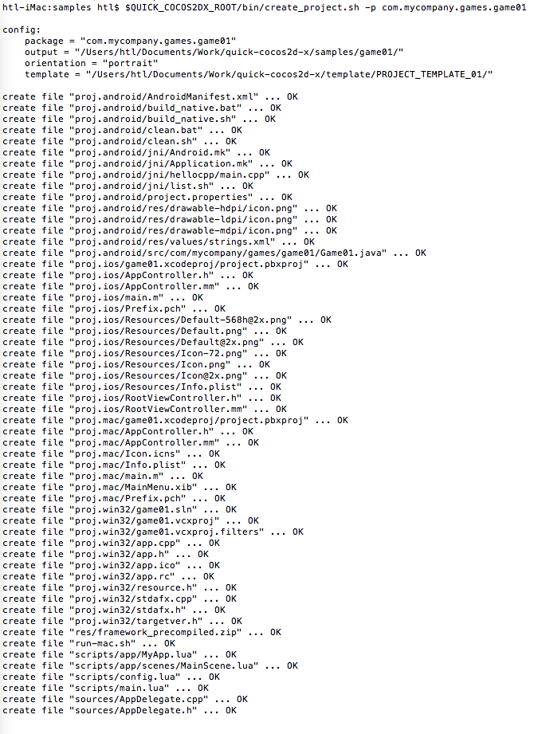

# 创建新项目 #

### 创建新项目之前，确保已经正确设置了 QUICK_COCOS2DX_ROOT 环境变量，参考：###

	设置 quick-Cocos2d-x 在 Mac 下的编译环境
	设置 quick-Cocos2d-x 在 Windows 下的编译环境

## 在 Mac 环境里创建新项目 ##

启动 “终端” 应用程序，然后进入需要放置新项目的目录：

~~~

cd ~/Desktop

~~~

运行 create_project.sh 命令，并指定项目的 package name：

~~~

$QUICK_COCOS2DX_ROOT/bin/create_project.sh -p com.mycompany.games.game01

~~~

create_project.sh 命令会以 package name 的最后一节作为新项目的目录名，因此上述命令会创建一个名为 game01 的目录。

成功后可以看到如下画面： 

接下来就可以用 player 运行项目了。或者打开 **proj.ios** , **proj.android** 里的工程文件，在真机上进行测试。

## 在 Windows 环境里创建新项目 ##

与 Mac 环境类似，只不过是在“命令提示符”窗口中执行 create_project.bat。

**注意**：不要在 cygwin 窗口里执行 create_project.bat 或者 create_project.sh

~~~

%QUICK_COCOS2DX_ROOT%\bin\create_project.bat -p com.mycompany.games.game01

~~~

### 创建项目时指定屏幕方向 ###

用 -o 参数指定屏幕方向，可用值有 landscape（横屏）、portrait（竖屏），例如：

~~~

$QUICK_COCOS2DX_ROOT/bin/create_project.sh -r landscape -p com.mycompany.games.game01

~~~

#### 提示 ####
更多create_project的用法可以在终端/命令行中输入 **$QUICK_COCOS2DX_ROOT/bin/create_project.sh -h** 了解

