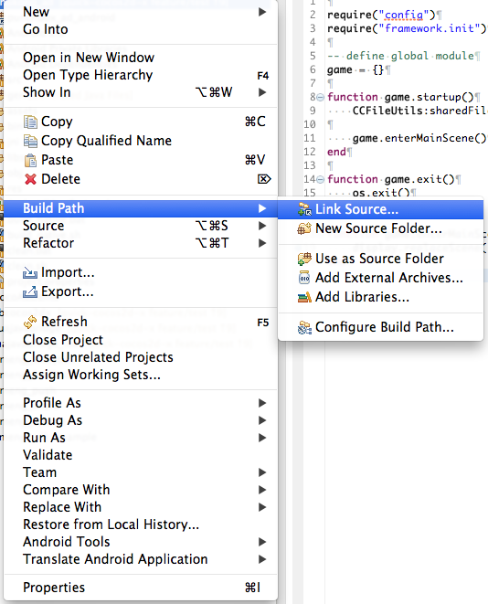
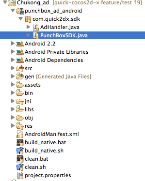
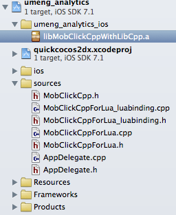

# 在QUICK中集成第三方SDK #

本文分别讲解两种不同类型SDK的集成流程

1. 集成各平台原生代码(以集成触控广告SDK为例)
2. 集成C++代码(以友盟游戏统计为例)

## 集成触控广告SDK ##

### 下载SDK ###
网址:<http://dev.cocounion.com/abdev/index>

### IOS版集成 ###

1.解压后，将libPunchBoxAd拷贝到 $QUICK_COCOS2DX_ROOT/lib/sdk/punchbox_ad/punchbox_ad_ios/src 中

2.打开要集成的项目的xcode工程，将 $QUICK_COCOS2DX_ROOT/lib/sdk/punchbox_ad/punchbox_ad_ios 中的代码加到xcode中

3.集成中所需要的中间代码放在$QUICK_COCOS2DX_ROOT/lib/sdk/punchbox_ad/punchbox_ad_ios下

4.中间层对lua提供的接口必须全是类方法

PunchBoxAdSDK.h

~~~

@interface PunchBoxAdSDK : NSObject

// public interface

+ (void) start:(NSDictionary*)options;
+ (void) stop;
+ (void) show:(NSDictionary*)options;
+ (void) remove;
+ (void) addScriptListener:(NSDictionary*)options;
+ (void) removeScriptListener;

@end

~~~

5.在framework中加入

- cc.ad.PunchBox.lua // punchbox工厂类，根据平台创建对的实例类
- cc.ad.punchbox.ProviderIOS.lua // ** 调用PunchBoxAdSDK接口 **
- cc.ad.init.lua // 加入根据参数是否启动调用punchbox Ad的判断

### Android集成 ###

1.解压后，将libs拷贝到要集成项目的proj.android/libs中

2.打开要集成项目的Android工程，在BuildPath中->link source选择$QUICK_COCOS2DX_ROOT/lib/sdk/punchbox_ad/punchbox_ad_android/punchbox_ad_android目录

3.集成中所需要的中间代码放在$QUICK_COCOS2DX_ROOT/lib/sdk/punchbox_ad/punchbox_ad_android/punchbox_ad_android下

4.中间层对lua提供的接口必须全是类方法

PunchBoxAdSDK.h

~~~

public class PunchBoxSDK {

    public static void start(String appId_) {
		....
    }
    
    public static void show(final String adType, final String adId, final String adPosition) {
    	....
    }
    
    ....
}

~~~

5.在framework中加入

- cc.ad.PunchBox.lua // punchbox工厂类，根据平台创建对的实例类
- cc.ad.punchbox.ProviderAndroid.lua // ** 调用PunchBoxAdSDK接口 **
- cc.ad.init.lua // 加入根据参数是否启动调用punchbox Ad的判断

### lua层调用 ###

1.根据平台启动广告模块

~~~

if device.platform == "ios" or device.platform == "android" then
	cc.ad:start({appId = PUNCHBOX_AD_SDK_APP_ID}, "ad.PunchBox")
end

~~~

2.显示banner广告

~~~

cc.ad:doCommand{command = "banner", args = {id = PUNCHBOX_AD_SDK_BANNER_ID, position = "top"}}

~~~

** 提示 **: 具体实际请参见samples/punchbox_ad及SDK对应的集成说明文档

## 集成友盟统计SDK ##

### 下载SDK ###
网址:<http://dev.umeng.com/game/game-cocos2d/sdk-download>

### 对MobClickCpp封装 ###

因为MobClickCpp.h中有一个map类型的参数等原因，我们在其上面加一个MobClickCppForLua类作中转

### 拷贝文件 ###

把

- $QUICK_COCOS2DX_ROOT/lib/sdk/umeng_analytics/MobClickCpp.h
- $QUICK_COCOS2DX_ROOT/lib/sdk/umeng_analytics/MobClickCppForLua.h
- $QUICK_COCOS2DX_ROOT/lib/sdk/umeng_analytics/MobClickCppForLua.cpp
- $QUICK_COCOS2DX_ROOT/lib/sdk/umeng_analytics/MobClickCppForLua_luabinding.h
- $QUICK_COCOS2DX_ROOT/lib/sdk/umeng_analytics/MobClickCppForLua_luabinding.cpp

拷贝到对象的工程中的source文件夹下

### IOS版集成 ###

把

- $QUICK_COCOS2DX_ROOT/lib/sdk/umeng_analytics/umeng_analytics_ios/libMobClickCpp.a
- $proj/sources/MobClickCpp.h
- $proj/sources/MobClickCppForLua.h
- $proj/sources/MobClickCppForLua.cpp
- $proj/sources/MobClickCppForLua_luabinding.h
- $proj/sources/MobClickCppForLua_luabinding.cpp

加到xcode工程中

$proj表示当前工程目录

** 注意 ** : cocos2d-x项目默认使用libstdc++编译,如果您的项目正在使用libc++编译请使用libMobClickCppWithLibCpp.a

依赖框架中添加libz.dylib

### Android版集成 ###

- 将 $QUICK_COCOS2DX_ROOT/lib/sdk/umeng_analytics/umeng_analytics_android中的libs,res内容拷贝到需要集成的eclipse工程下
- 修改proj.android/jni/Android.mk

~~~

	LOCAL_SRC_FILES :=
    	../../sources/MobClickCppForLua_luabinding.cpp \
    	../../sources/MobClickCppForLua.cpp
	LOCAL_LDLIBS := $(LOCAL_PATH)/../libs/cocos2dx2_libMobClickCpp.a

~~~

- 修改proj.android/jni/helloCpp/main.cpp, 在其中的JNI_OnLoad函数中加入

~~~

	MobClickCpp::initJniForCocos2dx2((void*)vm,
	"此处填写上一步修改的activity的名字 如org/cocos2d_x/samples/umeng_analytics/Umeng_analytics");

~~~
	
- 修改游戏中主activity，见样例中的Umeng_analytics
- 在applicationDidFinishLaunching调用luaopen_MobClickCppForLua_luabinding函数

### lua层调用 ###

- 在app中启动并设置setappkey

~~~

-- init analytics
if device.platform == "android" or device.platform == "ios" then
        cc.analytics:start("analytics.UmengAnalytics")
end
    
if device.platform == "android" then
    	cc.analytics:doCommand{command = "startWithAppkey",
    			args = {appKey = "536b184d56240bb2cd02adbf"}}
elseif device.platform == "ios" then
    	cc.analytics:doCommand{command = "startWithAppkey",
    			args = {appKey = "5369de0b56240b5363019991"}}
end

~~~

- 调用相关接口

~~~

-- 通过支付宝用 10元钱 购买了 1000 个金币
cc.analytics:doCommand{command = "payCoin", args = {cash = 10, source = 2, coin = 1000}}

~~~

** 提示 ** : 具体实际请参见samples/umeng_analytics及SDK对应的集成说明文档
