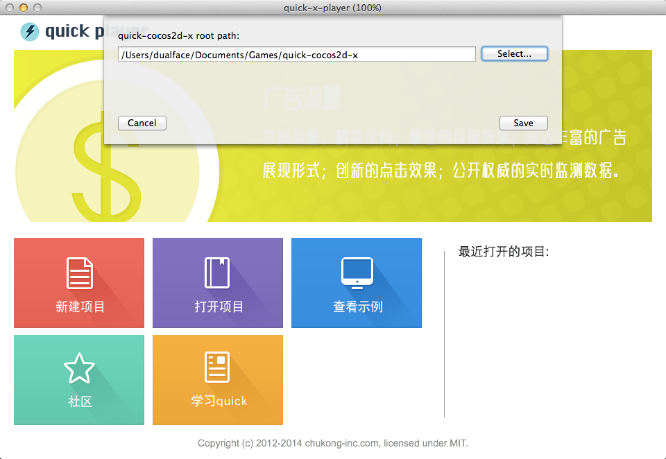
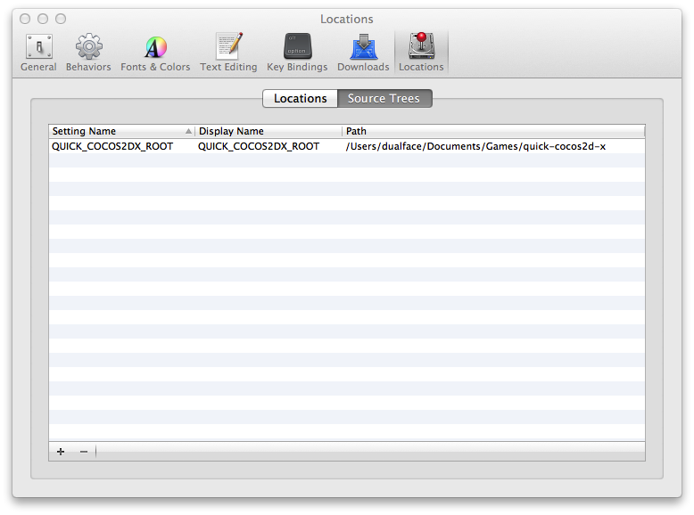
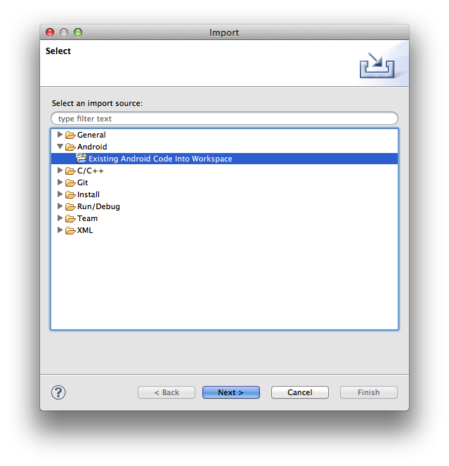
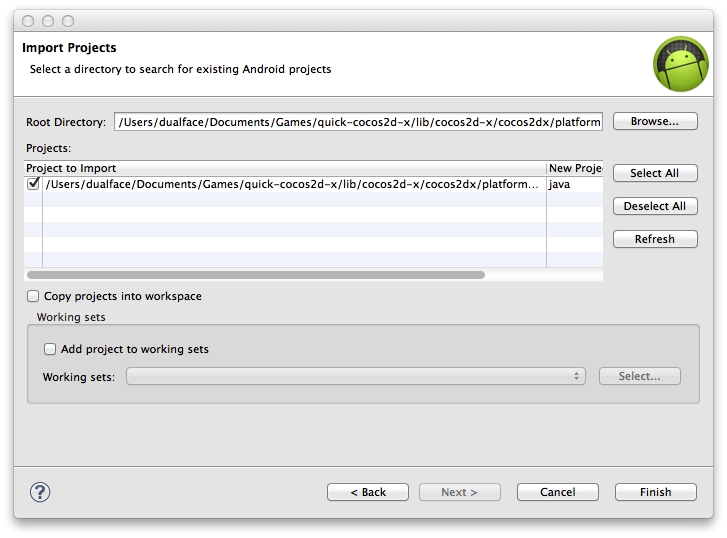
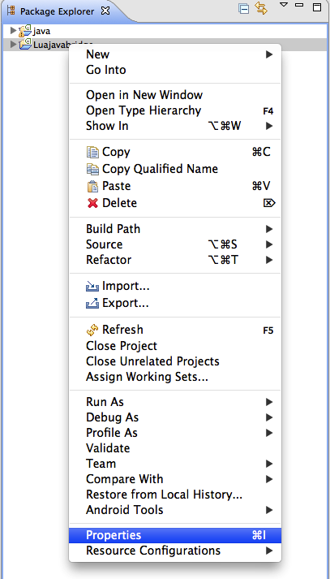
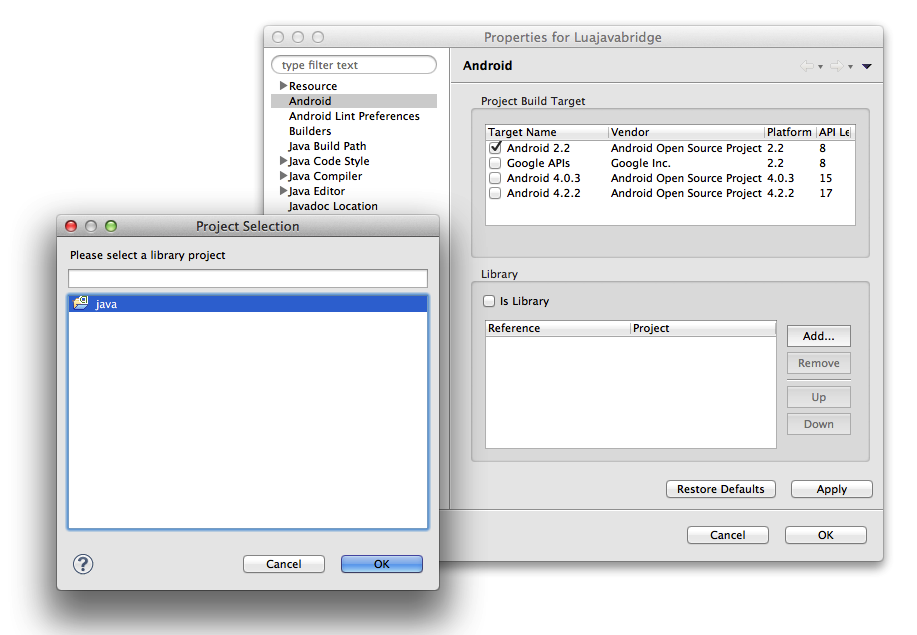

# 设置 quick-cocos2d-x 在 Mac 下的编译环境 #

如果不需要 Android，那么可以跳过 2/6 两个步骤。

配置编译环境的基本步骤：

1. 安装 Xcode
2. 安装最新的 Android ADT bundle 和 Android NDK
3. 下载 quick-cocos2d-x 源代码
4. 设置环境变量
5. 编译 quick-x-player proj.mac 项目
6. 编译 LuaJavaBridge 示例，并在 Android 真机上进行测试

## Step 1: 安装 Xcode ##

从 <https://developer.apple.com/xcode/index.php> 下载最新稳定版 Xcode，并进行安装。

Xcode 安装完成后，打开“偏好设置”对话框，安装 ** Command Line Tools **.

## Step 2: 安装最新的 Android ADT bundle 和 Android NDK ##

1. 从 http://developer.android.com/sdk/ 下载 ADT Bundle for Mac
2. 解压缩 adt-bundle-mac-x86_64-2013????.zip
3. 将 adt-bundle-mac-x86_64-2014???? 目录改名为 android
4. 将 android/sdk 目录改名为 android/android-sdk-macosx
5. 从 http://developer.android.com/tools/sdk/ndk/index.html 下载 Android NDK
6. 解压缩 android-ndk-r?-mac-x86_64.tar.bz2
7. 移动目录 android-ndk-r? 到 android/android-ndk-r?   (目录结构如下图)

最终的目录结构:

	<PATH_TO>/android/android-ndk-r?
	<PATH_TO>/android/android-sdk-macosx
	<PATH_TO>/android/eclipse
	

运行 android/android-sdk-macosx/tools/android, 选中 Android SDK 2.2（如果看不到 Android SDK 2.2，请设置代理）, 并完成安装。

## Step 3: 下载 quick-cocos2d-x 源代码 ##

方法 1: 最快速获得源代码的途径是通过 [quick-cocos2d-x](http://quick.cocoachina.com/) 官方网站上的下载页面。这里列出了所有的稳定版本及其下载链接。

注意，解压缩的源代码不能放在有空格和汉字的路径中。

方法 2: 使用 git 工具克隆 quick-cocos2d-x 仓库。启动 终端 应用程序, 运行命令:

~~~

$ git clone git@github.com:chukong/quick-cocos2d-x.git

    Cloning into 'quick-cocos2d-x'...
~~~

如果访问 github.com 速度太慢，可以使用国内镜像仓库，网页：<https://code.csdn.net/liaoyulei01/quick-cocos2d-x>

保持 git 仓库处于最新状态

运行命令:

~~~

$ cd quick-cocos2d-x
$ git pull

~~~

## Step 4: 设置环境变量 ##

启动 终端 应用程序, 运行命令:

~~~

$ touch ~/.bash_profile
$ open ~/.bash_profile -a TextEdit

~~~

添加下列代码:

~~~

export ANDROID_NDK_ROOT=<PATH_TO>/android/android-ndk-r8e
export ANDROID_SDK_ROOT=<PATH_TO>/android/android-sdk-macosx
export QUICK_COCOS2DX_ROOT=<PATH_TO>/quick-cocos2d-x
export COCOS2DX_ROOT=${QUICK_COCOS2DX_ROOT}/lib/cocos2d-x
export ANDROID_HOME=${ANDROID_SDK_ROOT}

~~~

启动 Xcode，在“偏好设置”中添加 Source Trees:

## Step 5: 编译 quick-x-player proj.mac 项目 ##

启动 Xcode, 打开项目 \<PATH_TO>/quick-cocos2d-x/player/proj.mac/quick-x-player.xcodeproj.

编译运行。

## Step 6: 编译 LuaJavaBridge 示例，并在 Android 真机上进行测试 ##

启动 终端 应用程序, 改变当前目录为 <PATH_TO>/quick-cocos2d-x/sample/luajavabridge/proj.android, 运行 build_native.sh:

~~~

$ cd quick-cocos2d-x/sample/luajavabridge/proj.android
$ ./build_native.sh

~~~

如果一切顺利，将看到:

~~~

SharedLibrary  : libgame.so
Install        : libgame.so => libs/armeabi/libgame.so

~~~

### 将项目导入 Eclipse ADT ###

启动 <PATH_TO>/eclipse/eclipse.app 应用程序, 导入 libcocos2dx 库.

1.选择菜单 File -> Import, 再选择 Android -> Existing Android Code Into Workspace : 

    
2.点击 Browse 按钮, 选择 <PATH_TO>/quick-cocos2d-x/lib/cocos2d-x/cocos2dx/platform/android/java :

3.点击 Finish.

4.重复上述步骤，导入 luajavabridge/proj.android:

5.在 Package Explorer 中选中 LuajavaBridge，点击右键选择菜单 Properties:

6.如果 ** Library ** 列表里 ** libcocos2dx ** 已经存在，就先删除。点击 ** Add ** 按钮, 选中 ** libcocos2dx **.

7.完成。

### 设置 Android 设备允许真机调试 ###

Android 官方文档：http://developer.android.com/tools/device.html

1. Enable USB debugging on your device.
	* On most devices running Android 3.2 or older, you can find the option under Settings > Applications > Development.
	* On Android 4.0 and newer, it’s in Settings > Developer options.
	
	Note: On Android 4.2 and newer, Developer options is hidden by default. To make it available, go to Settings > About phone and tap Build number seven times. Return to the previous screen to find Developer options.
	* 在系统设置中找到“开发者选项”，打开“USB调试”。
2. Set up your system to detect your device.
	* If you’re developing on Windows, you need to install a USB driver for adb. For an installation guide and links to OEM drivers, see the OEM USB Drivers document.
	* 根据不同的机型，也许需要安装该机型特定的 USB 驱动程序。例如 Moto 就必须安装 Moto 的 USB 驱动。

### 在设备上测试 LuaJavaBridge 示例 ###

1. 在 Eclipse 里选择菜单 Window -> Show View -> Other…, 再选择 Android -> Devices.

2. 如果设备设置完成，那么在 Devices 标签页中就可以看到你的设备:

3. 在项目 LuajavaBridge 上点击鼠标右键, 选择菜单 Debug As -> Android Application. 如果一切正常，等一会儿就可以在设备上看到运行画面了：

#### 提示 ####
截止2014.5.28, ** NDK ** 已更新到 ** android-ndk-r9d **,请用新的NDK版本
