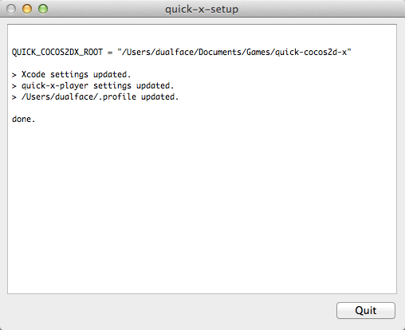
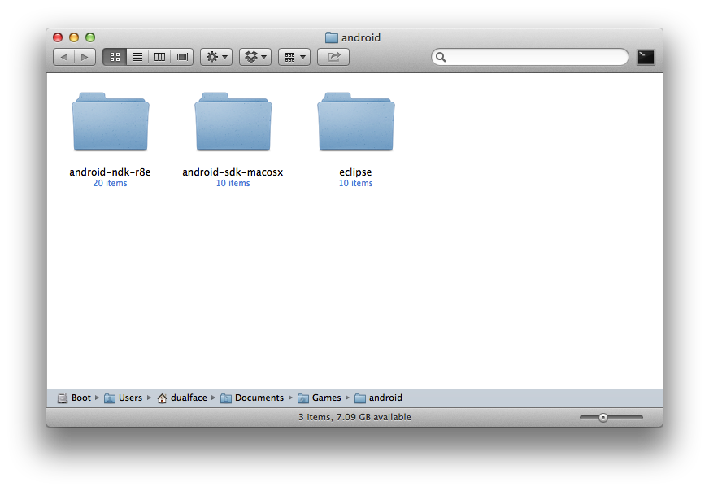
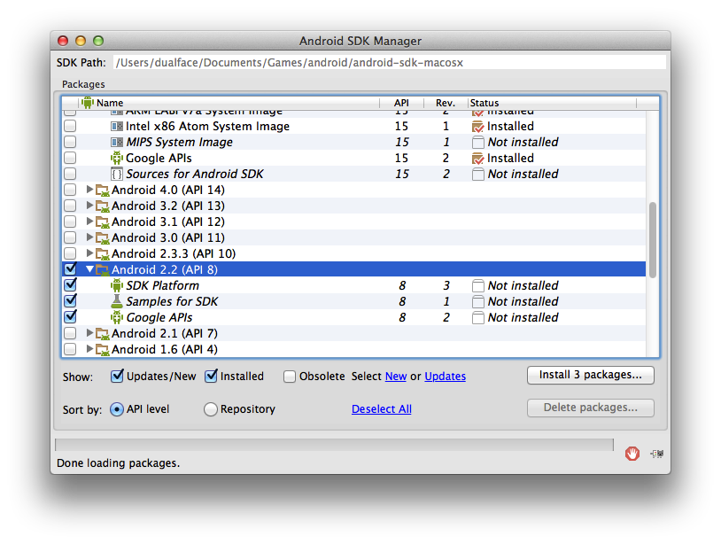
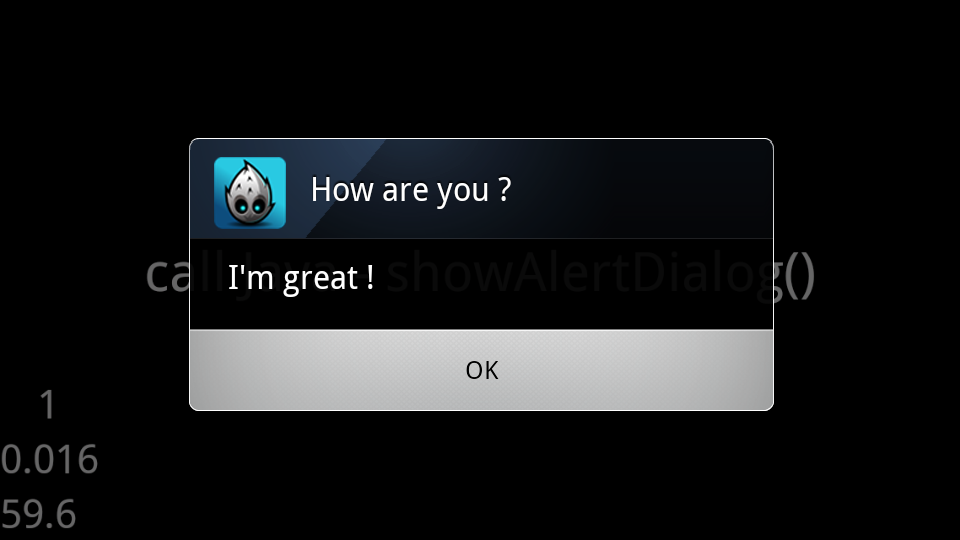

# 设置 Quick-Cocos2d-x 在 Mac 下的编译环境 #

如果不需要在 Android 上运行，那么可以跳过 3/4 两个步骤。

配置编译环境的基本步骤：

1. 下载 Quick-Cocos2d-x 源代码
2. 设置运行环境
3. 安装最新的 Android ADT bundle 和 Android NDK
4. 编译 LuaJavaBridge 示例，并在 Android 真机上进行测试


## Step 1: 下载 Quick-Cocos2d-x 源代码 ##

访问 [https://github.com/chukong/quick-cocos2d-x/releases](https://github.com/chukong/quick-cocos2d-x/releases) 下载最新版 quick 源代码。

Quick-Cocos2d-x 目录的放置有一定要求 ** ：

1. 不能放在根目录
2. 路径中不能包含中文和空格（所以别放桌面了）

~


## Step 2: 设置运行环境

运行 **setup.app**，完成运行环境的设置工作，成功会看到如下界面：



~


启动 **player/mac/player.app**，如果是首次运行，会提示设置 quick-Cocos2d-x 源代码所在路径。如果不是首次运行，请按 CMD+, 键打开偏好设置对话框进行设置：


上述设置完成后，即可使用 player 运行示例和您的项目。

~


## Step 3: 安装最新的 Android ADT bundle 和 Android NDK ##

1. 从 http://developer.android.com/sdk/ 下载 ADT Bundle for Mac
2. 解压缩 adt-bundle-mac-x86_64-2013????.zip
3. 将 adt-bundle-mac-x86_64-2014???? 目录改名为 android
4. 将 android/sdk 目录改名为 android/android-sdk-macosx
5. 从 http://developer.android.com/tools/sdk/ndk/index.html 下载 Android NDK
6. 解压缩 android-ndk-r9?-mac-x86_64.tar.bz2
7. 移动目录 android-ndk-r9? 到 android/android-ndk-r9?   (目录结构如下图)

最终的目录结构:

	<PATH_TO>/android/android-ndk-r9?
	<PATH_TO>/android/android-sdk-macosx
	<PATH_TO>/android/eclipse




运行 android/android-sdk-macosx/tools/android, 选中 Android SDK 2.2（如果看不到 Android SDK 2.2，请设置代理）, 并完成安装。


~


启动 终端 应用程序, 运行命令:

```

$ if [ -f ~/.profile ]; then open ~/.profile -a TextEdit; fi

```


如果没看到文本编辑窗口出现，则运行以下命令：

```

$ if [ -f ~/.bash_profile ]; then open ~/.bash_profile -a TextEdit; fi

```

添加下列代码:

```

export ANDROID_NDK_ROOT=<PATH_TO>/android/android-ndk-r8e
export ANDROID_SDK_ROOT=<PATH_TO>/android/android-sdk-macosx
export ANDROID_HOME=${ANDROID_SDK_ROOT}

```

~


## Step 4: 编译 LuaJavaBridge 示例，并在 Android 真机上进行测试 ##

启动 终端 应用程序, 改变当前目录为 <PATH_TO>/Quick-cocos2d-x/sample/luajavabridge/proj.android, 运行 build_native.sh:

```

$ cd Quick-cocos2d-x/sample/luajavabridge/proj.android
$ ./build_native.sh

```


如果一切顺利，将看到:

```

SharedLibrary  : libgame.so
Install        : libgame.so => libs/armeabi/libgame.so

```

### 将项目导入 Eclipse ADT ###

启动 <PATH_TO>/eclipse/eclipse.app 应用程序, 导入 libcocos2dx 库.

1.选择菜单 File -> Import, 再选择 Android -> Existing Android Code Into Workspace :


2.点击 Browse 按钮, 选择 <PATH_TO>/Quick-cocos2d-x/lib/cocos2d-x/cocos2dx/platform/android/java :


3.点击 Finish.

4.重复上述步骤，导入 luajavabridge/proj.android:

5.在 Package Explorer 中选中 LuajavaBridge，点击右键选择菜单 Properties:


6.如果 ** Library ** 列表里 ** libcocos2dx ** 已经存在，就先删除。点击 ** Add ** 按钮, 选中 ** libcocos2dx **.


7.完成。

### 设置 Android 设备允许真机调试 ###

Android 官方文档：http://developer.android.com/tools/device.html

1. Enable USB debugging on your device.
	* On most devices running Android 3.2 or older, you can find the option under Settings > Applications > Development.
	* On Android 4.0 and newer, it’s in Settings > Developer options.

	Note: On Android 4.2 and newer, Developer options is hidden by default. To make it available, go to Settings > About phone and tap Build number seven times. Return to the previous screen to find Developer options.
	* 在系统设置中找到“开发者选项”，打开“USB调试”。
2. Set up your system to detect your device.
	* If you’re developing on Windows, you need to install a USB driver for adb. For an installation guide and links to OEM drivers, see the OEM USB Drivers document.
	* 根据不同的机型，也许需要安装该机型特定的 USB 驱动程序。例如 Moto 就必须安装 Moto 的 USB 驱动。

### 在设备上测试 LuaJavaBridge 示例 ###

1. 在 Eclipse 里选择菜单 Window -> Show View -> Other…, 再选择 Android -> Devices.

2. 如果设备设置完成，那么在 Devices 标签页中就可以看到你的设备:

3. 在项目 LuajavaBridge 上点击鼠标右键, 选择菜单 Debug As -> Android Application. 如果一切正常，等一会儿就可以在设备上看到运行画面了：



\-EOF\-
