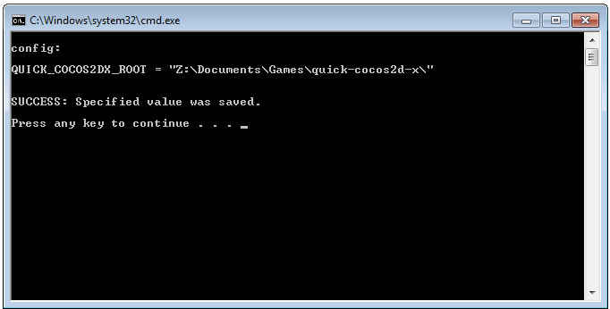
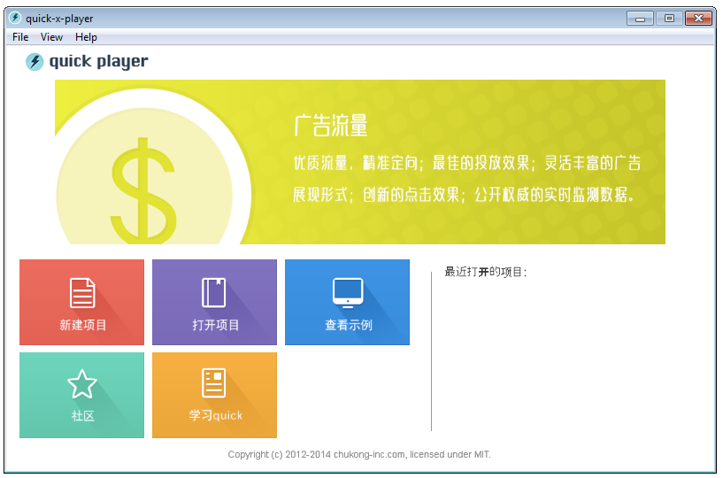
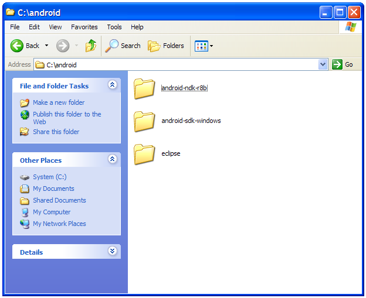
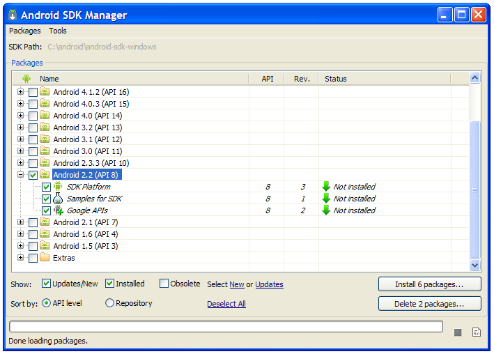
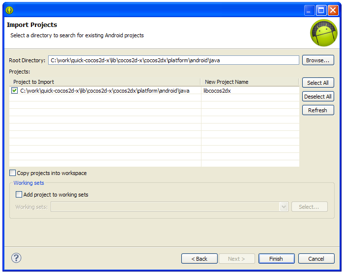
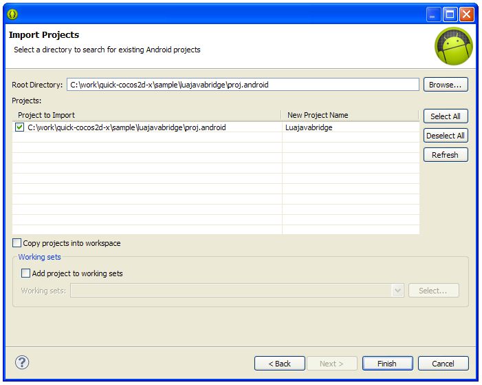

# 设置 quick-cocos2d-x 在 Windows 下的编译环境 #

配置编译环境的基本步骤：

1. 下载 quick-cocos2d-x 源代码
2. 设置运行环境
3. 安装 Java SDK
4. 安装最新的 Android ADT bundle 和 Android NDK
5. 编译 LuaJavaBridge 示例，并在 Android 真机上进行测试

## Step 1: 下载 quick-cocos2d-x 源代码 ##

访问 [https://github.com/chukong/quick-cocos2d-x/releases](https://github.com/chukong/quick-cocos2d-x/releases) 下载最新版 quick 源代码。

由于 ** Android SDK ** 和 ** NDK ** 的问题，** quick-cocos2d-x 目录的放置有一定要求 ** ：

1. 必须和 Android SDK/NDK 在同一个分区
2. 不能放在根目录
3. 路径中不能包含中文和空格（所以别放桌面了）

~


## Step 2: 设置运行环境

运行 **setup.bat**，完成运行环境的设置工作，成功会看到如下界面：



启动 **player/win/player.exe**，即可运行示例和您的项目。



~


## Step 3: 安装 Java SDK ##

从 <http://www.oracle.com/technetwork/java/javase/downloads/> 下载最新版的 Java SDK，并进行安装。

~


## Step 4: 安装最新的 Android ADT bundle 和 Android NDK ##

1.从 <http://developer.android.com/sdk/> 下载最新的 ** ADT Bundle for Windows **。

2.解压缩 adt-bundle-windows-x86-2014????.zip 。

3.将目录 adt-bundle-windows-x86-2014???? 改名为 android 。

4.将目录 android\sdk 改名为 android\android-sdk-windows 。

5.从 <http://developer.android.com/tools/sdk/ndk/index.html> 下载 Android NDK r9?

6.解压缩 android-ndk-r9?-windows-x86.zip

7.将目录 android-ndk-r9? 移动到 android\android-ndk-r9?

    最终的目录结构:

```

    <PATH_TO>\android\android-ndk-r9?
    <PATH_TO>\android\android-sdk-windows
    <PATH_TO>\android\eclipse

```



8.运行 ** android\android-sdk-windows\tools\android.bat ** , 选中 ** Android SDK 2.2 **（ ** 如果看不到 Android SDK 2.2，请设置代理 ** ）, 然后安装需要的包。



~


## Step 5: 编译 LuaJavaBridge 示例，并在 Android 真机上进行测试 ##

启动 命令行提示符 程序, 改变当前目录为 <PATH_TO>\quick-cocos2d-x\sample\luajavabridge\proj.android, 运行 build_native.bat:

```

cd quick-cocos2d-x\sample\luajavabridge\proj.android
build_native.bat

```

如果一切正常，等待几分钟以后会看到如下信息：

```

SharedLibrary  : libgame.so
Install        : libgame.so => libs/armeabi/libgame.so

```

### 将项目导入 Eclipse ADT ###

启动 \<PATH_TO>\eclipse\eclipse.exe, 导入 ** libcocos2dx ** 库（这个库是 cocos2d-x 的 Java 支持）.

1.选择菜单 ** File ** -> ** Import **, 再选择 ** Android ** -> ** Existing Android Code Into Workspace ** :


2.点击 ** Browse ** 按钮, 选择 ** \quick-cocos2d-x\lib\cocos2d-x\cocos2dx\platform\android\java ** 目录:




3.点击 Finish.

4.重复上述步骤, 将 ** luajavabridge\proj.android ** 目录导入 Eclipse:



5.在左侧 ** Package Explorer ** 里的 ** LuajavaBridge ** 项目上点击鼠标右键，选择菜单 ** Properties ** :


6.如果 ** Library ** 中已经存在 ** libcocos2dx ** 项，请先删除。然后点击 ** Add ** 按钮, 再选择添加 ** libcocos2dx ** 库.


7.导入完成。

### 设置 Android 设备允许真机调试 ###

Android 官方文档：<http://developer.android.com/tools/device.html>

1. Enable USB debugging on your device.
	- On most devices running Android 3.2 or older, you can find the option under Settings > Applications > Development.
	- On Android 4.0 and newer, it’s in Settings > Developer options.

	Note: On Android 4.2 and newer, Developer options is hidden by default. To make it available, go to Settings > About phone and tap Build number seven times. Return to the previous screen to find Developer options.
	- 在系统设置中找到“开发者选项”，打开“USB调试”。
2. Set up your system to detect your device.
	- If you’re developing on Windows, you need to install a USB driver for adb. For an installation guide and links to OEM drivers, see the OEM USB Drivers document.
	- 根据不同的机型，也许需要安装该机型特定的 USB 驱动程序。例如 Moto 就必须安装 Moto 的 USB 驱动。

### 在设备上测试 LuaJavaBridge 示例 ###

1.在 Eclipse 里选择菜单 ** Window ** -> ** Show View ** -> ** Other… ** , 再选择 ** Android ** -> ** Devices **.

2.如果设备设置完成，并且安装了正确的 USB 驱动，那么在 Devices 标签页中就可以看到你的设备:


如果看不到设备，请仔细检查设备设置和驱动程序。

3.在项目 ** LuajavaBridge ** 上点击鼠标右键, 选择菜单 ** Debug As ** -> ** Android Application **. 如果一切正常，等一会儿就可以在设备上看到运行画面了：


\-EOF\-
