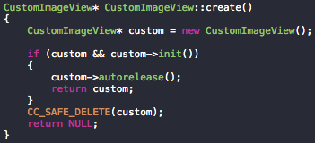
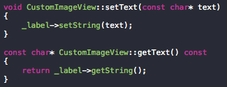
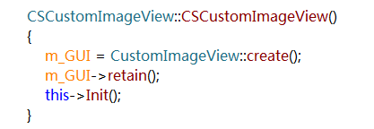
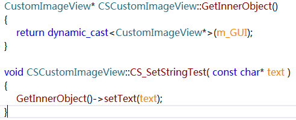
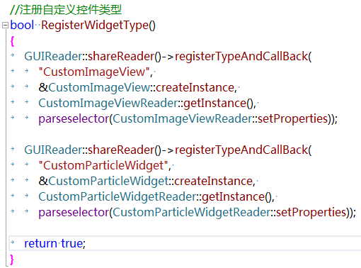
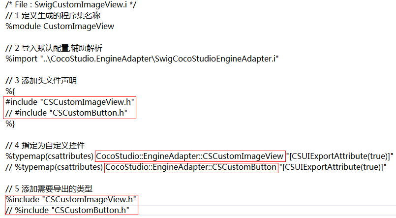
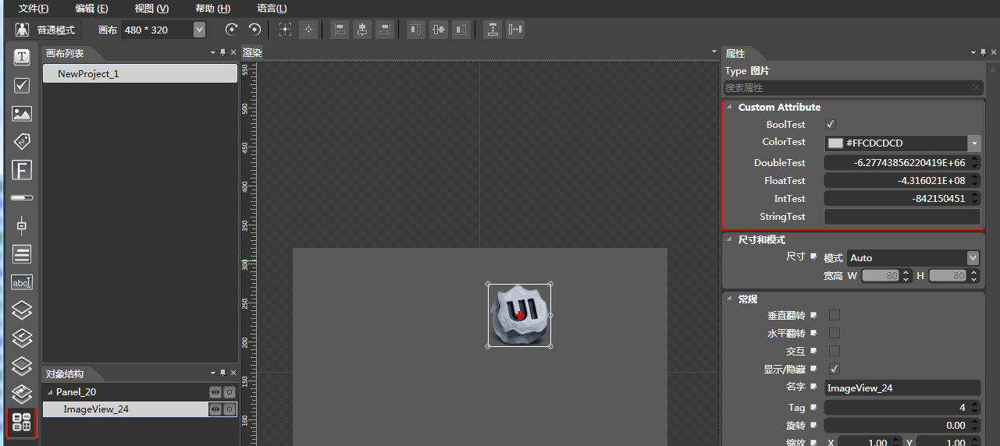

#UI控件自定义扩展功能说明

###简介：
  在本次的最新发布的UI编辑器1.3版中，添加了对自定义UI控件的编辑支持。利用这项功能，用户就可以在现有UI编辑器中集成自己编写的UI控件，和现有的UI控件一起使用编辑UI界面。下面给大家介绍利用该功能集成自定义控件的详细步骤。

  编写UI自定义控件插件主要包括以下几个步骤：

  1. 编写自定义控件
  2. 编写封装代码，实现编辑器约定接口
  3. 编写Swig生成脚本
  4. 编译生成项目
  5. 将生成的动态库拷贝到插件目录
  6. 启动UI编辑器，使用新控件编辑UI并保存
  7. 编写自定义控件属性解析代码
  8. 在游戏中加载UI界面显示

  在实际完成上面几个步骤前，首先我们来查看一个UI自定义控件扩展的实例，在安装完新版的CocoStudio 1.3版本后，在我的文档下的CocoStudio目录，可以看到Pluglin的Sample示例，即CustomImageView插件，打开CustomImageView解决方案，我们可以看到如下两个项目。

  其中CustomImageView是C++项目，主要包括自定义控件的源代码（CustomImageView类），提供给编辑器使用的C++封装类（CSCustomImageView类），Swig工具的配置脚本（SwigCustomImageView.i）三部分组成。Swig是个帮助使用C或者C++编写的软件能与其它各种高级编程语言进行嵌入联接的开发工具。在安装包中已经集成Swig的可执行程序。详细信息大家可以参考官方主页http://www.swig.org/
CustomImageViewWrap是C#项目，包括由Swig工具自动生成的C#封装代码，提供给编辑器动态挂载调用。以上就是完成UI自定义控件所要的全部内容。以下是具体实现流程。

###编写自定义控件
  接下来我们先来分析CustomImageView这个项目，首先是我们的自定义扩展UI，即CustomImageView类，CustomImageView是对ImageView的一个简单扩展，使得ImageView在显示图片的时候，能够同时显示一段文字，因此对外公开了setText和getText两个方法，来设置需要显示的文字内容。
只要用户的自定义控件是从coco2d：：gui：：widget类型继承的就可以。也可以选择从已有的控件继承扩展功能如button，slider等。

 CustomImageView 对象静态创建方法：

反射创建 CustomImageView 的方法：

自定义扩展属性显示文本的节点的初始化方法：

自定义扩展属性设置、获取文本的 set、get 方法：

###编写封装代码，实现编辑器约定接口

  CSCustomImageView类是对CustomImageView的封装，为了区分，添加了“CS”前缀，该类从CSImageView继承，与CustomImageView的继承关系一一对应，对于其他控件类型如Button等，则对应有CSButton封装类，如果编写CustomButton，则编写CSCustomButton需要对应的从CSButton类继承。所有默认的CocoStudio封装类型都在CocoStudio::EngineAdapter命名空间下。我们首先看CSCustomImageView的构造函数实现：

  其中m_GUI是在CSWidget中定义的Widget类型指针，需要子类进行初始化，然后调用Init（），完成初始化，所有子类必须进行这两步操作才能正常挂载。在CSCustomImageView中还定义了一些以“CS_”为前缀成对的Get、Set方法，如下所示：

  这些方法就是用来提供给编辑器检索可配置属性使用的，因此对这些方法定义有一些要求，具体就是：

  1. 方法名必须使用 ”CS_Set” 和 “CS_Get”作为前缀，区分大小写。
  2.  Set和Get方法必须成对出现，也即除了前缀部分，方法名剩余部分必须相同，Set方法目前只支持单个参数，同时必须和Get方法返回值的类型一致。
  3. 目前支持字符串，数值，颜色三种基本类型。

  查看CS_SetStringTest方法内部实现，如下所示：

  首先将m_GUI执行类型转换，然后直接调用在CustomImageView类型中公开的setText方法，设置自定义控件属性。
  总结一下，编辑器封装类的编写主要需要下面两个步骤。
    
   1. 在构造中初始化m_GUI，同时调用父类的Init方法。
   2. 按照预定的命名规则，封装需要公开的控件自定义属性。

###编写Swig生成脚本

  双击打开Swig脚本。内容如下：
  

该Swig脚本文件，主要包括5个部分：  
  其中的第1,2部分为默认配置，不需要修改。我们在添加自定义控件时，主要修改第3,4,5三个部分。  
第3部分添加自定义控件的头文件声明，如果我们编写了CSCustomButton扩展，则紧接着图中红色的框，另起一行写入#include “CSCustomButton.h”，如果有多个自定义控件的话，则每个占用一行。注意保留后面的 “%} “ 符号。  
然后在第4部分，添加导出控件类型声明，主要修改图中的红色部分，注意需要指定类型的全名，即包含命名空间的类名。  
最后，在第5部分添加导出，这里需要注意的是，这里的是 “ %include”，前面的是“%”符号，和第3部分的不同。这样Swig脚本就编写完成。

###编译生成项目

在编写完Swig脚本后，在VisualStudio的 ”解决方案资源管理器“ 中右键单击该文件（SwigCustomImageView.i），选择编译，在输出窗口会有 ”Invoking SWIG...“信息输出，表示调用Swig成功。如果脚本编写错误如语法错误这里也会有相关提示。
如果执行成功，在CustomImageViewWarp项目目录下，会生成三个CS文件，将这三个文件包含到CustomImageViewWarp项目中，

同时在CustomImageView项目目录下会生成SwigCustomImageView_wrap.cxx文件,同样将该文件包含到CustomImageView项目中。在Swig脚本的编译选项中，可以配置输出路径。

完成上面的操作后，选择Release配置，分别编译CustomImageView和CustomImageViewWrap两个项目，在输出目录生成CustomImageView.dll 和 CustomImageViewWrap.dll。

这里有一些需要注意设置：

  1. 必须设置release模式，进行编译。
  2. C#项目中，必须启用签名，在CustomImageViewWrap项目中使用Plugins.snk文件（默认已经配置）。
  3. 目前只支持基于Coco2d-x 2.2.2版本开发的自定义插件，暂不支持基于Coco2d-x 3.0开发的自定义控件。

###将生成的动态库拷贝到插件目录

在完成新版的CocoStudio安装后，在Windows7系统上，会在形如这样的路径  C:\Users\’UserName’\Documents\CocoStudio\Plugins\1.3，创建插件目录，现在将第4步生成的两个dll文件拷贝到该目录下。  
这里需要注意的是：  

  1. 必须同时放置两个DLL文件，并且不能直接修改Dll文件的名字，只能在VisualStudio中进行重命名配置，同时修改Swig脚本文件。
  2. 不同版本的编辑器，对应不同的插件目录，因为编辑器会随着Cocos2d-x引擎同步更新，因此不同版本的编辑器插件需要链接对应的引擎分别编译。

###编辑UI工程

在放置后插件后，启动UI编辑器，如果配置插件成功，则在左侧工具栏中会直接显示对应的自定义控件，

鼠标放置到最后的图标上，会显示自定义控件类名。然后就可以像使用其他控件一样，直接拖拽该控件到画布进行使用，选中该控件后，在右侧的属性窗口，会显示之前在CSCustomImageView类中公开的可以配置的属性。可以直接设置操作。编辑完成后，直接保存项目。

###编写自定义控件属性解析代码

示例 CustomImageViewReader 的代码：  
  自定义解析类需要从 cocos2d::CCOject 继承。
	 
  CustomImageViewReader 单例对象静态创建方法：  

  

CustomImageViewReader 解析 CustomImageView 自定义属性的回调方法：

  1、2 两部分的说明可参照 cocos2d-x TestCpp 工程中 CustomImageView.cpp、CustomImageViewReader.cpp

###在游戏中加载UI界面显示

  示例代码 CustomImageTest:  
 
  registerTypeAndCallBack 方法说明：  
    参数说明：  
  	“CustomImageView”  
    注册自定义控件的名称。  
    &CustomImageView::createInstance   
    自定义控件反射创建方法函数指针。  
    CustomImageViewReader::getInstance()  
    自定义控件CustomImageView 自定义扩展属性解析对象。  
    parseselector(CustomImageViewReader::setProperties)  
    解析自定义控件CustomImageView 自定义扩展属性的回调方法。  

  读取 json 前，先调用 GUIReader 的接口 registerTypeAndCallBack, 注册自定义控件类与自定义属性解析类对象及属性解析方法，属性解析方法必须是自定义属性解析类的成员方法。然后调用 GUIReader 的 widgetFromJsonFile 创建 ui 控件节点，widgetFromJsonFile 方法内部通过注册的自定义控件名称（如：“CustomImageView”）反射创建自定义控件，并调用注册的自定义属性解析类对象及回调函数解析自定义属性。

  示例代码可参照 cocos2d-x TestCpp 的 CustomImageTest.cpp 

