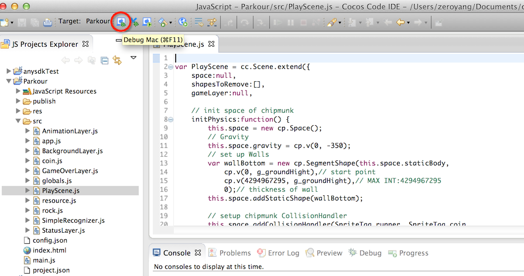

#在我们的游戏中添加Chipmunk 物理引擎

##介绍
Cocos2d-JS 能赋予我们创建令人印象深刻的游戏世界的能力。但它缺少了真实性。尽管我们能够处理复杂的运算来使得游戏更加真实，但有一种更轻松的方式来完成这个任务。回答是，*物理引擎*。

物理引擎提供重力、碰撞检测以及模拟物理场景，它们会让我们的游戏世界看上去更加真实。

在这篇教程中，我们将会在我们的parkour游戏中介绍Chipmunk物理引擎。

##为什么选择Chipmunk？
为什么我们应该选择Chipmunk物理引擎？因为它相比其他的2D物理引擎，能赋予我们更多的力量。

除了Chipmunk物理引擎外，还有别的选项——Box2D。

Box2D是一个优秀的物理引擎，它存在了很长一段时间。很多2D游戏都采用了Box2D作为自己的物理引擎。

但Chipmunk有它自己的优势。你可以浏览Chipmunk的[网站](http://chipmunk-physics.net/)查阅更多的信息。

##在Cocos2d-JS中激活Chipmunk

### 准备工作

首先，让我们在Cocos2d-JS中激活Chipmunk。

打开 *project.json* 文件，然后作如下修改：

将
```
 "modules" : ["cocos2d"],
 ```

改为:

```
 "modules" : ["cocos2d","chipmunk"],
```

这样，当Cocos2d-JS启动的时候，它会自动将在Chipmunk库。

然后，让我们创建一个名叫*globals.js*的新文件，并在里面添加两个全局变量。

```
var g_groundHight = 57;
var g_runnerStartX = 80;
```
最后，我们应该告诉框架在启动后，去加载*globals.js*文件。
在*jsList*数组的最后，添加*globals.js*的路径：

```
    "jsList" : [
        "src/resource.js",
        "src/app.js",
        "src/AnimationLayer.js",
        "src/BackgroundLayer.js",
        "src/PlayScene.js",
        "src/StatusLayer.js",
        "src/globals.js"
    ]
```

*注意：* 任何时候你在Cocos2d-JS里添加了一个新的文件，你要记得把它添加到*jsList*数组中。

### 初始化Chipmunk 物理世界

在Chipmunk中，用一个*space* 对象来表示物理世界。

首先，让我们添加一个名叫*space*的新成员变量到*PlayScene.js*文件中：

```
space:null,
```

总的来说，一个游戏只需要一个*space*对象。space对象可以被不同的层所共享。我们经常把*space对象的初始化代码* 放在PlayScene。

以下是设置物理世界的代码：

```
    // init space of chipmunk
    initPhysics:function() {
        //1. new space object 
        this.space = new cp.Space();
        //2. setup the  Gravity
        this.space.gravity = cp.v(0, -350);

        // 3. set up Walls
        var wallBottom = new cp.SegmentShape(this.space.staticBody,
            cp.v(0, g_groundHight),// start point
            cp.v(4294967295, g_groundHight),// MAX INT:4294967295
            0);// thickness of wall
        this.space.addStaticShape(wallBottom);
    },
```

上述的代码能够很好的解释它们的用途，所以我们可以把它们保持原样。如果你想要了解这些API的细节，你应该查阅Chipmunk的官方文档来获取更多信息。

在*update*函数中，我们告诉Chipmunk让它开始模拟物理场景。

在教程往下走之前，让我们在*AnimationLayer*增加一个小小的改动。既然我们将要在AnimationLayer里创建演员，所以我们应该修改AnimationLayer的构造器，让我们能传递*space*对象参数。

```
ctor:function (space) {
        this._super();
        this.space = space;
        this.init();
    },
```

当然我们应该在AnimationLayer里定义一个弱引用成员变量，并把它初始化为*null*。

我们的准备工作到这里就结束了。让我们最后在*onEnter*函数里调用：

```
    onEnter:function () {
        this._super();
        this.initPhysics();

        this.addChild(new BackgroundLayer());
        this.addChild(new AnimationLayer(this.space));
        this.addChild(new StatusLayer());

        this.scheduleUpdate();
    },
```

*注意：*你必须初始化物理引擎的space变量并将它传递到AnimationLayer中去。

##在Runner 精灵中添加物理组件

在上一篇教程中，我们通过spritsheet创建了runner精灵。在这一节中，我们将要使用*PhysicsSprite*对runner进行重写。

PhysicsSprite是一个可重用的组件，它能够将cocos2d精灵和物理body组合关联在一起。

以下是使用PhysicsSprite创建runner的代码：

```
        //1. create PhysicsSprite with a sprite frame name
        this.sprite = cc.PhysicsSprite.create("#runner0.png");
        var contentSize = this.sprite.getContentSize();
        // 2. init the runner physic body
        this.body = new cp.Body(1, cp.momentForBox(1, contentSize.width, contentSize.height));
        //3. set the position of the runner
        this.body.p = cc.p(g_runnerStartX, g_groundHight + contentSize.height / 2);
        //4. apply impulse to the body
        this.body.applyImpulse(cp.v(150, 0), cp.v(0, 0));//run speed
        //5. add the created body to space
        this.space.addBody(this.body);
        //6. create the shape for the body
        this.shape = new cp.BoxShape(this.body, contentSize.width - 14, contentSize.height);
        //7. add shape to space
        this.space.addShape(this.shape);
        //8. set body to the physic sprite
        this.sprite.setBody(this.body);
```

代码和注释都很容易看明白。把这些代码添加到*AnimationLayer*的*init*方法中去。

### 调试和测试

恭喜！你完成了的细节了。你可以在*Webstorm*里面按下*debug*按钮



现在你可以看到runner在屏幕上跑动了。

##总结

在这篇教程中，我们向你展示了如何设置Chipmunk物理世界，如何设置物理世界的边界，如何创建一个刚性的body和与其关联的shape。我们把物理属性添加到精灵上让它显得更真实。你可以在[这里](res/Parkour.zip)获得完整的代码。

###下一步

在下一篇教程中，我们将会介绍游戏里面摄像机(camera)的移动。然后我们也将会使用tiledMap代替背景图片。更重要的是，我们会使得游戏中得背景循环。在下一篇教程再见。


