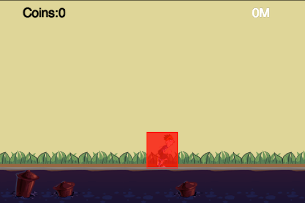

# 探索TiledMap和Display

## 介绍
在这篇教程中，我会向你展示如何在parkour游戏中添加TiledMap作为新的背景。

我们也将会学习如何使背景不断滚动以及玩家不断奔跑。

这背后的奥秘就是移动cocos2d的层。

## 完成一些准备工作
在我们下手前，让我们添加资源文件以及相对应我们游戏的名字。

### 设置资源和全局变量
既然我们将要在每一层引用其他的层。所以最好的方式来检索层是通过*标签*。

在*globals.js*添加下述的代码：

```
if(typeof TagOfLayer == "undefined") {
    var TagOfLayer = {};
    TagOfLayer.background = 0;
    TagOfLayer.Animation = 1;
    TagOfLayer.Status = 2;
};
```

以下我们给背景层、动画层、状态层一个标签名字，这样我们就能通过标签检索其他层。

我们也需要在*resource.js*添加资源变量。

```
//Our two tiled map are named s_map00 and s_map01.
var res = {
    helloBG_png : "res/helloBG.png",
    start_n_png : "res/start_n.png",
    start_s_png : "res/start_s.png",
    PlayBG_png  : "res/PlayBG.png",
    runner_png  : "res/running.png",
    runner_plist : "res/running.plist",
    map_png: "map.png",
    map00_tmx: "map00.tmx",
    map01_tmx: "map01.tmx"
};

var g_resources = [
    //image
    res.helloBG_png,
    res.start_n_png,
    res.start_s_png,
    res.PlayBG_png,
    res.runner_png,
    res.runner_plist,
    res.map_png,
    res.map00_tmx,
    res.map01_tmx
];
```

上述的代码能自己解释自己，所以让我们跳到下一节。

### 激活Chipmunk调试绘画
如果我们使用Chipmunk物理引擎，你最好激活调试绘画功能。所以调试的过程会更加方便。

在*AnimationLayer.js*的ctor方法中添加下面的代码：

```
this._debugNode = cc.PhysicsDebugNode.create(this.space);
// Parallax ratio and offset
this.addChild(this._debugNode, 10);
```

当你再次运行游戏，你将会看见在奔跑的玩家上的一个红色的盒子：


## TiledMap介绍
TileMap是一个2d游戏里面常见的概念。它对于构建非常大的地图和一些视差滚动背景非常有用。

TiledMap比一般的PNG文件消耗更少的内存。如果你想要构建一些很大型的地图，这一定是你最好的选择。

闲话少说，让我们深入看看TiledMap。

### 用TiledMap代替以前的背景
现在，是时候用酷炫的tiled map代替旧的静态的背景图。

我们将要在*BackgroundLayer.js*完成下面的工作。首先，我们应该在BackgroundLayer中添加四个成员变量：

```
map00:null,
map01:null,
mapWidth:0,
mapIndex:0,
```

我们应该删除旧的创建静态背景的代码。

(*注意*：下面我取注释代码片段，你可以完整地删除。)

```
//        var winSize = cc.Director.getInstance().getWinSize();
//
//        var centerPos = cc.p(winSize.width / 2, winSize.height / 2);
//        var spriteBG = cc.Sprite.create(s_PlayBG);
//        spriteBG.setPosition(centerPos);
//        this.addChild(spriteBG);
```

最后，我们将要添加新的代码片段来创建tiledmap 背景。

```
this.map00 = cc.TMXTiledMap.create(res.map00_tmx);
this.addChild(this.map00);
this.mapWidth = this.map00.getContentSize().width;
this.map01 = cc.TMXTiledMap.create(res.map01_tmx);
this.map01.setPosition(cc.p(this.mapWidth, 0));
this.addChild(this.map01);
```

保存所有的改动并运行：



在这里，我们添加两片地图。*map01*就在*map00*的旁边。在下面的章节中，我们将要解释为什么我们要添加两片地图。

## Scene Display介绍

既然物理body将要不断地向右移动，精灵会和物理body同步它的位置。

过了一段时间后，玩家会跑到屏幕外面，就像上一篇教程说的那样。

所以我们需要在每帧移动游戏层的x坐标，让它保持在可见的范围内。以下是AnimationLayer.js中代码片段：

```
getEyeX:function () {
    return this.sprite.getPositionX() - g_runnerStartX;
},
```

这里*getEyeX*函数计算动画层的*偏移(delta)*。

我们应该在包含背景层和动画层的*this.gameLayer*反方向移动相同的*偏移（delta）*。所以我们能够通过在PlayScene.js里的，每帧调用的*update*函数中添加下列代码：

```
     update:function (dt) {
        // chipmunk step
        this.space.step(dt);

        var animationLayer = this.gameLayer.getChildByTag(TagOfLayer.Animation);
        var eyeX = animationLayer.getEyeX();

        this.gameLayer.setPosition(cc.p(-eyeX,0));
    }
    
```

### 移动背景层
设置背景层的移动的方法跟我们上一节做的基本是一样的。不过我们需要针对两个tiled map完成一些计算。

让我们来完成它把。在BackgroundLayer里添加一个新的成员函数*checkAndReload*：

```
    checkAndReload:function (eyeX) {
        var newMapIndex = parseInt(eyeX / this.mapWidth);
        if (this.mapIndex == newMapIndex) {
            return false;
        }
        if (0 == newMapIndex % 2) {
            // change mapSecond
            this.map01.setPositionX(this.mapWidth * (newMapIndex + 1));
        } else {
            // change mapFirst
            this.map00.setPositionX(this.mapWidth * (newMapIndex + 1));
        }
        this.mapIndex = newMapIndex;
        return true;
    },
```

当eyeX超出了屏幕的宽度，表达式*parseInt(eyeX / this.mapWidth* 将会获得一个大于0的值。

我们将要使用*newMapIndex*来决定哪片地图需要移动以及多少像素需要移动。

那么，我们要在每帧调用这个函数。

```
    update:function (dt) {
        var animationLayer = this.getParent().getChildByTag(TagOfLayer.Animation);
        var eyeX = animationLayer.getEyeX();
        this.checkAndReload(eyeX);
    }
```

最后，我们要在背景层的init的最后要调用*scheduleUpdate*函数。

```
 this.scheduleUpdate();
```

## 收尾
好。我们要完成最后的收尾工作。

修改PlayScene的*onEnter*方法来添加层的*标签(tag)*，在游戏层中添加背景层和动画层。

```
    onEnter:function () {
        this._super();
        this.initPhysics();
        this.gameLayer = cc.Layer.create();

        //add Background layer and Animation layer to gameLayer
        this.gameLayer.addChild(new BackgroundLayer(), 0, TagOfLayer.background);
        this.gameLayer.addChild(new AnimationLayer(this.space), 0, TagOfLayer.Animation);
        this.addChild(this.gameLayer);
        this.addChild(new StatusLayer(), 0, TagOfLayer.Status);
        
        this.scheduleUpdate();
    },
```

恭喜！你成功完成了这篇教程。运行并看看它。

*注意*：如果你不想展示一个chipmunk刚体body的调试绘画信息。你可以放心地在创建PhysicsDebugNode下添加下列的代码：

```
this._debugNode.setVisible(false);
```

## 总结
在这篇教程，我们已经学到了TiledMap 和 display。这两个概念在你开发一个物理游戏是非常重要的。

你可以在[这里](res/Parkour.zip)下载整个项目。

## 下一步
在下一篇教程中，我们将要在我们的游戏中添加金币和障碍物。在这篇教程里，我们将要学习如何重构我们的代码让它更具有扩展性。

我们会在PlayScene类作清理并封装Coin和Rock两个类。

继续在下篇教程里调整代码并开心地编程！
