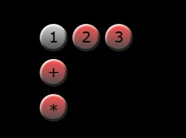
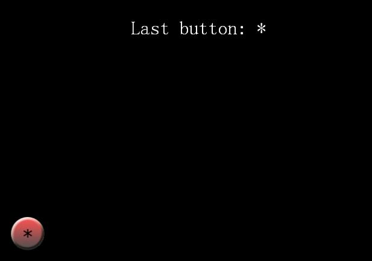
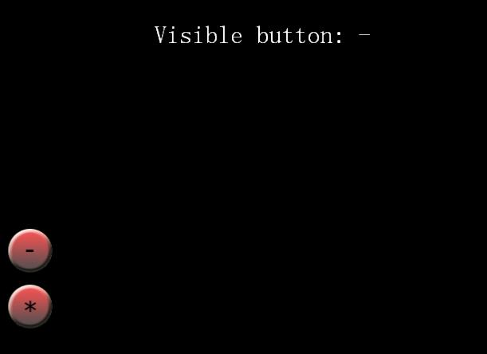
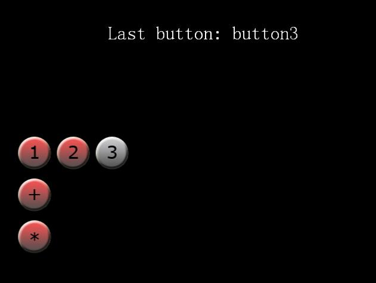

# 在Cocos2d-x里如何制作各种按钮
 
**程序截图**：
 


**注意**：原文是基于Cocos2d-iphone的教程，现已改为Cocos2d-X-3.0Beta版本。
  
当你在使用cocos2d制作一个游戏的时候，你很可能会发现，你需要的第一个东西就是“按钮”。（比如游戏开始时的菜单选择界面等）这个教程将会一步步地教你如何使用cocos2d来创建按钮。刚开始创建简单的按钮，然后再介绍开关按钮和单选按钮。这篇教程假设你已经知道如何使用cocos2d来制作简单的游戏了，或者具备同等相关经验。 
  
当我第一次想要在cocos2d里面添加一个按钮的时候，我是这样想的：创建一个精灵（sprite）来代表按钮，然后检测这个按钮什么时候被按下去。当然，这样做肯定是可行的。但是，在cocos2d里面，还有更简单的方法--通过使用cocos2d的菜单系统。   

在cocos2d的菜单系统里面，包含一个Menu，在Menu里面又包含一系列的Menuitems。Menu items可以是文本或者图片，而且菜单系统里面还包含了一些非常有用的逻辑，比如：排列菜单项，高亮显示被按下去的菜单项，开关菜单项等等。好了，让我们实践一下，看看用cocos2d的方式如何创建一个简单的按钮！


## 创建一个简单的按钮

打开VS，创建一个新的工程并命名为：Buttons。接下来，你需要一些按钮的图片--你可以自己创建，或者下载一些[我已经做好的图片](http://www.raywenderlich.com/downloads/Buttons.zip)。好了，现在你有图片了，把它们拖到resource文件夹下面。 

打开Classes分组下面的HelloWorldscene.h文件，然后在HelloWorld类里面添加一个成员变量，后面将会用到它： 

```
LabelTTF* label; 
```

好了，接下来就是重点了。在HelloWorldScene.cpp文件中，把下面的代码添加到init方法中： 

```
// Create a label for display purposes

label = LabelTTF::create("Last button: None", "Marker Felt", 32);
label->setPosition(Point(visibleSize.width / 2 + origin.x, origin.y + visibleSize.height - 80));
label->setHorizontalAlignment(TextHAlignment::CENTER);
this->addChild(label);

// Standard method to create a button

auto starMenuItem = MenuItemImage::create(
	"ButtonStar.png",
	"ButtonStarSel.png", CC_CALLBACK_1(HelloWorld::starMenuCallback, this));
starMenuItem->setPosition(Point(160, 220));
auto starMenu = Menu::create(starMenuItem, NULL);
starMenu->setPosition(Point::ZERO);
this->addChild(starMenu, 1);
```

首先，为了调试方便，我们创建了一个label。这个看起来很熟悉对不对？---我们在上一篇教程中有提到过。然而，这一次我们使用了一个新的创建函数，它可以让我们指定label的大小和文字对齐方式。在这里，我把label的位置设置在窗口中上方，而且文本设置为居中对齐。这是一种广为人知的技术了，特别是当你想实现一些左对齐或者右对齐的文本的时候。   

接下来的代码是创建按钮。首先使用类 **MenuItemImage** 来创建一个菜单项，并为这个按钮指定一张被选中的图片和没有被选中的图片。（也就是单击时被显示的图片和没有被单击时被显示的图片）当创建完菜单项之后，我们为按钮的点击事件指定了一个回调函数（这个函数后面会给出代码）。最后一步，就是创建一个 **Menu** 来包含这个按钮（或者一系列的按钮，以NULL结尾）。   

注意，我们在原点的位置创建了按钮。这里实际上指定了菜单的中心点的位置。然后，我们指定菜单项的位置相对于菜单的位置偏移（160，220）--这样的话，在屏幕上面显示的时候，菜单项就会显示在（160，220）的位置了。（因为菜单项的position是相对于菜单的中心点来的，把菜单的中心点设置为（0, 0），与屏幕坐标原点重合后，可以方便为每个菜单项指定坐标点，因为这时候，只要按钮实际屏幕出现的位置设置菜单项的坐标点就行了）。 

好了，还有一些代码需要补充。在init方法后面，添加我们的按钮回调函数： 

```
void HelloWorld::starMenuCallback(Object* pSender)
{
	label->setString("Last button: * ");
}
```

编译并运行，你会看到如下的运行结果：



## 开关按钮

另外一种在游戏里面常用的按钮类型就是--开关按钮。这种类型的按钮一次只有一个图片显示出来，当你单击它的时候，它就会切换到另外一张图片。这个可以用来制作一个控制面板的可见性的控制器，这样可以最大限度地利用设备上面有限的屏幕大小。 

非常幸运的是，cocos2d里面就内置了一种特殊的menu item叫做**MenuItemToggle**，它可以使事情变得更加简单。让我们来体验一下吧！首先，在HelloWorldScene.h里面添加２个成员变量： 

```
MenuItemImage *_plusItem;
MenuItemImage *_minusItem;
```

然后，在你为场景添加的StartMenu后面，再添加下面的代码： 

```
	_plusItem = MenuItemImage::create(
		"ButtonPlus.png",
		"ButtonPlusSel.png");
	_minusItem = MenuItemImage::create(
		"ButtonMinus.png",
		"ButtonMinusSel.png");

	MenuItemToggle *toggleItem = MenuItemToggle::createWithCallback(CC_CALLBACK_1(HelloWorld::plusMinusButtonCallback, this), _plusItem, _minusItem, NULL);

	auto toggleMenu = Menu::create(toggleItem, NULL);
	toggleMenu->setPosition(Point(160, 290));
	this->addChild(toggleMenu, 1);
```

首先， 就像我们前一个例子中一样，创建两个 **MenuItemImage** 。这里有一点不同--我把它们都添加到了 **MenuItemToggle** 里面。这个类会管理当前应该显示的菜单项，同时会在开关元素之间进行一些切换。   

注意，当创建 MenuItemImage 的时候，我没有设置回调函数（也可以把回调函数设置成了NULL），但是我为 MenuItemToggle 类设置了回调函数。这样，就会使得代码意途更加清晰：当 MenuItemImage 在 MenuItemToggle 中的时候，在 MenuItemImage 上的任何 selector 都不会被调用，而只有 MenuItemToggle的selector会被调用。当然，我们可以很容易地在回调函数里面区分，到底哪个菜单项是可见的。   

接下来，让我们看看如何实现回调函数吧！在init方法后面添加下面的代码：

```
void HelloWorld::plusMinusButtonCallback(Object* pSender)
{
	MenuItemToggle *toggleItem = (CCMenuItemToggle *)pSender;
	if (toggleItem->selectedItem() == _plusItem){
		label->setString("Visible button: +");
	}
	else if (toggleItem->selectedItem() == _minusItem){
		label->setString("Visible button: -");
	}
}
```

因此，正如你所见，MenuItemToggle里有一个**selectedItem()**方法，它可以告诉我们它的哪一个子菜单项当前可见（注意，当前可见的不等于被单击的） 

好了，让我们运行一下吧！你会看到如下结果：



## 单选按钮

第三种常用的按钮类型就是单选按钮（radio button）。我在做一个游戏的时候，发现自己需要一些单选按钮，但是，cocos2d的源代码里面并没有任何有关单选按钮的实现。因此，我们自己实现一个单选按钮。

但是，目前cocos2d里面还是没有，因此，在这期间，你可以免费地使用我上面提到的一些实现。这篇教程使用的是我自己写的单选按钮的实现。首先，下载[RadioMenu.h和RadioMenu.cpp](radiomenu.zip)，然后把它们拖到你的Classes文件夹下。然后在HelloWorldScene.cpp的顶部添加下面代码： 

```
#include "RadioMenu.h"
```

然后，在init方法后面，紧跟你添加开关按钮的代码，添加下面代码： 

```
	auto *menuItem1 = MenuItemImage::create("Button1.png", "Button1Sel.png", this, menu_selector(HelloWorld::but1Callback));
	auto *menuItem2 = MenuItemImage::create("Button2.png", "Button2Sel.png", this, menu_selector(HelloWorld::but2Callback));
	auto *menuItem3 = MenuItemImage::create("Button3.png", "Button3Sel.png", this, menu_selector(HelloWorld::but3Callback));

	auto *radioMenu = RadioMenu::create(menuItem1, menuItem2, menuItem3, NULL);
	radioMenu->setPosition(Point(220, 360));
	radioMenu->alignItemsHorizontally();
	radioMenu->setSelectedItem_(menuItem1);
	menuItem1->selected();	
	this->addChild(radioMenu, 10);
```

首先，像之前一样，创建MenuItemImage，但是我们不是把它加到CCMenu类中，而是把它们加到RadioMenu类中。这个类确保一次只有一个菜单项被选中。这里，我们设置默认情况下，第一个菜单项被选中。 这里有一个新的知识点：我们利用cocos2d里面的自己布局功能，调用menu的 **alignItemsHorizontally()** 来水平对齐menu中的所有菜单项。注意，菜单项是相对于菜单的中心点来布局的。因此，我们不再需要把菜单的中心点设置为（０，０）了--取而代之的是，我们需要把菜单往中间靠右挪动一些，这样我们就可以让菜单项都完整地显示出来。 最后一件事情--像之前一样添加回调函数：

```
void HelloWorld::but1Callback(Object* pSender)
{
	label->setString("Last button: button1 ");
}

void HelloWorld::but2Callback(Object* pSender)
{
	label->setString("Last button: button2 ");
}

void HelloWorld::but3Callback(Object* pSender)
{
	label->setString("Last button: button3 ");
}
```

编译并运行，你将会看到下面的结果：



## 背后的原理

如果你看一看菜单系统是如何实现的，你会注意到所有的菜单项都是Node的子类，但是Menu是Layer的子类。根据[cocos2d最佳实践](http://www.cocos2d-iphone.org/wiki/doku.php/ko:prog_guide:best_practices?s%5b%5d=layers)，你不应该创建非常大的层次结构，你应该让层次结构尽可能的小。 因此，这意味着，你可能需要把尽可能多的菜单项放到一个菜单里面。因为，Layer是从Node派生出来的，它也可以run action。就是说，你可以对menu run action。

## 总结

这里有这个教程的完整的[全部源代码](./buttons.zip)。希望这个教程对你有帮助，如果你在使用cocos2d的button的时候有什么好的意见或好点子，请跟我分享！

**原文链接地址**：http://www.raywenderlich.com/414/how-to-create-buttons-in-cocos2d-simple-radio-and-toggle