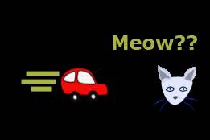
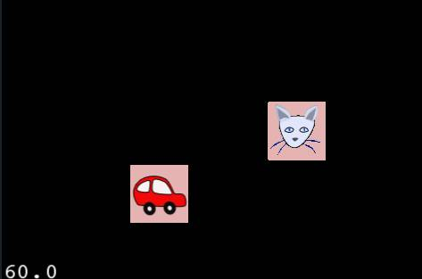

# 使用Cocos2d-x3.0和物理引擎实现碰撞检测

## 前言

## 从SpriteBatchNode中添加我们的精灵

首先，创建一个空白的项目，将实例代码删除。

接下来，让我们把资源文件放入的Resources目录下。

然后，在HelloWorldScene.h文件的HelloWorld类中，添加下面的成员变量：

	SpriteBatchNode* _spriteSheet;

现在，让我们修改HelloWorldScene.cpp中的init方法来加载我们的SpriteBatchNode和plist文件。具体修改如下：
	
	bool HelloWorld::init()
	{
	    //////////////////////////////
	    // 1. super init first
	    if ( !Layer::init() )
	    {
	        return false;
	    }
	
		_spriteSheet = SpriteBatchNode::create("sprites.png", 2);
		SpriteFrameCache::getInstance()->addSpriteFramesWithFile("sprites.plist", "sprites.png");
		this->addChild(_spriteSheet);
		this->spawnCar();
		this->schedule(schedule_selector(HelloWorld::secondUpadte), 1.0f);
		this->scheduleUpdate();
	
	    return true;
	}

第一件事情就是创建一个SpriteBatchNode对象，它是一个可以用来高效地绘制它的所有的Sprite结点的对象。很明显，这些Sprite必须共享相同的纹理（texture）。当我们把车子和猫加入到场景中的时候，我们需要将它们当作SpriteBatchNode的孩子加进去。

然后，我们使用CCSpriteFrameCache类来加载坐标属性列表文件。这个函数会自动地查找一个与之同名的图片（即sprites.png).这也就是前面说的，为什么要把”sprites.png“和"sprites.plist”取成相同名字的原因。

在这之后，我们调用一个函数在场景中显示一辆车。同时，还设置一个计时器，每隔一秒调用一次secondUpdate函数。

接下来，让我们实现spawnCar方法。我们的做法是让车子永远地在屏幕中间做路径为三角形的运动。在init函数的上面添加下面函数代码：

	void HelloWorld::spawnCar()
	{
		SpriteFrame* frame = SpriteFrameCache::getInstance()->spriteFrameByName("car.png");
		Sprite* car = Sprite::createWithSpriteFrame(frame);
		car->setPosition(Point(100, 100));
		addBoxBodyForSprite(car);
		car->setTag(2);
		car->runAction(MoveTo::create(1.0f, Point(300, 300)));
		car->runAction(RepeatForever::create(Sequence::create(MoveTo::create(1.0,Point(300, 100)),MoveTo::create(1.0,Point(200, 200)),MoveTo::create(1.0,Point(100, 100)),NULL)));
		_spriteSheet->addChild(car);
	}

注意，这里创建sprite的时候，不是使用spriteWithFile，而是使用spriteWithSpriteFrameName。这里指的是使用spritesheet纹理中代表Car的图片来创建精灵。

还有一点需要注意，我们不是把Car作为HelloWorld层的函数添加进去，而是把Car作为SpriteBatchNode的孙子添加进去的。

这个函数的后面部分你应该比较熟悉了。因此，让我们添加一些猫吧！在上面的spawnCar方法后面添加下面的方法：

	void HelloWorld::spawnCat()
	{
		auto winSize = Director::getInstance()->getWinSize();
	
		auto cat = Sprite::createWithSpriteFrameName("cat.png");
	
		int minY = cat->getContentSize().height / 2;
		int maxY = winSize.height - (cat->getContentSize().height / 2);
		int rangeY = maxY - minY;
		int actualY = CCRANDOM_0_1() * rangeY;
	
		int startX = winSize.width + (cat->getContentSize().width / 2);
		int endX = -(cat->getContentSize().width / 2);
	
		Point startPos = Point(startX, actualY);
		Point endPos = Point(endX, actualY);
	
		cat->setPosition(startPos);
		addBoxBodyForSprite(cat);
		cat->setTag(1);
		cat->runAction(Sequence::create(MoveTo::create(1.0, endPos), CallFuncN::create(this, callfuncN_selector(HelloWorld::spriteDone)),NULL));
	
		_spriteSheet->addChild(cat);
		
	}

	void HelloWorld::secondUpadte(float dt)
	{
		this->spawnCat();
	}
	
	void HelloWorld::spriteDone(Node* sender)
	{
		Sprite *sprite = (Sprite*)sender;
		_spriteSheet->removeChild(sprite,true);
	}

你应该对上面的代码线路熟悉了，如果不熟悉，建议看相关的教程后再继续。编译并运行代码，如果一切ok，你将会看到一辆车在屏幕上来回动，同时有一只猫从右至左穿过屏幕。接下来，我们将添加一些碰撞检测的代码。

## 添加碰撞检测代码

Cocos2d-x3.0中，事件派发机制做了重构，所有事件均有事件派发器统一管理。物理引擎的碰撞事件也不例外，
下面的代码注册碰撞begin回调函数。

	void HelloWorld::onEnter()
	{
		Layer::onEnter();
	
		auto contactListener = EventListenerPhysicsContact::create();
		contactListener->onContactBegin = CC_CALLBACK_2(HelloWorld::onContactBegin, this);
	
		auto dispatcher = Director::getInstance()->getEventDispatcher();
	
		dispatcher->addEventListenerWithSceneGraphPriority(contactListener, this);
	}

	bool HelloWorld::onContactBegin(EventCustom* event, const PhysicsContact& contact)
	{
		auto spriteA = (Sprite*)contact.getShapeA()->getBody()->getNode();
		auto spriteB = (Sprite*)contact.getShapeB()->getBody()->getNode();
	
		if (spriteA->getTag() == 1)
		{
			spriteA->removeFromParentAndCleanup(true);
		}
	
		if (spriteB->getTag() == 1)
		{
			spriteB->removeFromParentAndCleanup(true);
		}
	
		return true;
	}

完成！相比老版教程的代码是不是简洁易懂了许多？全新的Physics integration，把chipmunk和Box2D封装到引擎内部，游戏开发不用关心底层具体是用的哪个物理引擎，不用直接调用物理引擎的接口。我可以把更多的精力放在游戏的内容而非实现上，现在车和猫发生碰撞猫会消失。

## 总结！

这里有本教程的[完整源代码](./Box2DCollision.zip)。

