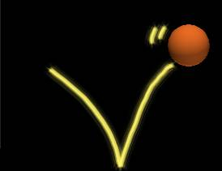
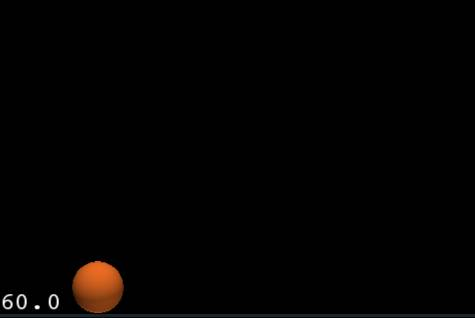

# 在Cocos2d-x3.0里面如何使用物理引擎：弹球

## 前言

程序截图：

这个教程的目的就是让你们熟悉在Cocos2d-x3.0里面如何使用新版的物理引擎，所采用的例子就是制作一个简单的应用，里面有一个篮球，你可以通过旋转你的手机来改变重力的方向，同时篮球碰到屏幕边界可以反弹。

这个教程假设你已经学过前面的教程《如何使用Cocos2d-x3.0来制作一个简单的iphone游戏》，或者有同等相关经验也可以。

好了，让我们开始学习物理引擎吧！

# 创建一个空的工程

执行cocos2d-x-3.0beta2\tools\project-creator目录下的create_project.py，创建命为boxball。如果你直接编译并且运行的话，你将会看到一个很酷的例子，里面展示了Box2d的许多内容。然后，这个教程的目的，我们将从0开始，创建一个篮球反弹的应用，这样我们就可以更好地理解那个范例的具体原理。

因此，让我们把HelloWorld模板里面的内容都删除掉，因为我们要从0开始。把HelloWorldScene.h里面的内容替换成下面的代码：

	#ifndef __HELLOWORLD_SCENE_H__
	#define __HELLOWORLD_SCENE_H__

	#include "cocos2d.h"

	USING_NS_CC;

	class HelloWorld : public cocos2d::Layer
	{
	public:
		Sprite* _ball;
		PhysicsWorld* m_world;
		void setPhyWorld(PhysicsWorld* world){ m_world = world; };
		static cocos2d::Scene* createScene();
		virtual bool init();
		CREATE_FUNC(HelloWorld);
	};
	#endif // __HELLOWORLD_SCENE_H__

同时修改HelloWorldScene.cpp文件:

	#include "HelloWorldScene.h"

	Scene* HelloWorld::createScene()
	{
		auto scene = Scene::createWithPhysics();
		scene->getPhysicsWorld()->setDebugDrawMask(PhysicsWorld::DEBUGDRAW_ALL);
		auto layer = HelloWorld::create();
		layer->setPhyWorld(scene->getPhysicsWorld());
		scene->addChild(layer);
		return scene;	
	}
	bool HelloWorld::init()
	{
		if ( !Layer::init() )
		{
			return false;
		}
		return true;
	}

编译并运行，看到一篇黑色，这是一个空的项目。好了，现在让我们开始创建物理场景吧。

# 创建世界相关理论

cocos2d-x-3.0中对物理系统进行了封装，开发过程中可不用再纠结与box2d和chipmunk的接口。Physics integration大大方便了物理系统的使用，有兴趣的话可以去看看这篇文章[http://www.ityran.com/archives/5431](http://www.ityran.com/archives/5431)

通过createWithPhysics()方法创建一个带有物理效果的Scene，然后将需要添加物理效果的层加入其中:

	auto scene = Scene::createWithPhysics();
	scene->getPhysicsWorld()->setDebugDrawMask(PhysicsWorld::DEBUGDRAW_ALL);
	auto layer = HelloWorld::create();
	layer->setPhyWorld(scene->getPhysicsWorld());
	scene->addChild(layer);

# DebugDraw
 
开启DebugDraw
 
DebugDraw对需要使用物理系统的我们来说是个很有用的方法。它可将碰撞体的形状、关节等等全部绘制出来，方便我们观察物体及整个场景的可碰撞区域。

	scene->getPhysicsWorld()->setDebugDrawMask(PhysicsWorld::DEBUGDRAW_ALL);

# 添加篮球精灵

好了，下载我制作的篮球图片，并且把它添加到工程里去吧。下载完后，直接拖到Resources文件夹下。
接下来，在HelloWorldScene.cpp文件顶部添加下面的代码：

同时在HelloWorld类中添加以下成员变量：

	Sprite *_ball;

然后，在HelloWorldScene.cpp的init方法中加入下面的代码：

	auto visibleSize = Director::getInstance()->getVisibleSize();
	auto origin = Director::getInstance()->getVisibleOrigin();
	
	_ball = Sprite::create("Ball.jpg", Rect(0, 0, 52, 52));
	_ball->setPosition(Point(400,600));
	auto ballBody = PhysicsBody::createCircle(_ball->getContentSize().width / 2);
	_ball->setPhysicsBody(ballBody);
	this->addChild(_ball);
	
	auto edgeSp = Sprite::create();
	auto boundBody = PhysicsBody::createEdgeBox(visibleSize, PHYSICSBODY_MATERIAL_DEFAULT, 3);
	edgeSp->setPosition(Point(visibleSize.width / 2, visibleSize.height / 2));
	edgeSp->setPhysicsBody(boundBody); this->addChild(edgeSp); edgeSp->setTag(0);
	
	return true;
与Box2d是不是有很大的不同？3.0新的物理引擎接口为我们省去了许多麻烦。使得我们一点点来解释一下。下面，我会一段段地重复上面的代码，那样可以解释地更加清楚一些。

	auto winSize = Director::getInstance()->getWinSize();
	
	_ball = Sprite::create("Ball.jpg", Rect(0, 0, 52, 52));
	_ball->setPosition(Point(100, 100));
	this->addChild(_ball);

首先，我们往屏幕中间加入一个精灵。如果你看了前面的教程的话，这里应该没有什么问题。

接下来为弹珠添加刚体属性:首先定义一个刚体body

	auto ballBody = PhysicsBody::createCircle(_ball->getContentSize().width / 2);
	_ball->setPhysicsBody(ballBody);

接下来，我们创建world对象。

	auto edgeSp = Sprite::create();
	auto boundBody = PhysicsBody::createEdgeBox(visibleSize, PHYSICSBODY_MATERIAL_DEFAULT, 3);
	edgeSp->setPosition(Point(visibleSize.width / 2, visibleSize.height / 2));
	edgeSp->setPhysicsBody(boundBody); this->addChild(edgeSp); edgeSp->setTag(0);
	
编译并运行，你应该可以看到球会往下掉，碰到边界会有弹性效果。

# 完成加速计控制

如果我们可以通过倾斜屏幕让球朝着屏幕的某个方向运行，那将会很棒。首先，我们需要在init方法里面加入下面的代码：

	this->setAccelerometerEnabled(true);

在HelloWorld类中添加新的方法：

	virtual void onAcceleration(Acceleration* acc, Event* unused_event);

并完善：

	void HelloWorld::onAcceleration(Acceleration* acc, Event* unused_event)
	{
		Vect gravity(-acc->y * 15, acc->x * 15);
		m_world->setGravity(gravity);
	}

这里是[完整源代码](./box2d.zip)。