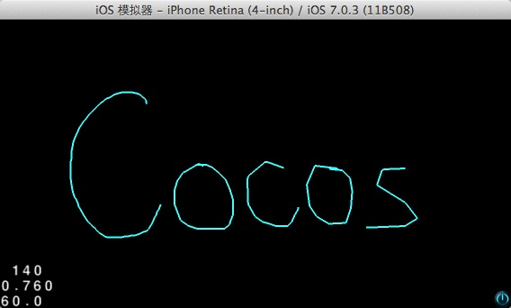
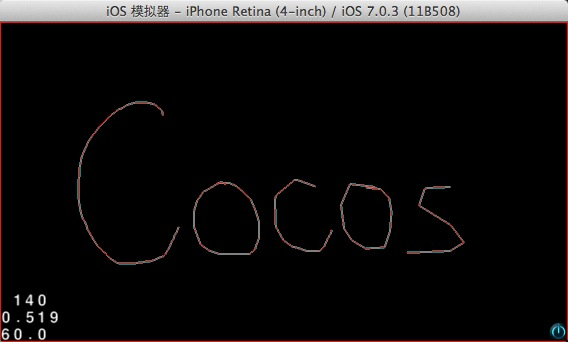

# Cocos2d-x3.x实现屏幕画线并添加刚体属性

为了方便理解，本文分为如下两部分：

- 实现屏幕画线
- 为线段添加刚体属性

## 实现屏幕画线

### 效果预览




### 涉及内容

- 触摸机制
- 线段绘制方法

### 创建 PhysicWorld 类

在头文件**PhysicWorld.h**中加入以下代码：

```
#include "cocos2d.h"
USING_NS_CC;
struct _segment{
    Point p1;
    Point p2;
};
class PhysicWorld : public Layer
{
public:
    virtual bool init();
    static Scene* createScene();
    CREATE_FUNC(PhysicWorld); 
    virtual bool onTouchBegan(Touch *touch, Event *unused_event);
    virtual void onTouchMoved(Touch *touch, Event *unused_event);
    virtual void onTouchEnded(Touch *touch, Event *unused_event);
    virtual void onTouchCancelled(Touch *touch, Event *unused_event);
    virtual void draw();        
private:
    Point pre_point;
    Point cur_point;
    _segment seg;
    std::vector<_segment> segment;
};
``` 

其中声明了一个结构体 **_segment** （线段），顾名思义此结构体用于记录线段的两个端点，以便后续绘制线段的过程。

因为我们需要利用触摸事件自定义绘制线段的方法，故重载了父类的**onTouchBegan, onTouchMoved, draw**等方法，具体实现过程下文详解。

#### 触摸响应

关于**“3.x新触摸机制”**，可参考Testcpp中相应源码，同时网络上也有很多[博文](http://blog.csdn.net/start530/article/details/18325493)可供学习，此处便不再赘述其原理。

首先，我们需要添加一个触摸监听。触摸监听的创建方式有两种：

- EventListenerTouchOneByOne 单点触摸
- EventListenerTouchAllAtOnce 多点触摸

此处我们选择 **EventListenerTouchOneByOne**

```
auto touch_listener = EventListenerTouchOneByOne::create();
``` 

接下来我们通过监听器监听相应事件，并回调相应方法，如下：

```
touch_listener->setSwallowTouches(true);
touch_listener->onTouchBegan = CC_CALLBACK_2(PhysicWorld::onTouchBegan, this);
touch_listener->onTouchMoved = CC_CALLBACK_2(PhysicWorld::onTouchMoved, this);
touch_listener->onTouchEnded = CC_CALLBACK_2(PhysicWorld::onTouchEnded, this);
touch_listener->onTouchCancelled = CC_CALLBACK_2(PhysicWorld::onTouchCancelled, this);
```

将事件监听器加入到事件调度中：

```
_eventDispatcher->addEventListenerWithSceneGraphPriority(touch_listener, this);
```

相应事件的回调方法：

- **onTouchBegan** : 首先获取触摸点的坐标，并将上一次触摸点坐标**pre_point**和当前触摸坐标**cur_point**均赋值为该值。

```
bool PhysicWorld::onTouchBegan(Touch *touch, Event *unused_event){
    Point location = touch->getLocation();
    pre_point = cur_point = location;
    return true;
}
```
- **onTouchMoved** : 同样首先获得在屏幕滑动时经过的点的坐标，并计算其与上一个点之间的距离。当距离的平方大于 25 时将 **pre_point** 和 **cur_point** 分别赋值到结构体seg的 **p1** 和 **p2** 中，并将seg变量存储到std::vector中。

```
void PhysicWorld::onTouchMoved(Touch *touch, Event *unused_event){
    Point location = touch->getLocation();
    cur_point = location;
    if((pre_point - cur_point).getLengthSq()>25){
        seg.p1=pre_point;
        seg.p2=cur_point;
        segment.push_back(seg);
        pre_point=cur_point;
    }
}
```

- **onTouchEnded** : 同上。

最后我们在析构函数中删除触摸监听：

```
_eventDispatcher->removeEventListeners(EventListener::Type::TOUCH_ONE_BY_ONE); 
```

#### 绘制

cocos2dx 绘制基本图元可参考[博文](http://4137613.blog.51cto.com/4127613/754729)，但在3.x中相应接口有所改变，笔者将整理一篇文章出来供大家参考。

此处，我们在成员函数draw的函数体中实现自己的绘制方法:

```
void PhysicWorld::draw(){ 
    DrawPrimitives::setDrawColor4B(0, 255, 255, 255);
    glLineWidth(4);
    for (std::vector<_segment >::const_iterator i=segment.begin(); i!=segment.end(); i++){
        DrawPrimitives::drawLine(i->p1, i->p2);
    }
}
```

有上述代码很容易看出，首先是设置绘制颜色和线条宽度。

然后再通过循环取出存储在vector中的线段值，依次进行绘制。

## 为线段添加刚体属性

### 效果预览




### 涉及内容

- 创建物理世界
- 添加刚体

### 创建 PhysicWorld 类 

当然你完全可以在上一篇文章所编写的代码的基础上进行修改，实际上笔者也正是这么做的。

在头文件**PhysicWorld.h**中添加如下内容(省略部分可参考本文的上部分): 

```
class PhysicWorld : public Layer
{
public:
	... ...
	void setPhysicsWorld(PhysicsWorld* world){_world = world;}
	... ...
private:
	... ...
	PhysicsWorld* _world;
	... ...
};
```

### 实现过程

#### 1. 创建物理世界

关于3.x 新物理特性的内容 **[泰然网](http://www.ityran.com/)** 有两篇文章可供参考 [在Cocos2d-x 3.0中使用物理引擎](http://www.ityran.com/archives/5431) 和 [利用Cocos2dx-3.0新物理特性模拟弹珠迷宫](http://www.ityran.com/archives/5531)

首先我们创建物理世界：

在**static Scene* createScene();**的实现方法中添加如下代码：

```
Scene* PhysicWorld::createScene()
{
    auto scene = Scene::createWithPhysics();
    auto layer = PhysicWorld::create();
    layer->setPhysicsWorld(scene->getPhysicsWorld());
    scene->addChild(layer);
    return scene;
}
```

通过 **createWithPhysics()** 方法创建一个带有物理效果的场景对象，并且在此场景中添加当前层。

为了方便后续的开发，我们可在上述方法中添加如下一句代码，开启debugDraw来绘制出刚体:

```
scene->getPhysicsWorld()->setDebugDrawMask(PhysicsWorld::DEBUGDRAW_ALL);
```

### 2. 绘制线条刚体

在成员函数draw方法的for循环里添加如下代码:

```
lineBody = PhysicsBody::createEdgeSegment(i->p1, i->p2);
edgeNode = Node::create();
edgeNode->setPhysicsBody(lineBody);
addChild(edgeNode);
```

再次运行程序，通过绘制即可获取本文首部所示的图片，相较于本文的第一张效果图字体中多了红色。

这也正是我打开debugDraw的原因，红色的线条表明了我们的线段已经具备了刚体属性。 

**源码可从[github](./code)获取,将其加入你的Classes文件夹中。**

## 总结

现在我们已经实现了实时绘制线条刚体，想象一下，如果这个时候我们在场景中添加一个刚体小球，是否就能使得我们的小球按照我们实时绘制的线条轨迹滚动呢？

当然可以了，这也是笔者接下来准备做的事情。
