# Quick-Coco2d-x开发环境搭建

## 1.Quick-Coco2d-x介绍
Quick-Coco2d-x是Cocos2d-x在Lua上的增强和扩展版本，廖宇雷廖大觉得官方Cocos2d-x的Lua版本不是太好用，于是便在官方Lua版本的基础上进行了一次自己的封装，并且添加了一些游戏开发中常用的第三方库，便于开发人员使用。至于Lua与Javascript的比较或者是Quick-Coco2d-x与Cocos2d-x的开发效率之类的比较，就不赘述了，相信看这篇文章的童鞋都已经在其他地方看过了。

## 2.工具准备
Quick-Coco2d-x的底层基本是沿袭Cocos2d-x的那套，所以可移植性也差不多，常用的Mac,iOS,Windows,Android也是支持的，如果原来开发过Android或者iOS游戏的开发者可以无视`2.2`和`2.3`两节。而如果第一次来做Android或者iOS游戏开发的话，咱们还是一步一步来，毕竟东西也不是太多，如果我写的不是太清楚的地方，也欢迎各位批评和指正。

## 2.1 获取Quick-Coco2d-x的代码
首先，自然是要获取Quick-Coco2d-x(以下简称quick)的代码，quick的代码被廖大分别托管在github和osc上，osc的代码貌似现在是已经停止更新了，github在quick被触控收购后已经转移到触控的仓库中，地址是：

	https://github.com/chukong/Quick-Coco2d-x

git作为程序员的社交网站，具体功能相信不需要我多说。打开quick的代码仓库的页面如下：

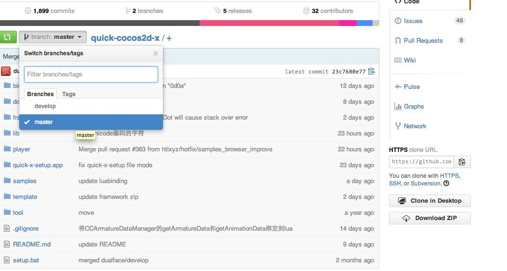

咱们先确定是使用哪个分支来做开发，quick一直维护的只有两个分支，一个是`master`分支，一个是`develop`分支。`master`分支是正式版本，缺点是Cocos2d-x的版本可能会稍微落后于官方，一些quick新添加的功能可能没有，优点在于稳定版本是经过测试使用后没问题，可以放心大胆的使用；`develop`版本是目前正在开发的版本，缺点是问题可能会比较多，优点是Cocos2d-x的版本比较新，有一些新添加的功能在里面。如果是商用游戏的话推荐使用正式版本，如果是自己学习的话既可以使用正式版本也可以使用`develop`版本。

选好版本之后我们把版本`clone`下来，至于`clone`的工具，既可以使用`git命令行`，也可以使用`github客户端`或者`SourceTree`之类的工具，个人推荐使用`SourceTree`，GUI界面还是比较简单直白的^_^。

### 2.3 获取Android工具链
Android下开发需要的工具有：

- 1. Eclipse+ADT/AndroidStudio/IDEA
- 2. NDK-r9+
- 3. Java JDK
- 4. Lua 5.1.4
- 5. Android SDK

因为在Android下开发游戏还是要使用到C++代码，所以咱们还是需要使用NDK-r9的版本来做开发。至于编辑器最好是用Eclipse,目前Android的开发支持的最完整的还是Eclipse+ADT这一套装备。如果是嫌装ADT麻烦的话可以到android的开发者官网下载android-bundle(点[这里](http://developer.android.com/sdk/index.html#download)下载)。
先把上面列出的软件安装好，然后打开Eclipse或者android-bundle，为了方便开发Lua，我们需要给Eclipse安装LDT，LDT的地址是：`http://download.eclipse.org/koneki/releases/stable`。如果是有Eclipse Market的Eclipse版本，直接打开Eclipse Market，搜索LDT安装即可。如果没有Eclipse Market,选中`Help->Install New Software`，输入上面的LDT的地址，并安装。

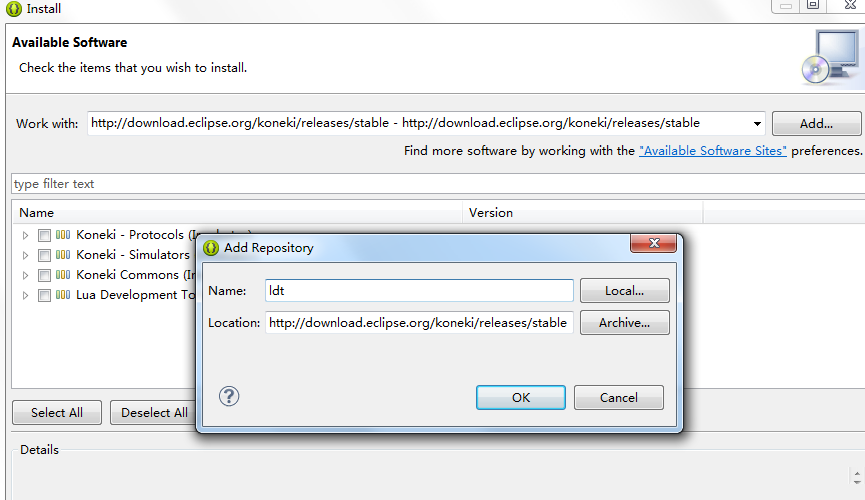

安装成功后重启Eclipse，LDT就成功的安装了。

## 3.环境配置
所有的软件安装完成后，我们还不能马上使用quick,还需要配置一些环境变量和参数。

### 3.1 Quick-Coco2d-x环境配置
相对来说,quick的环境变量配置是很简单的，较老的版本需要在windows中配置环境变量`QUICK_COCOS2DX_ROOT`。

右键`我的电脑或者计算机`->`属性`->`高级`->`环境变量`,打开环境变量设置窗口

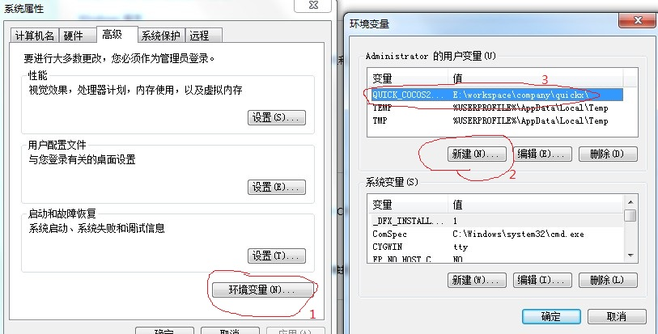

点击新建，添加一个名为`QUICK_COCOS2D_ROOT`的变量，值为你clone下来的quick的根路径。

新版本的quick包含一个自动设置环境变量的脚本。在quick的根目录下可以找到一个名为setup.bat的批处理脚本，运行它，就会自动为你完成刚才说的步骤了。当你改变了quick的文件夹时，也需要改变环境变量中`QUICK_COCOS2D_ROOT`的值。

配置好这些参数基本上quick的player就可以运行起来了。打开quick根目录下的player/win下的quick-x-player.exe文件，为了方便也可以在桌面上创建一个快捷方式。打开后的界面如下：

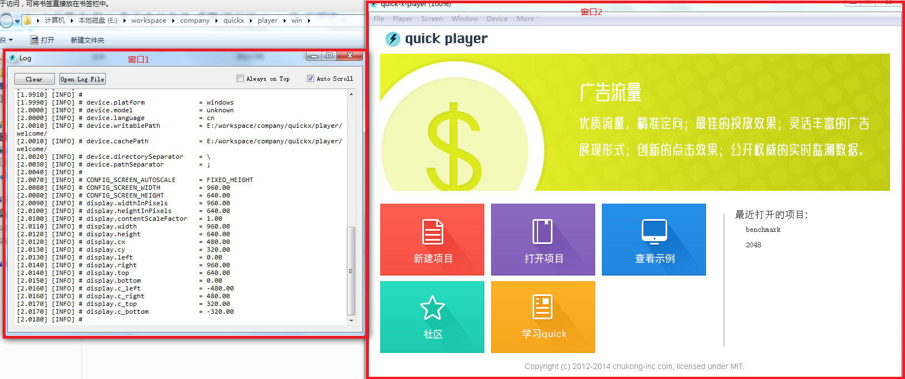
 
图中的窗口1是调试信息窗口，窗口2是运行的界面窗口。

我们来运行quick的一个demo来试试。点击查看示例，player中的窗口会变成下面这样：

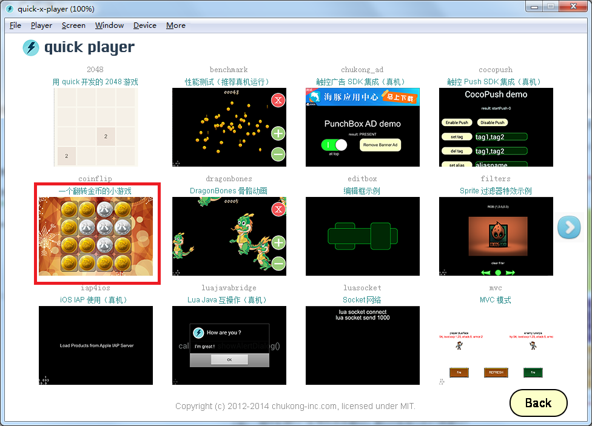

作为从quick发布到现在一直陪伴左右的coinflip当然是我们展示的首选。点击coinflip，进入游戏。

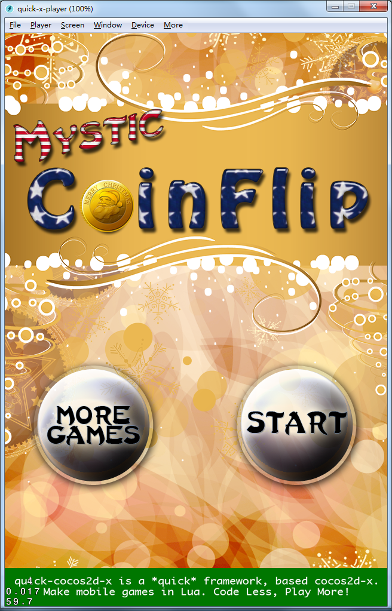

漂亮的界面就出现了，大家开心的玩耍吧。

### 3.2 Android环境配置
配置好quick的参数后我们运行quick自带的demo是毫无问题了，接下来，我们要让quick运行到自己的设备上。

首先，用quick的player的`新建项目`建立一个项目

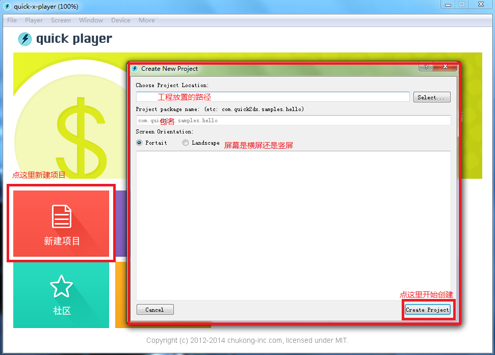

我在这里新建了一个名为fristtest的项目，路径放到quick目录下的smaples里，包名随便填吧^_^，点击create project创建好项目。在项目创建完成后，关闭创建项目窗口，回到player，打开刚才创建的项目。**这里要注意，要选中项目的根目录，不要选proj.android之类的指定平台目录**。如果一切正常的话看到应该是如下界面：

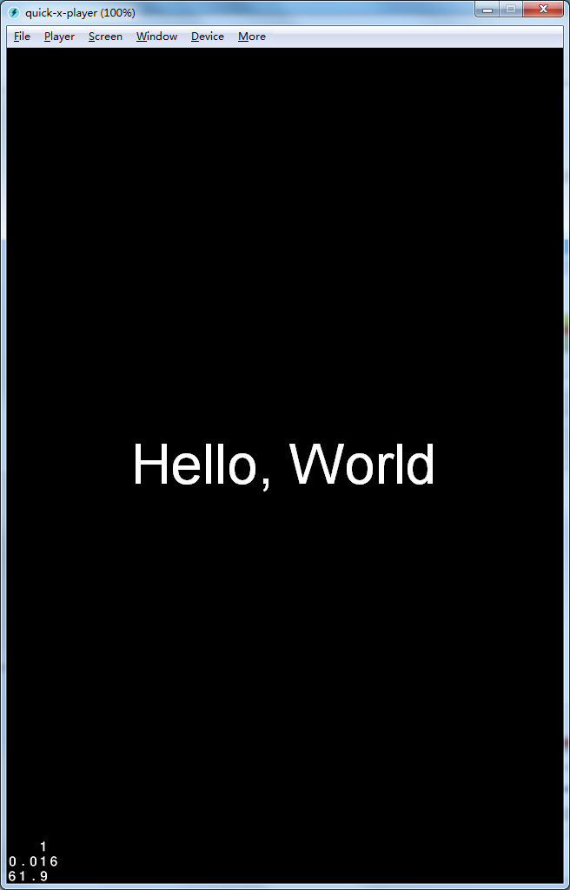

> 如果屏幕方向不对或者是想看看其他屏幕方向的显示效果可以点菜单栏的`Screen`，然后选择`Landscape`或者`Portrait`来做更改。

既然在Player上运行没问题，接下来我们就可以让它在android上运行起来。打开Eclipse，在Eclipse的`Package Explorer`中点击右键，选择`Import`,选择`Android`->`Existing Android Code Into Workspace`，然后找到刚才创建项目的proj.android目录，确定后就可以导入到Eclipse的workspace中了。

不出意外的话你看到的应该是一片xx，这是因为咱们还没导入Cocos2d-x的java代码导致的。

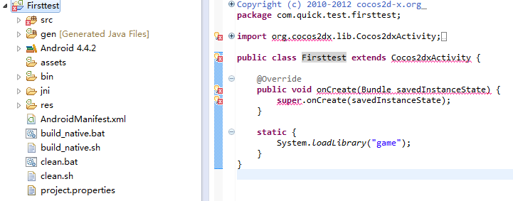

导入Cocos2d-x的Java代码有两种方式，一种是直接把代码拷贝到src目录下，还有一种方式是直接将Cocos2d-x的代码作为第三方库的形式导入。第一种方式适合要经常修改引擎Java代码的同学，第二种方式的话不是经常更改引擎Java代码的同学。
第一种方式，不多说，直接把`quick根目录\lib\Cocos2d-x\cocos2dx\platform\android\java\src`下的文件拷贝到项目的src目录下然后刷新项目就可以了。
第二种方式和导入quick的android工程一样导入`quick根目录\lib\Cocos2d-x\cocos2dx\platform\android\java`下的代码到workspace中，之后选择我们在quick中建立的工程，点击`右键->Properties->Android`,在Library中点击Add，

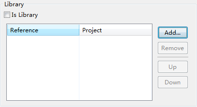

在弹出的窗口中`libcocos2dx`项目

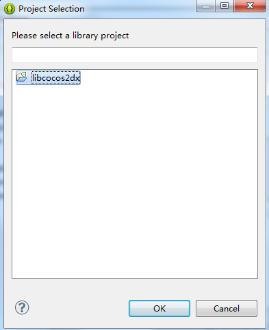

点击`OK`退出。好了，现在所有的xx都消失了。

接下来我们还需要配置NDK的编译环境，至于怎么配置NDK的编译环境，大家可以度娘下，这里就不细说了。在配置好NDK编译环境后，在`proj.android`下执行命令`ndk-build`或者`build_native`，生成C++库。
再到Eclipse中按照原来的方式点击`Run`就可以在手机上运行了。

