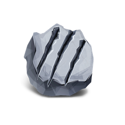
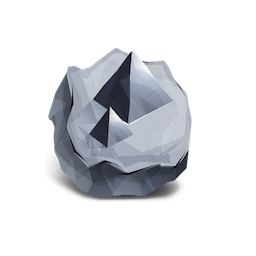

# CocoStudioとは

CocoStudioはCocos2d-xをベースにしたプロ用のゲーム開発ツールです。It promises to be free of charge in an infinite duration.
4つのエディタを使えばゲーム素材を素早く作り、退屈な開発をシンプルにできるでしょう。UI Editor, Animation Editor, 
Scene Editor , Data Editorの4つです。これらはアニメーションリソース、UIインターフェース、ゲームシーン、
ゲームデータを扱い、ゲーム開発の中心プロセスをカバーします。またツール郡は開発メンバーごとの役割にそったものですから、
それぞれの仕事を効率的に、ほとんどミスなく進められるでしょう。単純には高い生産性とクオリティをローリスク、ローコストで得られるでしょう。

*Figure 1: CocoStudio*  

CocoStudioは偶然生まれたわけではありません。私たち（中国のchekong社）は2012年にFishJoy2()を作り始めて多くの問題に直面しました。
Cocos2d-xにはUIやアニメーションのビジュアルツールがなかったので、プログラマがゲームデザイナーの要望を満たすのにとても時間がかかりました。
その時にビジュアルツールを作ろうと思いました。最初はSP-IIと名付けたツールをFishJoy2のために作りました。
その半年後、SP-IIを改良したCocoStudioの初版を2013年に出しました。

## UI Editor

UI Editorはデザイナーがグラフインターフェースを作るエディタです。
画像ツールで作ったインターフェース用画像を配置し、編集、結合、加工できます。
それをUI resourceとしてエクスポートすればゲームのコードから直接使えます。
UI EditorはCocos2d-xの全プラグインを含み、いくつかは拡張されているので、開発中のいろんな要求に応えるでしょう。
個別画像、全画像、UIテンプレート、UIアニメーションのエクスポートもできるのでいろいろ活用できます。

## Animation Editor

Animation Editorはキャラクターアニメーション、エフェクト、シーンアニメーションのようなダイナミックリソースを編集できます。
デザイナーがよく使うことになります。用意した画像をエディタに配置して多彩なアニメーション効果をつけ、プレビューできます。
キーフレーム、ボーン、シーケンスフレームのアニメーションをサポートします。またFlashや、PSDとpListのように、個別の画像を大きな画像にまとめてエクスポートするなどの幅広いリソース最適化を行います。

## Scene Editor

シーン要素やステージをデザインします。プランナーがアニメーションやマップやパーティクル、画像、オーディオなどのリソースを統合する一方で、コリジョンやトリガやコントローラなどプログラム寄りのリソースも編集できます。
さらに携帯電話やシミュレータからワイヤレスでシーンをプレビューできます。

## Data Editor

data designersはテーブルを取り込んでブレイクダウンし、アトリビュート表やデータ表のような共通のデータ形式でエクスポートします。index.animaをサポートしているので、幅広いデータ編集ができます。

