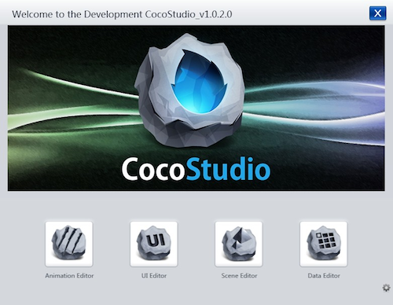
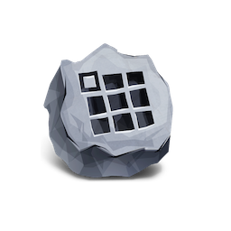

# CocoStudioとは

CocoStudioはCocos2d-xをベースにしたプロ用のゲーム開発ツールです。It promises to be free of charge in an infinite duration.
4つのエディタを使えばゲーム素材を素早く作り、退屈な開発をシンプルにできるでしょう。UI Editor, Animation Editor, 
Scene Editor , Data Editorの4つです。これらはアニメーションリソース、UIインターフェース、ゲームシーン、
ゲームデータを扱い、ゲーム開発の中心プロセスをカバーします。またツール郡は開発メンバーごとの役割にそったものですから、
それぞれの仕事を効率的に、ほとんどミスなく進められるでしょう。単純には高い生産性とクオリティをローリスク、ローコストで得られるでしょう。

*Figure 1: CocoStudio*  

CocoStudioは偶然生まれたわけではありません。私たち（中国のchekong社）は2012年にFishJoy2()を作り始めて多くの問題に直面しました。
Cocos2d-xにはUIやアニメーションのビジュアルツールがなかったので、プログラマがゲームデザイナーの要望を満たすのにとても時間がかかりました。
その時にビジュアルツールを作ろうと思いました。最初はSP-IIと名付けたツールをFishJoy2のために作りました。
その半年後、SP-IIを改良したCocoStudioの初版を2013年に出しました。

## UI Editor

UI Editorはデザイナーがグラフインターフェースを作るエディタです。
画像ツールで作ったインターフェース用画像を配置し、編集、結合、加工できます。
それをUI resourceとしてエクスポートすればゲームのコードから直接使えます。
UI EditorはCocos2d-xの全プラグインを含み、いくつかは拡張されているので、開発中のいろんな要求に応えるでしょう。
個別画像、全画像、UIテンプレート、UIアニメーションのエクスポートもできるのでいろいろ活用できます。

## Animation Editor

Animation Editorはキャラクターアニメーション、エフェクト、シーンアニメーションのようなダイナミックリソースを編集できます。
デザイナーがよく使うことになります。用意した画像をエディタに配置し、

After importing ready image resources into the editor, they are able to put on various animation effects 
according to the design scheme and preview them in the editor. 

The editor supports key frame animation, 
sequence frame animation, bone animation, etc. Also, it allows for a wide range of resource optimization methods 
like exporting individual images or the whole image, as well as parse of Flash, PSD and Plist resources.

## Scene Editor

An editor for designing scene elements and game levels. With the editor, planners are able to integrate a mix of diverse game resources, including animation resources, UI resources, map resources, particle resources, image resources, audio, etc. Meanwhile, it can also be used to edit logical resources such as collisions, triggers, and controllers. Furthermore, the editor supports simulation operation, meaning that one can run the current scene in the simulator or his/her phone via wireless connection.

## Data Editor

The data designers import tables of values into this editor, break down the complicated ones, and then export them as common data files such as table of attribute or data. A wide range of different data arrangements can be choosed from data manager while exporting as the editor supports index.anima
