# パルクール(障害物競走)ゲームをビルドしてみよう

## 概要

### IronCityの紹介

CocoStudioの使い方がわかるシンプルなゲームを紹介します。
IronCityというタイトルで、Cocos2d-html5とCocoStudio v1.0.2 で作られています。
（書いている間にCocoStudio1.1.0がリリースされ、日本語翻訳中はすでに1.2.0.1が出ています）
ユーザーインターフェースとアニメーションはCocoStudioで作られており、
githubからcloneできます:https://github.com/yuye-liu/CocostudioIronCity

IronCityはメニューとゲームの2シーンを持つシンプルなアクションゲームです。
ゲームシーンではジェスチャーで主人公のCocoManが走ったり(右フリック)、ジャンプ(上フリック)、ストップ(左フリック)、ショット(画面をタップ)します。
長く走り多くのモンスターを撃ち、ハイスコアを目指しましょう。

*Figure 5: Main Menu Scene*  

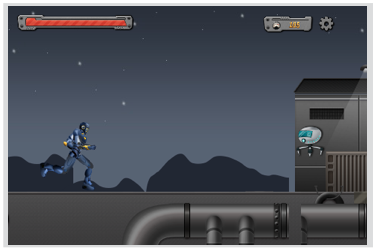

*Figure 6. Game Scene*  

*Figure 7: IronCityのコード階層*  

スクリーンショットはIronCityのファイル構成で、ソースは3パートに別れています。
それぞれどうCocoStudioを使っているか説明します。

- MainMenuScene.js: 最初のシーン。背景画像とスタートボタンがあり、スタートボタンを押すと次のGameSceneに移ります。

- GameScene.js: メインのシーンです。全リソース情報(WidgetのプロパティなどUIEditorからExportしたもの)はここで定義しています。シーンは menu,play,gameoverの3つのレイヤーから出来ています。CocoManの衝突判定もやっています。

- Background.js: ゲームの背景マップを作ります。タイルマップを使っています。

- GameOver.js: UI レイヤーです。CocoManが死ぬとGameOverレイヤーを生成します。GameOverレイヤーはスコアのUIがあり、UI Editorで作られています。これら3レイヤーのUI Editorプロジェクトは“CocoStudioIronCity/IronCityCocoStudioProject/IronCityUI”にあります。

*Figure 8: IronCityUI*  

- Laser.js: レーザーはCocoManの武器でタッチした場所にショットします。Laser.jsはcc.Spriteクラスを拡張しており、レーザーのspriteを画面に置いたり消したりしています。

- MenuUI.js: UIEditorで作った3つのUI(体力バー、スコア、セッティングボタン)からなるUIレイヤーです。
単純なので次章のUI Editorの説明で使います。

- SettingUI.js: セッティング画面のUIレイヤーです。セッティングボタンを押すとゲームはポーズしてSettingUIを生成します。SettingUIでは音楽のon/offやボリューム設定をして、GameSceneかMainMenuに戻るボタンがあります。

- Monster.js: 2種類のモンスターの生成、消滅、移動とアニメーションのためにcc.Nodeを拡張しています。モンスターの動きはAnimationEditorで作られていますが、パラパラ漫画のような画像の置き換えてやっています。アーマチュア（Boneなど間接を使ったアニメーション）は次の章で学びます。

- Player.js: このjsはcc.Layerを拡張しており、“imManArmature”などCocoManの7つのアニメーションをロードして再生します。走るアニメーションを例にAnimationEditorを使ったアーマチュアの作り方を紹介します。

## ゲームコンポーネントをデザインする

UIEditorとAnimationEditorでユーザーインターフェースを作る方法を説明します。ここではSceneEditorとDataEditorは使いませんので必要ならヘルプドキュメントを見てください。

IronCityにはcocoStudioで作った3つのメニューと9のアニメーションがあります。githubからcloneしたCocoStudioプロジェクトの“IronCityCocoStudioProject”のフォルダに入っています。

3つのメニューは“GameMenuUI”, “GameSceneOverLayer”, “GameSceneSetMenu”で、GameSceneの3つのレイヤーに対応します。CocoManの9つのアニメーションは“CMRun”や“CMRunJump” です。次章で“GameMenuUI”と“CMRun”を例にUIEditorとAnimationEditorの使い方を説明します。

*Figure 9: CocosManAction*  

# "GameMenuUI"の作り方

## 使うUIWidgetを決める

まずUIに何が必要か考えます。IronCityの“GameMenuUI”では体力バーとスコアとsettingボタンです。
CocoStudioを開いてUIEditorを選び、ファイルメニューから「プロジェクトを作成」を選びます。

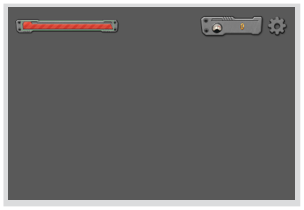

*Figure 10. Imagination of IronCity*  

## ウィジェットを追加する

*Figure 11: UI Editor*  

スクリーンショットはUIEditorで、Widgetsのパネルを使って必要なリソースをエディタに配置したところです。

Toolsのパネルは左右の回転と、8種の整列ができます。Canvasの欄はUILayerの解像度を選んで指定します。左上のノーマルと書いたボタンはポーズ（配置）モードとアニメ（タイムライン）モードを切り替えます。アニメーション部分はAnimationEditorと同じですから後で説明します。

Widgetsツールバーには14のウィジェットがあり、キャンバスにドラッグできます。スペースキーを押し続ければキャンバス自体をマウスでドラッグすることもできます。こうしたショートカットはPhotoshop
に似せてあります。右のResourceパネルからはWidgetのPropertyのパネルに画像リソースをドラッグできます。Resourceパネルにはpsdファイルもドラッグして取り込めます。この例ではbloodBar（体力バー）のテクスチャに“bloodBar.png”をドラッグしました。ファイル名はアルファベットにしましょう。

ウィジェットを追加し、リソースパネルから画像をセットしました。左下のオブジェクト構造パネルはレイヤーの階層構造が出ますが、ゲーム内の前後関係とは違います。Cocos2d-xやCocos2d-html5ではZorder でスプライトの前後関係を指定できます。これはUIEditorではステータスパネルの下の「RenderLayer」にあたります。

*Figure 12: ResourceをTextureにドラッグする*  

## プロパティをセットしてエクスポートする

“GameMenuUI”の準備ができたので、ファイルメニューの「プロジェクトを出力」をクリックします。デフォルト設定でエクスポートすることが多いでしょう。Widgetのステータスをセットし忘れないでください。例えばレイヤパネルの「touchable」をチェックしないと、パネルに属するWidgetを「touchable」にしてもタッチできなくなります。

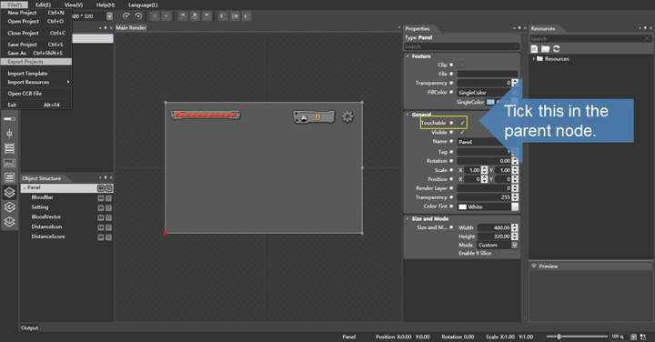

*Figure 13: エクスポート前にプロパティをセット*   

## エクスポートしたリソースを利用する

*Figure 14: エクスポートしたファイルをゲームに取り込む*  

エクスポートしたらCocoStudioプロジェクトの“export”フォルダにファイルが出来ます。jsonファイル(JavaScript Object Notation file＝データ交換フォーマットの一つであるJavascript式配列)ができ、UIEditorでセットしたウィジェットプロパティが保存されます。jsonは開発者にも読みやすいので、このファイルを調べて問題が解決することもあるでしょう。

*Figure 15: エクスポートした JSON*  

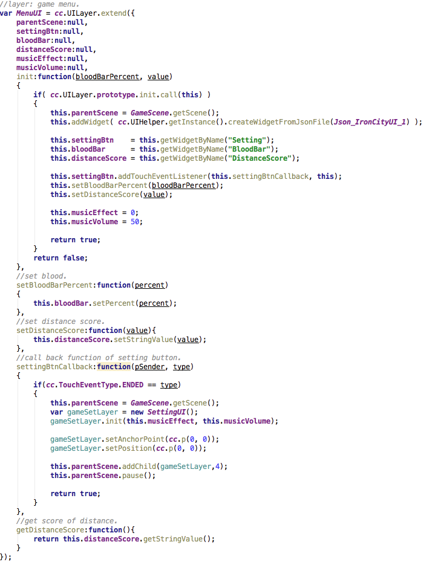

*Figure 16: MenuUI.js*  

IronCityがエクスポートしたリソースをどう使っているか見ます。
IronCityではexportしたリソース情報のjsonをGameScene.jsに移し替えて持っています(Cocos2d-html5ではMenuUI.jsになります)。
これはLayer Menu UIとその最初の関数です。

<code>
*this.addWidget( cc.UIHelper.getInstance().createWidgetFromJsonFile(Json_IronCityUI_1));*
</code>

<code>*createWidgetFromJsonFile()*</code> で"json"をゲームに読み込みます。MenuUIでは、セッティングボタン、体力バー（プログレスバー）、距離スコア（アトラスラベル）があります。
<code>*getWidgetByName()*</code>のfunctionを使って、オブジェクト階層の名前からウィジェットを取得できます。

ウィジェットはそれぞれのインターフェースでプログラムから呼ばれます。<code>*setPercent()*</code>でプログレスバーの割合をセットしたり、<code>*setStringValue()*</code>でアトラスラベルを書き換えます。
全ウィジェットは<code>*addTouchEventListener()*</code>でタッチイベントを取得できます。IronCityでは、全リソース定数を別ファイルに移しました。Cocos2d-html5の“CocoStudio test”を見ればもっとわかるでしょう。

# "CMRun"アニメーションの作り方

## プロジェクト作成

cocoManが走るアニメーションを作りましょう。まず“GameMenuUI”と同じく新プロジェクトを作り“Running”と名付け、全部のリソースをリソースパネルにドラッグしましょう。

*Fiture 17: Animation Editor*  

最初は「ポーズモード」ですから、左上のボタンで「アニメモード」に切り替えて使います。
次にAnimationEditorでアーマチュアを作ります。

### Boneの作成

アーマチュアを作るには、ボーンの各パーツの画像が必要です。

IronCityではCocoManを6パーツに分けました。ボディを2から4のボーンで作り、それをつなげました。

*Figure 18: Animation EditorでのBone作成*   

この場合、全画像をメインレンダーに置いています。これは右足で、太もも、すね、膝と足の４パーツになります。
ヒットボックスで衝突領域を指定できます。これは一例ですが、実際は違うやり方をしています。ボーンや衝突領域を増やすほどブラウザ上でのパフォーマンスは下がるのでここでは使いません。あなたが使うなら、“CocoStudio Test”の中の“TestColliderDetector”を参考にしてください。合成したら、右足全体がメインレンダーにある状態になります。ボーンを作りましょう。

アーマチュアを作る5ステップ:

1."create bone"モードにする 
2.boneをかく 
3."create bone"モードをoffにする 
4.画像とboneを合わせる 
5.boneを親要素につなげる 

 

*Figure 19: Step 1-2*  

*Figure 20: Step 3-4*  

*Figure 21: Step 5*  

終わったら、cocoManのパーツをジグソーパズルのように組み合わせます。親のボーンに接続するのをお忘れなく。これは走るアニメーションの最初のポーズになります。ほかのポーンはこの基本形をコピーや拡張して作ります。次はアニメーションを作ります。

Figure 22: ステップ1-5を繰り返してアーマチュアを完成します。

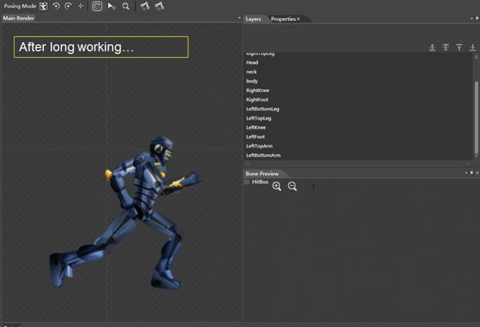

### Animation Mode

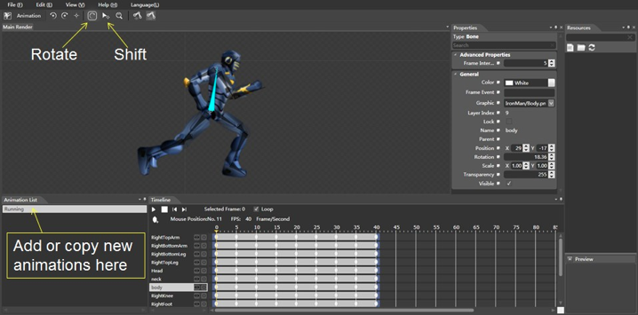

*Figure 23: Animation Mode*

左上のボタンを押してアニメモードにしましょう

このUIEditorのアニメモードとAnimationEditorはほとんど同じです。

タイムラインはアニメーション制作のキモです。flashやSpineのタイムラインツールを知っていればすぐなじめるでしょう。

タイムラインは多くのフレームがあります。ローテートやシフトのボタンを使って、キーフレームごとにボーンの状態やポーズをセットして
アニメーションを作っていきます。

*Figure 24: Key Frames of CMRunFigure*

これは"Running"アニメーションのキーフレームになります。フレーム40は0と同じです。Loop
をチェックしてアニメーションをループできます。タイムラインのPlay
ボタンでアニメーションを再生できます。fpsを変更してアニメーション速度も変えられます。

### 作ったアーマチュアをプログラムで使う

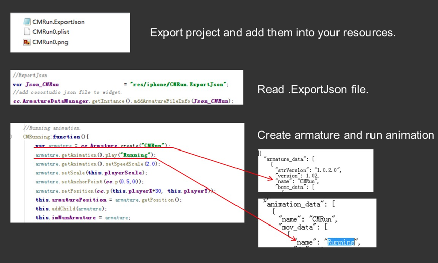

*Figure 25: Create Armaute and Run*

アーマチュアとアニメーションをつくってエクスポートしたら、通常3ファイルがエクスポートフォルダに出来ます。 

ExportJsonファイルはjsonですからAnimationEditorでの設定内容が開発者に読める形で書かれています。 <code>*CMRunning()*</code> の関数はアーマチュアを作って動かす簡単な例になります(“Player.js”) 

UIEditorのように<code>*cc.ArmatureDataManager.getInstance().addArmatureFileInfo(Json_CMRun)*</code> でパスを指定しリソースを読み込みます。
<code>*cc.Armature.create(“CMRun”)*</code> はExportJsonファイルから"CMRun"というアーマチュアを作ります。

"CMRun"はプロジェクト名です。もし名前を変更するならExportJsonファイルの"CMRun"を全部置換するのが早いでしょう。
 <code>*armature.getAnimation().play(“Running”)* </code>  はExportJsonから"Running"というアニメーションを見つけます。
  この名前はAnimationEditorのアニメーションリストで指定できます。また、ExportJsonファイルを編集してもOKです。

### Callback Functionsを呼ぶ

アーマチュアでコールバック関数を呼ぶ方法は2つあります。アニメーション完了時の <code>*setMovementEventCallFunc()*</code>  と、フレームごとの <code>*setFrameEventCallFunc()*</code>です。

*Figure 26: Callback Functions をセットする*

## Scene Editor と Data Editor

### Scene Editor

*Figure 26: Scene Editor Sample: RPGGame on CocoStudio v1.1.0*  

画像はSceneEditorのスタートページにあるRPGGameというサンプルです。Scene Editorのインターフェースや使い方はUIEditorと似ています。
リソースを追加してウィジェットをドラッグして、プロパティをセットしたらプロジェクトをエクスポートします。
簡単に紹介しましょう。
  

*Figure 27. Play, stop , connect to device ボタン*  

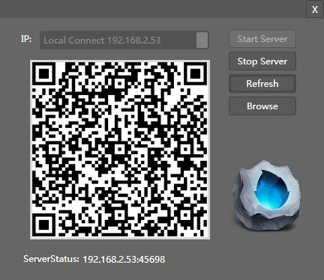

*Figure 28: Connect Device*

**Play, stop , connect to device ボタン**: この3ボタンはキャンバスの右にあります。"Play"をクリックするとPCでシーンをプレビューでき、"stop"ボタンでプレビューを閉じます。
最後のボタンは"connect to device"ボタンです。Webサーバーが起動して、IPアドレスを入力すればhtml5や携帯電話など他のデバイスでシーンを実行できます。

**Sprite:** CCSprite in Cocos2d-html5.  

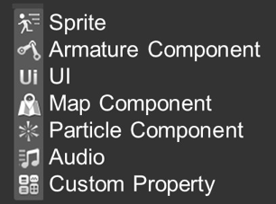

*Figure 29: Scene Editorでのウィジェット名*

**Armature Componet:**   Cocos2d-html5のCCArmautre。アーマチュアをドラッグ（通常はAnimationEditorで作ったExportJsonファイルです）してシーンに置き、Animationリストで実行するアニメーションを選びます。
  

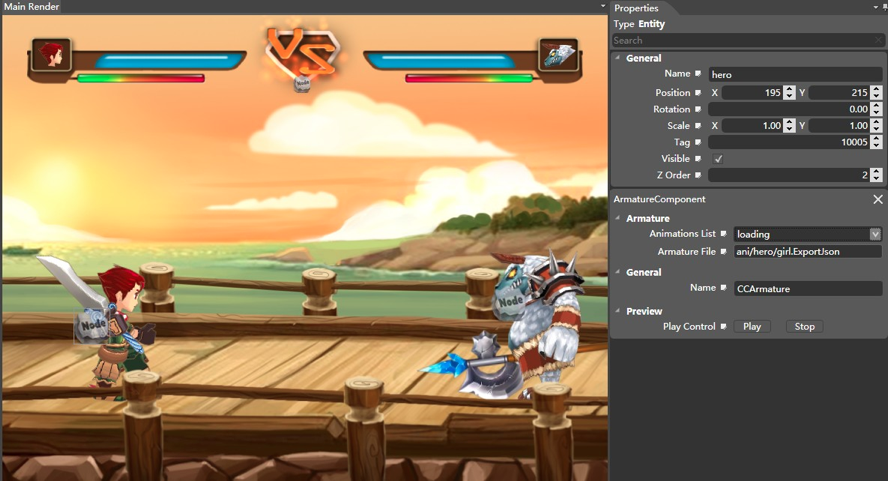

*Figure 30. サンプルプロジェクト内のアーマチュア: Fight Scene*  

**UI:** アーマチュアと同様に、UIEditorで作ったUIリソースもUIウィジェットに追加できます。

**Map Component:** mapリソースをmapコンポーネントにドラッグします。mapリソースは[Tiled](http://www.mapeditor.org/)などのタイルマップ作成ツールでエクスポートした"tmx"ファイルになります。

**Particle Component:** Particleリソースは[ParticleDesigner](http://71squared.com/particledesigner)などで作れます。ParticleComponentを使ってparticleをシーンに追加します。

*Figure 31. Particle Component properties*  

**Audio:** mp3とwavに対応しており、Audio widgetをドラッグして追加します。

*Figure 32: Audio properties*  

**Custom Property:** CustomPropertyはData Editorと関連するので後から説明します  

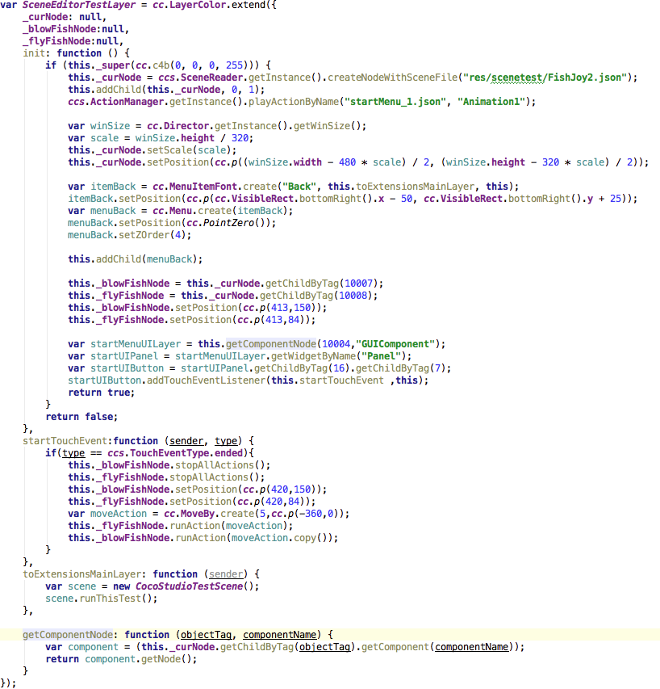

*Figure 33: Scene Editor Test*  

画像はCocos2d-html5のTest casesの“SceneEditorTest”です。これはScene Editorのスタートページにある“FishJoy2”のサンプルです。
<code>*createNodeWithSceneFile()*</code> を使ってSceneEditorでエクスポートしたリソースからCCNodeを作ります。
SceneEditorの全ウィジェットは"Tag"プロパティをち、親ノードから<code>*getChildByTag()*</code>を使ってウィジェットを探せます。
エクスポートしたSceneEditorのリソースを使うのは簡単なので、“CocoStudio Test”を見ればさらに学べるでしょう。

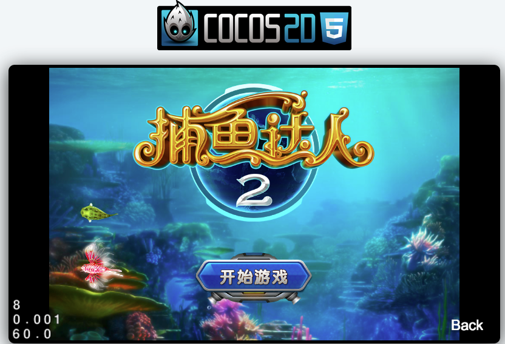

*Figure 34: SceneEditorTestを実行するとScene Editorで編集したシーンをプレビューできます*  

### Data Editor
  

*Figure 35: Excelデータ*  

*Figure 36: Data Editor*  

Data EditorではExcelやCSVのデータを取り込めます。データデザイナーの人は、これらをDataEditorで編集してJson出力でき、jsonはScene Editorでカスタムコンポーネントとして使えます。カスタムコンポーネントの使い方はSceneControllerのSceneControllerを見ればよいでしょう。
