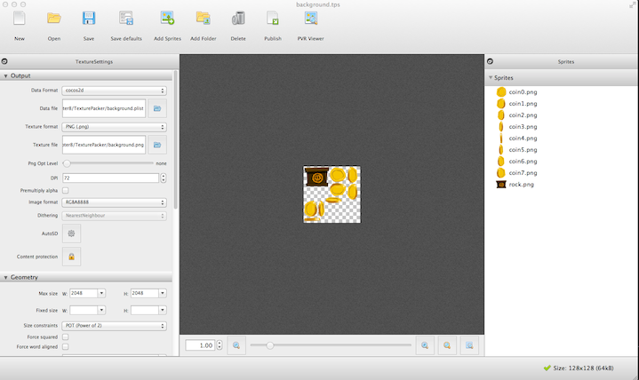
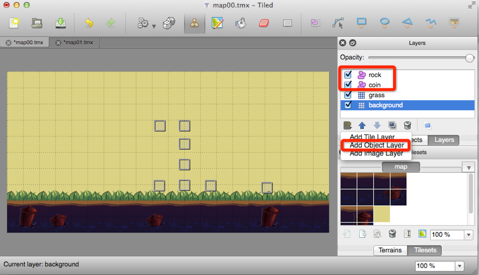
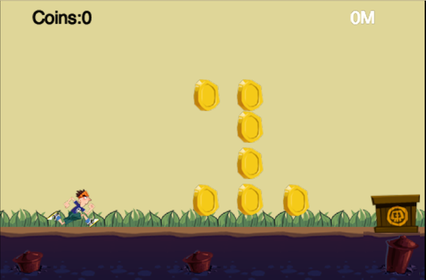

# Add Coin and Obstacles Into Our Game

## Introduction
In this tutorial, we will try to add Coin and Obstacles into our parkour game.

After this tutorial, our player should be able to collect the coin when he is running and he will die when he collides with the obstacle.

We will also cover how to design a game level with tiled map editor. Since the game logic is a little bit complex than before,
so we will refactor the code before we adding new game components.

## Preparation
Before we start, let's finish the preparation stuff.

### Setup Resource and Globals
Since we will add two more game elements into our parkour game. So we need add some more global integer tags to identify each game items.

Let's add the following code snippets at the end of *globals.js*:

```
// collision type for chipmunk
if(typeof SpriteTag == "undefined") {
    var SpriteTag = {};
    SpriteTag.runner = 0;
    SpriteTag.coin = 1;
    SpriteTag.rock = 2;
};
```

Here we use 0,1,2 to represent runner,coin and rock.

We also introduce another spritesheet named *background.png* and *background.plist*. We have packed the coins and rocks sprites into the spritesheet named background.png.

The details of how to pack these sprites are leave out for the next subsection.

Next, let's copy the resource files into our *res* directory and add two more variables for further referring.

```
var s_background = "background.png";
var s_background_plist = "background.plist";


var g_resources = [
    //image
    {src:s_HelloBG},
    {src:s_start_n},
    {src:s_start_s},
    {src:s_runner},
    {src:s_runnerplist},
    {src:s_background},
    {src:s_background_plist},
    {src:s_map},
    {src:s_map00},
    {src:s_map01}
];
```


### Pack Coins and Rocks into Spritesheet with TexturePacker

In the previous chapter, we have learned how to pack a bunch of small sprites into a big large compact spritesheet. Let's pack another spritesheet.

At first, you should launch TexturePacker and drag all the assets under *res/TexturePacker/coins and rocks* director.(Note: You can get the whole game resource from the download as before.)

After dragging the resource, you should specify the *Data file* and *Texture format* with some path like *xxx/chapter8/res/background.png* or *xxx/chapter8/res/background.plist*.

If you don't want to any optimization of the spritesheet, just leave them out and press *Publish* to generate the final spritesheet.



## Introduction to TiledMap Object Layer
We have used TiledMap for our level map, but it lacks game items. So in this section, we will cover how to design level items with TiledMap object layer.
###Add Coin Object Layer
At first, we'll add Coin object layer.

1. Launch Tiled and open *map00.tmx* and *map01.tmx*.

2. Create an Object layer named *coin* in map00.tmx and map01.tmx.


3. Design object layer by dragging and dropping rectangle object into the map.
You can change the rectangle size and it's position. You can also duplicate or delete the objects.


4. Some tips on designing object layer:
You can change opacity of the layers in the tiled map so that you can easily place the object.


###Add Rock Object Layer
The process to create the Rock object layer is more or less the same as creating coin object layer.

So we will leave it out for your own implementation.

## Refactor BackgroundLayer Class and Add Some Helper Method
Sometimes, when you are coding, you may find that it is extremely hard to add new functionality into the existing structure.

It is a bad code smell and we should stop and do refactor work right now.
### Refactor BackgroundLayer Class
Since we will add Chipmunk physic body into our background, so we need a method to obtain the *space* object created in *PlayScene*.

Let's change the name of *ctor* function in Background Layer and pass a parameter named *space* into it. We should also add a new member variable into the
BackgroundLayer class. Here is the code snippets:

```
    ctor:function (space) {
        this._super();

        // clean old array here
        this.objects = [];
        this.space = space;

        this.init();
    },
```

Here we have added additional init code. We added a array named *objects* and initialize it to an empty array.

(*Note: You should call this.init() method right after the assignment of this.space = space. Because we will create physic objects in the init method*)

### Add Helper Method
1. Add more member variables into BackgroundLayer class:
```
    space:null,
    spriteSheet:null,
    objects:[],
```

2. Initialize spritesheet in the *init* method:
```
    // create sprite sheet
        cc.SpriteFrameCache.getInstance().addSpriteFrames(s_background_plist);
        this.spriteSheet = cc.SpriteBatchNode.create(s_background);
        this.addChild(this.spriteSheet);
```

3. Add a method named *loadObject* to initialize rock and coins.
```
 loadObjects:function (map, mapIndex) {
        // add coins
        var coinGroup = map.getObjectGroup("coin");
        var coinArray = coinGroup.getObjects();
        for (var i = 0; i < coinArray.length; i++) {
            var coin = new Coin(this.spriteSheet,
                this.space,
                cc.p(coinArray[i]["x"] + this.mapWidth * mapIndex,coinArray[i]["y"]));
            coin.mapIndex = mapIndex;
            this.objects.push(coin);
        }

        // add rock
        var rockGroup = map.getObjectGroup("rock");
        var rockArray = rockGroup.getObjects();
        for (var i = 0; i < rockArray.length; i++) {
            var rock = new Rock(this.spriteSheet,
                this.space,
                rockArray[i]["x"] + this.mapWidth * mapIndex);
            rock.mapIndex = mapIndex;
            this.objects.push(rock);
        }
    },
```

Here we iterate all the objects info in the tiled map and create responding Chipmunk rigid bodies. Finally we store these object into the *objects* array.

All these code are self-explanation. You should only pay attention to the *mapIndex* parameter. We use the parameter to calculate where we should place the rigid body.

We need call *loadObject* method at the end of *init* method to create the  physic objects in the first two screen maps.

```
this.loadObjects(this.map00, 0);
this.loadObjects(this.map01, 1);
```

4. Add another two helper methods for removing unused chipmunk rigid bodies.

The first method is called *removeObjects*. It removes a object by *mapIndex*. Here is the implementation:

```
removeObjects:function (mapIndex) {
        while((function (obj, index) {
            for (var i = 0; i < obj.length; i++) {
                if (obj[i].mapIndex == index) {
                    obj[i].removeFromParent();
                    obj.splice(i, 1);
                    return true;
                }
            }
            return false;
        })(this.objects, mapIndex));
    },
```

The other method is called *removeObjectByShape*:

```
   removeObjectByShape:function (shape) {
        for (var i = 0; i < this.objects.length; i++) {
            if (this.objects[i].getShape() == shape) {
                this.objects[i].removeFromParent();
                this.objects.splice(i, 1);
                break;
            }
        }
    },
```

This method will remove a chipmunk object by its shape.

###Wrap it up: Add Creation and Disposable Logic in checkAndReload Method
When the map is moved, we should also call *loadObject* method to recreate the "Coins & Rocks".

And also we sould remove all unused objects by calling *removeObjects* method.

Here is the code snippets:
```
  checkAndReload:function (eyeX) {
        var newMapIndex = parseInt(eyeX / this.mapWidth);
        if (this.mapIndex == newMapIndex) {
            return false;
        }

        if (0 == newMapIndex % 2) {
            // change mapSecond
            this.map01.setPositionX(this.mapWidth * (newMapIndex + 1));
            this.loadObjects(this.map01, newMapIndex + 1);
        } else {
            // change mapFirst
            this.map00.setPositionX(this.mapWidth * (newMapIndex + 1));
            this.loadObjects(this.map00, newMapIndex + 1);
        }
        this.removeObjects(newMapIndex - 1);
        this.mapIndex = newMapIndex;

        return true;
    },
```


## Add Coin and Rock
Now it's time to add the coin and rock implementation. Despite the implementation details, you should also pay attention to the design idea behind these two
classes. Here we prefer to inherit from cc.Class instead of cc.Sprite. We let each object to own a instance of cc.Sprite.
### Design and Implement Coin Class
1. Create a new file named *Coin.js*. We will define our Coin class in this file. Make sure you have this filed located in your *src* directory.

2. Derived a class named *Coin* from cc.Class, let's take a look at the whole implementation:
```
var Coin = cc.Class.extend({
    space:null,
    sprite:null,
    shape:null,
    _mapIndex:0,// which map belongs to
    get mapIndex() {
        return this._mapIndex;
    },
    set mapIndex(index) {
        this._mapIndex = index;
    },

    /** Constructor
     * @param {cc.SpriteBatchNode *}
     * @param {cp.Space *}
     * @param {cc.p}
     */
    ctor:function (spriteSheet, space, pos) {
        this.space = space;

        // init coin animation
        var animFrames = [];
        for (var i = 0; i < 8; i++) {
            var str = "coin" + i + ".png";
            var frame = cc.SpriteFrameCache.getInstance().getSpriteFrame(str);
            animFrames.push(frame);
        }

        var animation = cc.Animation.create(animFrames, 0.2);
        var action = cc.RepeatForever.create(cc.Animate.create(animation));

        this.sprite = cc.PhysicsSprite.createWithSpriteFrameName("coin0.png");

        // init physics
        var radius = 0.95 * this.sprite.getContentSize().width / 2;
        var body = new cp.StaticBody();
        body.setPos(pos);
        this.sprite.setBody(body);

        this.shape = new cp.CircleShape(body, radius, cp.vzero);
        this.shape.setCollisionType(SpriteTag.coin);
        //Sensors only call collision callbacks, and never generate real collisions
        this.shape.setSensor(true);

        this.space.addStaticShape(this.shape);

        // add sprite to sprite sheet
        this.sprite.runAction(action);
        spriteSheet.addChild(this.sprite, 1);
    },

    removeFromParent:function () {
        this.space.removeStaticShape(this.shape);
        this.shape = null;
        this.sprite.removeFromParent();
        this.sprite = null;
    },

    getShape:function () {
        return this.shape;
    }
});
```

Let's explain the code piece by piece.

At first, we add three member variables named: *space*, *sprite* and *shape*. We will use these variables to create the coin object's physic body
and its display attribution.

Then, we added another member variable *_mapIndex*.  We used the *get/set* syntax sugar to define accessor of the variable.

The *ctor* method is the constructor of Coin class. We will create a Coin class with a spritesheet, a space and a position object later.

Since the coins are circular shape, so we have created CircleShape attached to the rigid body. The remaining part of the ctor function is self-explanation.

At last, we need to define a method to do the cleanup work. It's the *removeFromParent* method. It firstly remove the rigid body from the space and then remove the sprite
from its parent. The *getShape* method is just a getter method used for accessing the shape object stored in the coin object.

### Design and Implement Rock Class
The principle of designing the Rock class is more or less as the Coin class except for the rigid shape type part.

Because our Rock class is a rectangle box. So we use cp.BoxShape to replace the cc.CircleShape in Coin class.

Here is the full source code of Rock.js:

```
var Rock = cc.Class.extend({
    space:null,
    sprite:null,
    shape:null,
    _map:0,// which map belong to
    get map() {
        return this._map;
    },
    set map(newMap) {
        this._map = newMap;
    },

    /** Constructor
     * @param {cc.SpriteBatchNode *}
     * @param {cp.Space *}
     * @param {cc.p}
     */
    ctor:function (spriteSheet, space, posX) {
        this.space = space;

        this.sprite = cc.PhysicsSprite.createWithSpriteFrameName("rock.png");
        var body = new cp.StaticBody();
        body.setPos(cc.p(posX, this.sprite.getContentSize().height / 2 + g_groundHight));
        this.sprite.setBody(body);

        this.shape = new cp.BoxShape(body,
            this.sprite.getContentSize().width,
            this.sprite.getContentSize().height);
        this.shape.setCollisionType(SpriteTag.rock);

        this.space.addStaticShape(this.shape);
        spriteSheet.addChild(this.sprite);
    },

    removeFromParent:function () {
        this.space.removeStaticShape(this.shape);
        this.shape = null;
        this.sprite.removeFromParent();
        this.sprite = null;
    },

    getShape:function () {
        return this.shape;
    }
});
```

## Improve the PlayScene
### Refactor onEnter function of PlayScene
1. At first, let's add a extra array named *shapesToRemove* and initialize it at the beginning of *onEnter* function.

```
//the following line goes in init member variable define area
shapesToRemove :[],

//the following line goes at the beginning of the *onEnter* function.
this.shapesToRemove = [];
```

2. Secondly, modify the creation of BackgroundLayer. Here we simply pass the space object into BackgroundLayer's constructor.
```
    this.addChild(new BackgroundLayer(this.space), 0, TagOfLayer.background);
```

### Add Collision Detection Callbacks
- At first, we should call these two functions at the end of *initPhyiscs* method:

```
 // setup chipmunk CollisionHandler
        this.space.addCollisionHandler(SpriteTag.runner, SpriteTag.coin,
            this.collisionCoinBegin.bind(this), null, null, null);
        this.space.addCollisionHandler(SpriteTag.runner, SpriteTag.rock,
            this.collisionRockBegin.bind(this), null, null, null);
```

The *addCollisionHandler* method needs a callback when collision occurs.

- Then, let's define these two callbacks to handle player collide with coins and rocks.

```
 collisionCoinBegin:function (arbiter, space) {
        var shapes = arbiter.getShapes();
        // shapes[0] is runner
        this.shapesToRemove.push(shapes[1]);
    },

    collisionRockBegin:function (arbiter, space) {
        cc.log("==game over");
    },
```

- Delete unused rigid bodies in background layer. You should add the following code at the end of *update* method:

```
        // Simulation cpSpaceAddPostStepCallback
        for(var i = 0; i < this.shapesToRemove.length; i++) {
            var shape = this.shapesToRemove[i];
            this.getChildByTag(TagOfLayer.background).removeObjectByShape(shape);
        }
        this.shapesToRemove = [];
```

We can't delete physic bodies during the physic simulation process. so we use an extra array named *shapesToRemove* to hold the temporal data needed to be deleted.


## Wrap all these things up
Congratulations! You almost reach the end. Before we hit the *debug* button to see the results. Let's add some extra glue code to connect everything together.

Open *cocos2d.js* and append two more array items at the end of *appFiles* array.

```
    appFiles:[
            'src/resource.js',
            'src/myApp.js',
            'src/AnimationLayer.js',
            'src/BackgroundLayer.js',
            'src/PlayScene.js',
            'src/StatusLayer.js',
            'src/globals.js',
            'src/Coin.js',
            'src/Rock.js'
        ]
```

Build and run! Cheers, we did it!:)

Let's see our final fruits:



## Summary
In this tutorial, we have enjoyed a very long journey. But worth it, isn't it?

We have learned how to use TiledMap's object layer to design complex game levels and how to customize your own class to extend your code structure.

You can download the full source code from [here](https://github.com/andyque/cocos-docs/blob/chapter8/tutorial/parkour-game-with-javascript/7.0-add-coin-and-obstacles/res/Parkour.zip).

## Where to go from here?
In the next tutorial, we'll cover how to update game HUD constantly and we'll also add game over logic and simple gesture recognizer into our game to make the
player to jump over the obstacles. Keep tuning!
